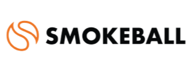

# Captivo Labs

  

    
  

  

    
Integration Partner

    
Connecting UCaaS & CCaaS platforms to the business applications you rely on — so every call is logged, documented, and linked to the right record. Automatically.

  

## About Captivo Labs

Captivo Labs builds middleware that bridges phone systems and the business software professional services teams run on. Their integration engine connects UCaaS and CCaaS platforms — including RingCentral — to practice management, CRM, ERP, and document management systems, eliminating manual call logging entirely.

Their platform is purpose-built for industries where every call matters: legal, automotive, hospitality, and health clinics. For legal teams in particular, Captivo Labs automates the entire post-call workflow — logging the call, capturing duration and direction, creating a draft time entry, and linking everything to the right matter — without anyone touching a keyboard.

## Connectors

  <a href="../../crm/smokeball/" class="crm-mkt__card crm-mkt__card--partner">
    

    

      
Legal Practice Management

      
Smokeball

      
Automatically log RingEX calls and communications against Smokeball matters and client records — with screen pop, time tracking, and draft time entries.

    

    

      By Captivo Labs
      View docs →
    

  </a>

  <a href="../../crm/odoo/" class="crm-mkt__card">
    

    

      
ERP / CRM

      
Odoo

      
Log RingEX calls to Odoo contacts and CRM records across sales, support, and operations.

    

    

      By Captivo Labs
      View docs →
    

  </a>

## Contact Captivo Labs

Ready to learn more about our integrations or discuss your requirements?

  

    
Talk to Captivo Labs

    
Reach out to get a demo, register interest in a connector, or ask about support for other platforms.

  

  <a href="https://www.captivolabs.com/#contact" class="bld-cta__btn" target="_blank" rel="noopener">Contact Captivo Labs →</a>

