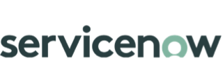

# Gate6

  

    
  

  

    
Enterprise Integration Partner

    
Connecting your business applications, platforms, and data sources into cohesive enterprise solutions.

  

## About Gate6

Gate6 specializes in connecting business applications, platforms, and data sources into cohesive enterprise solutions. Their dedicated System Integration Services team ensures seamless integration across infrastructure, technology architecture, applications, and data. With a focus on preserving legacy investments while embracing future innovations, Gate6 delivers end-to-end solutions tailored to each customer's needs.

Gate6 developed their App Connect connector for ServiceNow in direct partnership with RingCentral, making them one of the most deeply qualified partners for enterprise App Connect deployments.

## Connectors

Gate6 currently offers one live App Connect connector, with two more coming soon. [Contact Gate6](#contact-gate6) to discuss your integration requirements.

  <a href="../../crm/servicenow/" class="crm-mkt__card crm-mkt__card--partner">
    

    

      
ITSM / Enterprise

      
ServiceNow

      
Embed click-to-dial and call logging directly into ServiceNow incidents, cases, and service records.

    

    

      From $15 / user / month
      View docs →
    

  </a>

  <a href="../../crm/agencyzoom/gate6/" class="crm-mkt__card crm-mkt__card--partner">
    

    

      
Insurance Agency Management

      
AgencyZoom

      
Log RingEX calls and SMS to AgencyZoom client records with screen pop, click-to-dial, and multi-location support.

    

    

      From $15 / user / month
      View docs →
    

  </a>

  

    

    

      
Field Service Management

      
ServiceTitan

      
Log RingEX calls and activity directly into ServiceTitan jobs and customer records for field service teams.

    

    

      Coming soon
      Stay tuned →
    

  

  

    

    

      
Work OS / Project Management

      
monday.com

      
Bring RingEX call activity into monday.com boards — automatically creating items and logging communication history.

    

    

      Coming soon
      Stay tuned →
    

  

## Contact Gate6

Ready to get started with ServiceNow, or want to be notified when monday.com or ServiceTitan connectors launch? Gate6's team is ready to help.

  

    
Talk to Gate6

    
Reach out to discuss your integration requirements, get a quote, ask about connector licensing, or register interest in an upcoming connector.

  

  <a href="https://www.gate6.com/contact-us/" class="bld-cta__btn" target="_blank" rel="noopener">Contact Gate6 →</a>

