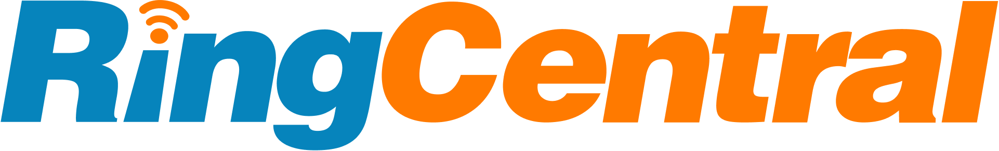
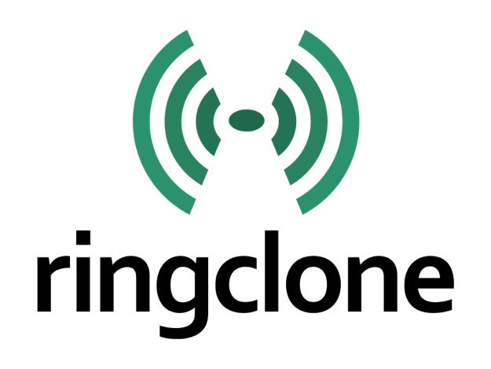

<!-- ═══════════════════════════════════════════════════════════
     HERO BAND
     ═══════════════════════════════════════════════════════════ -->

  

    <h1 class="crm-mkt__hero-title">Build Support for Your CRM</h1>
    
App Connect is an open-source framework that any developer can extend. If your CRM isn't supported today, the following partners — including RingCentral Professional Services — can build it for you.

  

  

    

      4
      Partners
    

    

      11+
      CRMs built
    

    

      1–3
      Weeks to ship
    

  

<!-- ═══════════════════════════════════════════════════════════
     VENDOR GRID  (alphabetical)
     ═══════════════════════════════════════════════════════════ -->

  <a href="captivolabs/" class="crm-mkt__card">
    

    

      
Integration Partner

      
Captivo Labs

      
Connects UCaaS and CCaaS platforms to the business applications professional services teams rely on — every call logged automatically.

    

    

      Certified Partner
      Learn more →
    

  </a>

  <a href="gate6/" class="crm-mkt__card">
    

    

      
Enterprise Integration

      
Gate6

      
End-to-end system integration specialists with a proven App Connect connector for ServiceNow.

    

    

      Certified Partner
      Learn more →
    

  </a>

  <a href="loyally/" class="crm-mkt__card">
    

    

      
Customer Service Technology

      
Loyally

      
Connects customer-service platforms so agents see the right data at the right time — in one screen.

    

    

      Certified Partner
      Learn more →
    

  </a>

  <a href="professional-services/" class="crm-mkt__card crm-mkt__card--partner">
    

    

      
Professional Services

      
RingCentral

      
RingCentral's own team builds support for your CRM — single vendor, rapid delivery, ongoing support.

    

    

      By RingCentral
      Learn more →
    

  </a>

  <a href="ringclone/" class="crm-mkt__card">
    

    

      
CRM Integration

      
RingClone

      
Specialists in App Connect integrations, with an active connector for Zoho CRM and growing expertise.

    

    

      Certified Partner
      Learn more →
    

  </a>

<!-- ═══════════════════════════════════════════════════════════
     CALLOUT — Build it yourself
     ═══════════════════════════════════════════════════════════ -->

  

    
Want to build it yourself?

    
App Connect is open source and built for extensibility. Any developer can integrate a CRM — proprietary or SaaS — using a set of well-defined API endpoints. Most integrations ship in days.

  

  

    <a href="../../developers/" class="crm-mkt__callout-btn crm-mkt__callout-btn--primary">Read the developer guide</a>
    <a href="https://community.ringcentral.com" class="crm-mkt__callout-btn crm-mkt__callout-btn--secondary">Ask the community</a>
  

