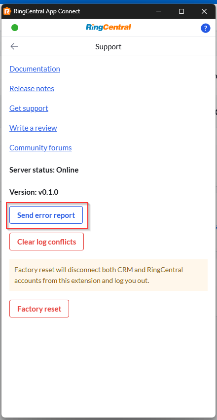

# Tips for submitting bug reports and requesting help from the App Connect team

The most effective way for us to fix bugs is to know and reproduce them first. Error logs are essential for this process. If you're reading this page, thank you for helping us improve the application!

To help us diagnose issues quickly, we need three types of information: console logs, network logs, and screen recordings.

## Error Report

If you run into an issue, please record an error report directly from the app:

- Open `User Settings` → `Support` to find the built-in error report collector.
- Follow the on-screen instructions in App Connect and it will record your actions and prepare the data to share with us.
- When you finish reproducing the issue, be sure to stop the recording and submit the report.
- We'll contact you via your email when we receive the error report.

!!! tip "Good issue description at submission step will significantly help us locate the cause."