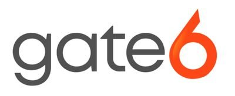

# AgencyZoom

  

    
  

  

    
Insurance Agency Management

    
AgencyZoom is a sales and agency management platform built specifically for insurance agencies — tracking leads, policies, renewals, and client communications in one place.

  

App Connect supports AgencyZoom through two certified partner integrations. Both log RingEX calls and SMS directly into AgencyZoom client records — choose the option that best fits your agency's size, workflow, and budget.

## Choose your integration

  <a href="agencyzoom-gate6/" class="crm-mkt__card crm-mkt__card--partner">
    

    

      
Enterprise Integration Partner

      
AgencyZoom by Gate6

      
Gate6's enterprise-grade connector brings deep AgencyZoom integration with advanced configuration options for larger agencies and multi-location operations.

    

    

      By Gate6 · Paid
      View docs →
    

  </a>

  <a href="agencyzoom-aa/" class="crm-mkt__card crm-mkt__card--partner">
    

    

      
Insurance Technology Partner

      
AgencyZoom by Accelerated Automation

      
Accelerated Automation's connector is purpose-built for insurance agencies, with tight AgencyZoom workflow automation and hands-on onboarding support.

    

    

      By Accelerated Automation · Paid
      View docs →
    

  </a>

## Not sure which to choose?

Both integrations deliver the core App Connect feature set for AgencyZoom — call logging, click-to-dial, screen pop, and SMS. The differences come down to deployment preferences, support model, and pricing. Contact either vendor directly to discuss your agency's specific requirements before committing.

<!--

  

    
Need help deciding?

    
Reach out to the RingCentral team and we'll help match you with the right integration for your agency.

  

  <a href="https://www.ringcentral.com/contact-sales.html" class="bld-cta__btn" target="_blank" rel="noopener">Talk to RingCentral →</a>

-->
