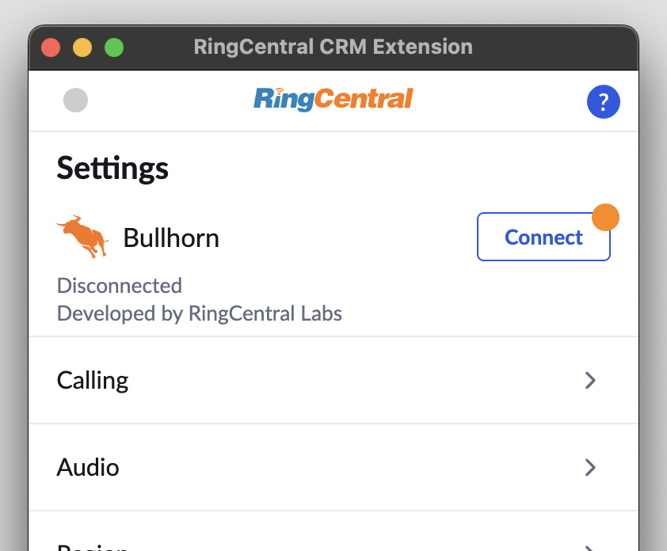
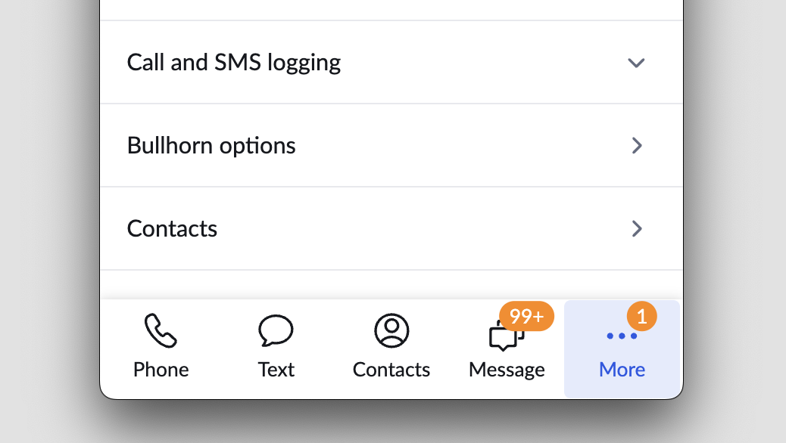

# Setting up App Connect for Bullhorn

Bullhorn is the global leader in software for the staffing industry. More than 10,000 companies rely on Bullhorn’s cloud-based platform to power their staffing processes from start to finish. 

RingCentral's integration with Bullhorn helps streamline communications with candidates, and helps staffing agents better support candidates through the entire recruitment pipeline by helping to manage and store communication history for all candidates. 

## Install the extension

If you have not already done so, begin by [installing App Connect](../getting-started.md) from the Chrome web store. 

<iframe width="825" height="464" src="https://www.youtube.com/embed/afbdQD0y4Yo?si=UKcBw2BP4pj2adNc" title="App Connect for Bullhorn - quick start" frameborder="0" allow="accelerometer; autoplay; clipboard-write; encrypted-media; gyroscope; picture-in-picture; web-share" allowfullscreen></iframe>

## Setup the extension

Once the extension has been installed, follow these steps to setup and configure the extension for Bullhorn. 

1. [Login to Bullhorn](https://www.bullhornstaffing.com/).

2. While visiting a Bullhorn application page, click the quick access badge to open or bring the dialer to the foreground. 

3. Navigate to the Settings screen in App Connect, and find the option labeled "Bullhorn."

    { .mw-300 }

4. Click the "Connect" button. 

5. A window will be opened prompting you to enter your Bullhorn username and password. Login to Bullhorn. 

When you login successfully, the Chrome extension will automatically update to show you are connected to Bullhorn. If you are connected, the button next to Bullhorn will say, "logout".

And with that, you will be connected to Bullhorn and ready to begin using the integration. 

## Auto log with default Note Action preference setup

In Settings, there's a "Bullhorn options" entry button.

We provide four options to choose from, corresponding to the different communications that can be logged in Bullhorn via App Connect. The values you enter here will be used in two different ways:

1. When logging calls automatically, these note actions will be used when creating the associated notes. 
2. When logging calls manually, these note actions will determine which action is selected by default in the logging screen. 

### Editing the enumerated list of possible note actions

As an admin, navigate inside of Bullhorn to Admin > System Settings. Then filter the list of settings for "commentActionList." There you should fine a comma-delimited list of values that determine the possible/allowed note actions. 

## Placeholder companies when creating contacts

Bullhorn requires that every contact be associated with a company. When logging calls for new contacts, App Connect will first look for a company called, "Placeholder company." If a company with that name is not found, one will be created. Then the contact will be associated with that company record. It is the intent that once the call is complete that an agent do one of the following:

1. Edit the company called "Placeholder Company" with a more appropriate name and with additional details.
2. Edit the contact to associate it with a more appropriate company stored in Bullhorn. 

In this way, App Connect ensures that all contacts created by it conform to the requirements of Bullhorn so that all contact records are complete. 

## Screen-pop for multiple contacts

A feature of App Connect is to allow a user to open all matched contacts when they receive a phone call. However, Bullhorn's API does not support this feature. Therefore in App Connect, we can only support the option "Prompt to select" under Call-pop settings. 

## Bullhorn and server-side call logging

*Coming in App Connect 1.5.7*

To ensure seamless and continuous server-side logging within the application, even if your direct Bullhorn login session expires, it is essential to configure the appropriate Bullhorn API username and password.

These API credentials serve a critical role in allowing the application to authenticate with Bullhorn's services programmatically. This enables the system to maintain a persistent connection for logging purposes, independent of your interactive user session.

### Required Permissions for the API User

The Bullhorn API user associated with these credentials must be granted specific permissions to ensure all necessary data can be accessed and logged. These permissions include:

* **Access to all contacts**: This allows the application to retrieve and log information related to all contact records within your Bullhorn instance.
* **Create/Update/Assign notes**: This permission is vital for logging activities related to notes, including their creation, any modifications, and assignments.

Without these permissions, the server-side logging functionality may be incomplete or fail to capture critical event data. It is recommended to create a dedicated API user in Bullhorn with only the necessary permissions to adhere to the principle of least privilege.

{ .mw-300 }

!!! warning "Important: Password Changes"
    Note that Bullhorn may require users to update their passwords periodically for security purposes. If you change the password for your Bullhorn API user, you must also update the password in the App Connect extension settings.

