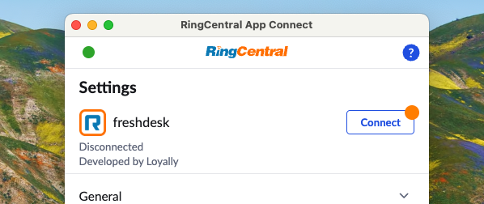

# App Connect and Freshdesk

Freshdesk, the online customer engagement solution from Freshworks, lets you streamline your company's customer support using the customer service software and helps you to efficiently manage your customers as you scale. 

RingCentral supports Freshdesk via a trusted third-party vendor and Premium Partner [Loyally](https://loyally.eu/), whose experience with Freshdesk began with their popular custom-built [Freshdesk integration](https://www.ringcentral.com/apps/freshdesk-premium-cti). 

!!! info "As a third-party integration, the Freshdesk integration comes at an additional cost"

## Install the extension

If you have not already done so, begin by [installing App Connect](../getting-started.md) from the Chrome web store. 

## Setup the extension

Once the App Connect extension has been installed, follow these steps to setup and configure the extension for Freshdesk. 

1. [Login to Freshdesk](https://www.freshworks.com/freshdesk/).

2. While visiting a Freshdesk application page, click the quick access button to bring the dialer to the foreground. 

3. Navigate to the Settings screen in App Connect, and find the option labeled "Freshdesk."

    { .mw-300 }

4. Click the "Connect" button. 

5. A window will be opened prompting you to enter your Freshdesk username and password. Login to Freshdesk. 

When you login successfully, the extension will automatically update to show you are connected to Freshdesk. If you are connected, the button next to Freshdesk will say, "logout".

And with that, you will be connected to Freshdesk and ready to begin using the integration. 
