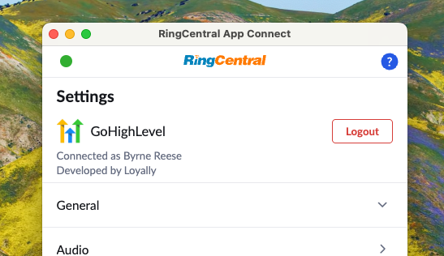

# App Connect and HighLevel

HighLevel is the all-in-one sales & marketing platform that agencies can white-label and resell to their clients. RingCentral supports HighLevel via a trusted third-party vendor and Premium Partner [Loyally](https://loyally.eu/).

!!! info "As a third-party integration, the HighLevel integration comes at an additional cost"

!!! warning "The HighLevel adapter is currently in beta. If you experience any diffculty, please reach out via the [App Connect community](https://community.ringcentral.com/groups/app-connect-22)"

## Sign-up for the Beta

The GoHighLevel integration will be a paid integration. For that reason, access to the beta currently requires people to sign-up with Loyally. Please contact Loyally to join the beta now. 

[Sign-up for HighLevel Beta](https://buy.stripe.com/9B614n1OBgat8d701LdUY0X){ .md-button .md-button--primary }

## Install the extension

If you have not already done so, begin by [installing App Connect](../getting-started.md) from the Chrome web store. 

## Setup the extension

<iframe width="560" height="315" src="https://www.youtube.com/embed/AAJbmt-CFDI?si=BjLdBYXiqRaaVXa-" title="YouTube video player" frameborder="0" allow="accelerometer; autoplay; clipboard-write; encrypted-media; gyroscope; picture-in-picture; web-share" referrerpolicy="strict-origin-when-cross-origin" allowfullscreen></iframe>

Once the App Connect extension has been installed, follow these steps to setup and configure the extension for Freshdesk. 

1. [Login to HighLevel](https://app.gohighlevel.com/).

2. While visiting a HighLevel application page, click the quick access button to bring the dialer to the foreground. 

3. Navigate to the Settings screen in App Connect, and find the option labeled "Freshdesk."

    { .mw-300 }

4. Click the "Connect" button. 

5. A window will be opened to initiate the login and authorization process. Conplete the authorization process.

!!! warning "Multi-step authorization flow" 
    HighLevel's authorization flow for App Connect is a multi-step process in which a number of windows are opened. This can lead to other browser windows being hidden on your desktop. Some of these windows are required for authorization. Make sure you complete each step until you see a positive indication from HighLevel that you have completed the process. 

When you login successfully, the extension will automatically update to show you are connected to HighLevel. If you are connected, the button next to Freshdesk will say, "logout".

And with that, you will be connected to HighLevel and ready to begin using the integration. 

## Using the GoHighLevel integration

### Manual call logging

<iframe width="560" height="315" src="https://www.youtube.com/embed/V6xJm0vNMic?si=hJtm4qUdkKwT6poP" title="YouTube video player" frameborder="0" allow="accelerometer; autoplay; clipboard-write; encrypted-media; gyroscope; picture-in-picture; web-share" referrerpolicy="strict-origin-when-cross-origin" allowfullscreen></iframe>

### Automated call logging

<iframe width="560" height="315" src="https://www.youtube.com/embed/gq7ru9Fx8Rs?si=JStLkTshem7vChcd" title="YouTube video player" frameborder="0" allow="accelerometer; autoplay; clipboard-write; encrypted-media; gyroscope; picture-in-picture; web-share" referrerpolicy="strict-origin-when-cross-origin" allowfullscreen></iframe>
