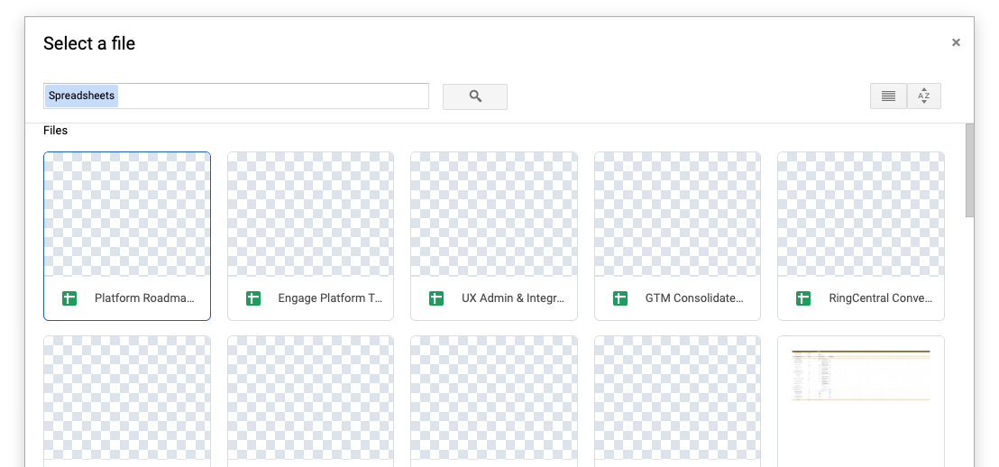

# Setting up App Connect for Google Sheets

Google Sheets is the CRM everyone in the world has access to. Is it a highly specialized CRM? No. But it is free, and in the right hands can be a flexible and invaluable tool. 

RingCentral's integration with Google Sheets track selected communications and contacts with whom you do business with.

## Install the extension

If you have not already done so, begin by [installing App Connect](../getting-started.md) from the Chrome web store or Microsoft Edge store. 

<iframe width="560" height="315" src="https://www.youtube.com/embed/FvgVObKvoMM?si=VmAjQk2ayzMzr47T" title="App Connect for Google Sheets" frameborder="0" allow="accelerometer; autoplay; clipboard-write; encrypted-media; gyroscope; picture-in-picture; web-share" referrerpolicy="strict-origin-when-cross-origin" allowfullscreen></iframe>

## Setup the extension

Once the extension has been installed, follow these steps to setup and configure the extension for Google Sheets. 

1. [Connect to Google](https://docs.google.com/).

2. While visiting a Google Docs application page, click the quick access badge to open or bring the dialer to the foreground. 

3. Navigate to the Settings screen in App Connect, and find the option labeled "Google Sheets."

    { .mw-300 }

4. Click the "Connect" button. 

5. A window will be opened prompting you to enter your Google username and password. Login to Google. 

   When you login successfully, App Connect will automatically update to show you are connected to Google Sheets. If you are connected, the button next to Google Sheets will say, "logout".
   
6. Finally, you need to navigate to "Google Sheets options" and create a Google Sheet into which calls and contacts will be logged. Navigate to "Google Sheets options" and click "Create Google Sheet."

And with that, you will be connected to Google Sheets and ready to begin using the integration. 

## Creating a Google Sheet to log to

To begin logging, you need to create or select a Google sheet to log communications and contacts to. Navigate to "Google Sheets options" under Settings, enter a name for the file, and click "Create new sheet."

You are then welcome to share the Google Sheet created by App Connect with your co-workers. Your co-workers then would link to an existing sheet rather than create their own. 

<figure markdown>
  { .mw-400 }
  <figcaption>How to create a Google Sheet to log to</figcaption>
</figure>

### Linking to an existing Google Sheet

You may also select a Google sheet to log communications to. This is especially helpful if you have multiple people within the company all logging calls to a shared sheet. To link to an existing sheet, users should click the button "Select existing sheet." Doing so will launch the Google sheet selector modal dialog. Select the sheet and click Continue. 

<figure markdown>
  
  <figcaption>Selecting the Google Sheet to log communications to</figcaption>
</figure>
