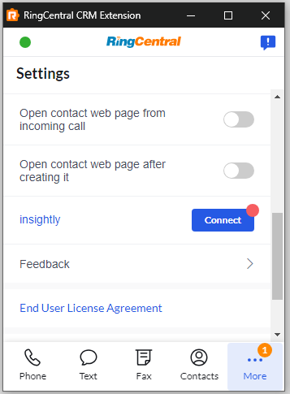
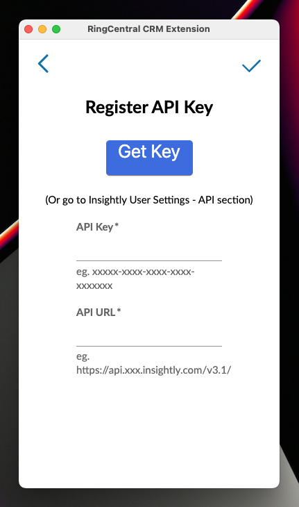
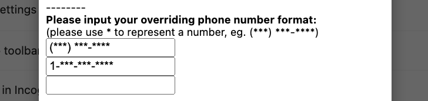

# Setting up App Connect for Insightly

Growing businesses across the globe rely on Insightly to help them build lasting customer relationships. Insightly delivers a platform that can take businesses to the next level: a powerful CRM, plus marketing automation, a customer service app, and an integration tool.

RingCentral's integration with Insightly helps streamline communications between customers, and helps sales staff to better support them through their entire lifecycle by helping to manage and store communication history with customers, capture important communication metadata and more.

## Install the extension

If you have not already done so, begin by [installing App Connect](../getting-started.md) from the Chrome web store. 

<iframe width="825" height="464" src="https://www.youtube.com/embed/5hWvVI12UAc?si=IX1PjO__Njki_60i" title="App Connect for Insightly - quick start" frameborder="0" allow="accelerometer; autoplay; clipboard-write; encrypted-media; gyroscope; picture-in-picture; web-share" allowfullscreen></iframe>

## Setup the extension

Once the extension has been installed, follow these steps to setup and configure the extension for Insightly. 

1. [Login to Insightly](https://login.insightly.com/User/Login).

2. While visiting an Insightly application page, click the quick access button to bring the dialer to the foreground. 

3. Navigate to the Settings screen in App Connect, and find the option labeled "Insightly."

    { .mw-400 }

4. Click the "Connect" button. 

5. A window will be opened prompting you to enter numerous attributes from Insightly, including:
    * API key
    * API URL

    { .mw-400 }

6. Click the "Get API Key" button and the extension will attempt to retrieve these values for you. You may also enter these values manually. In Insightly, navigate to User Settings from the pull down menu in the upper-righthand corner. Scroll down until you see a section labeled "API." Copy and paste your API key and API URL into the corresponding fields. 

    { .mw-600 }

When you login successfully, the Chrome extension will automatically update to show you are connected to Insightly. If you are connected, the button next to Insightly will say, "logout".

And with that, you will be connected to Insightly and ready to begin using the integration. 

## Setting up phone number matching to properly match contacts

Insightly's contact lookup method is very strict. As a result, if the phone numbers in Insightly are not stored using the E.164 standard, e.g. `+1##########`, then App Connect will fail to find the contact record for call logging and call pop. 

To address this, short of reformatting every phone number stored in Insightly, is to go to [Phone number format alternatives](../users/phone-number-formats.md) under the "Contacts" settings and set the phone number formats to conform with the conventions used by your company. 

{ .mw-300 }
  
Navigate to App Connect's Contacts settings page and enter in the phone formats used by your company. Define a format by using an asterix "*" in place of any digit/number. Any other character used in the format string will be interpretted literally. 

Let's look at a few examples. First, consider the following format string:

    (***) ***-****
	
| Phone number     | Does it match? |
|------------------|----------------|
| (555) 123-2334   | Yes            |
| (555)123-2334    | No             |
| 1 (555) 123-2334 | No             |
| 555-123-2334     | No             |

Now, let's look at one more example. Consider the format string:

    1 (***) ***-****
	
| Phone number      | Does it match? |
|-------------------|----------------|
| 1 (555) 123-2334  | Yes            |
| +1 (555) 123-2334 | No             |
| (555) 123-2334    | No             |
| 555-123-2334      | No             |

We have found the following formats are commonly used among customers (feel free to copy and paste them into advanced settings):

* `(***) ***-****`
* `***-***-****`
* `***.***.****`
* `1 (***) ***-****`

Select or enter up to three different formats used by your company and click "Save." 

<figure markdown>
  
  <figcaption>Phone number formats after being properly filled in.</figcaption>
</figure>

!!! tip "The E.164 format is used by default. You do not need to specify the format `1**********`."

Making this change will improve your experience with the extension considerably. Here are a few things to bear in mind:

* Every phone number format you add results in another search request to Insightly, which could lead to performance issues.
* Searches are performed using each of the formats in order. The first phone number that is found will stop the search process. So place the formats that are most likely to yield results first in order. 
