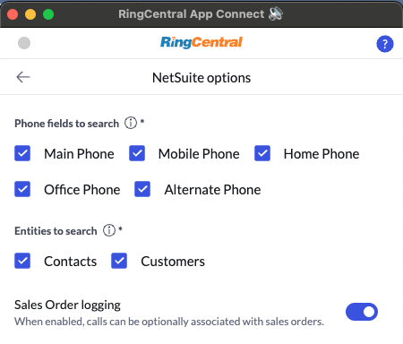

# Setting up App Connect for NetSuite

NetSuite is a cloud-based business management software that helps organizations manage their financials, operations, and customer relationships.

RingCentral's integration with NetSuite helps streamline communications with contacts, and helps staffing agents better support contacts through the entire sales order pipeline by helping to manage and store communication history for all contacts. 

!!! warning "Prerequisites"
    * The current version of the NetSuite integration requires NetSuite version 2024.1 or later. 
    * NetSuite users must have [REST Web Services](https://docs.oracle.com/en/cloud/saas/netsuite/ns-online-help/section_1544787084.html#Related-Topics) enabled. 
	* NetSuite OneWorld license holders will need to manually add the "Subsidiaries" permission to the role they use to connect to NetSuite. 

## Install the SuiteApp

To begin using the NetSuite integration, users will first need to do the following:

* Login to NetSuite, then visit the [RingCentral Suite App](https://www.suiteapp.com/RingCentral-Unified-CRM-Extension) page, or:
  * Click on the "SuiteApps" tab if your role gives you access to it
  * Search for "RingCentral" in the directory
  * Click "RingCentral App Connect" in the search results
* Click the "Install" button found in the upper right hand corner of the page

If you see, "Not compatible" in place of an "Install" button, then you must be running an older version of NetSuite. You will need to upgrade to 2024.2 or later. 

Installing the app from the SuiteApp marketplace is a necessary step prior to installing the Chrome extension discussed below. 

## Setup roles and permissions in NetSuite

Upon installation of the SuiteApp, a role will be created automatically within your account called "RingCentral App Connect." This role has been specially tuned to contain the bare minimum number access level to fully operate the Chrome extension. You can see a detailed list of permissions below if you would like to incorporate these permissions into a custom role of your own. 

### NetSuite OneWorld instructions

Upon installing the SuiteApp from the Marketplace, a new custom role named **"RingCentral App Connect"** will be automatically created in your account. If you are a OneWorld license holder, you will need to take these additional steps.

1. Clone the "RingCentral App Connect" role by selecting the "Customize" option.
2. While cloning, add the permission **"List -> Subsidiaries"** to the cloned role.

Use this cloned role when logging into and connecting App Connect to NetSuite.

!!! info "The role is created by SuiteApp locked by default and cannot be edited. If you wish to make modifications, you may duplicate the role by clicking on 'Customize.'"

### Turn on REST web services

REST Web Services is default to be invisible. We'll need to turn on the feature so to make it selectable for roles. Here's how to do it:

1. From NetSuite homepage, go to Setup -> Company -> Enable Features
2. Go to sub-tab, "SuiteCloud"
3. Tick on "REST Web Services" and save

### Create role with required permissions

We recommend using the "RingCentral App Connect" role created for you when you install the SuiteApp. However, if you would like to create a custom role that includes the permissions necessary to allow this extension to operate fully, consult the table below. 

| Category     | Permission                           | Level                       |
| ------------ | ------------------------------------ | --------------------------- |
| Lists        | Contacts                             | Full                        |
| Lists        | Customers                            | Full                        |
| Lists        | Phone Calls                          | Full                        |
| Lists        | Subsidiaries                         | View  (OneWorld users only) |
| Lists        | Notes Tab                            | Full                        |
| Lists        | Documents and Files                  | Full                        |
| Reports      | SuiteAnalytics Workbook              | Edit                        |
| Setup        | Log in using OAuth 2.0 Access Tokens | Full                        |
| Setup        | REST Web Services                    | Full                        |
| Setup        | User Access Tokens                   | Full                        |
| Transactions | Sales Order                          | Full                        |
| Transactions | Opportunity                          | Full                        |
| Transactions | Find Transaction                     | View                        |

## Install the Chrome/Edge extension

If you have not already done so, begin by [installing App Connect](../getting-started.md) from the Chrome web store. 

<iframe width="825" height="464" src="https://www.youtube.com/embed/yo4Q1Vj-sH4" title="App Connect for NetSuite - quick start" frameborder="0" allow="accelerometer; autoplay; clipboard-write; encrypted-media; gyroscope; picture-in-picture; web-share" allowfullscreen></iframe>

## Setup the extension

Once the extension has been installed, follow these steps to setup and configure the extension for NetSuite. 

1. [Login to NetSuite](https://system.netsuite.com/pages/customerlogin.jsp).

2. While visiting a NetSuite web page, click the quick access button to bring the dialer to the foreground. 

3. Navigate to the Settings screen in App Connect, and find the option labeled "Netsuite".

    { .mw-200 }

4. Click the "Connect" button. 

5. A window will be opened prompting you to allow OAuth scopes. Allow it.

When you login successfully, the Chrome extension will automatically update to show you are connected to NetSuite. If you are connected, the button next to NetSuite will say, "logout".

And with that, you will be connected to NetSuite and ready to begin using the integration. 

## Placeholder companies when creating contacts

NetSuite requires that every contact be associated with a company. When logging calls for new contacts, App Connect will first look for a company called, "Placeholder company." If a company with that name is not found, one will be created. Then the contact will be associated with that company record. It is the intent that once the call is complete that an agent do one of the following:

1. Edit the company called "Placeholder Company" with a more appropriate name and with additional details.
2. Edit the contact to associate it with a more appropriate company stored in NetSuite. 

In this way, App Connect ensures that all contacts created by it conform to the requirements of NetSuite so that all contact records are complete. 

## Contact matching via phone numbers

When attempting to find and match a phone call to a customer or contact record, the NetSuite integration searches the following fields:

* Main Phone
* Home Phone
* Mobile Phone
* Office Phone

In addition, App Connect will search the "Office Phone" field for contacts, and the "Alternate Phone" field for customer entities. 

!!! warning "App Connect does not search custom phone fields."

## Optimizing contact matching performance

If you are experiencing a timeout issue during contact search, you can follow the steps below to optimize the search process. First navigate to Settings → NetSuite Options, then:

* Under "Phone fields to search," limit your search to only the fields you use.
* Under "Entities to search," limit your search to only those object types you want returned in your results.
* Disable  "Sales Order logging" to prevents calls from being logged against sales orders.

{ .mw-200 }

## Entity Search and Creation

NetSuite's entity management system in App Connect provides flexible contact handling with support for multiple entity types during both search and creation operations.

### Supported Entity Types

App Connect for NetSuite supports working with the following entity types:

#### **During Entity Search**
When searching for existing records, App Connect searches across these entity types:

- **Contact** - Individual person records associated with companies
- **Customer** - Business entities that purchase products or services
- **Vendor** - Business entities that provide products or services

!!! info "Customer Search Behavior"
    When searching within the "Customer" entity type, App Connect will find records regardless of their customer status (Lead, Prospect, or Customer). The search does not differentiate between these customer subtypes.

#### **During Contact Creation**
When creating new contact records, App Connect supports creating these entity types:

- **Contact** - Individual person records
- **Customer** - Customer entity records  
- **Vendor** - Vendor entity records
- **Lead** - Prospective customer records (customer subtype)
- **Prospect** - Potential customer records (customer subtype)

### Entity Search Configuration

You can optimize entity search performance and results by configuring the search settings in App Connect:

1. **Navigate to Settings** → **NetSuite Options**
2. **Under "Entities to search"** - Select which entity types to include in search results:
   - ✅ **Contacts** - Include individual person records
   - ✅ **Customers** - Include customer entity records (includes Leads and Prospects)
   - ✅ **Vendors** - Include vendor entity records

### Search vs Creation Differences

| **Operation** | **Available Entity Types** | **Behavior** |
|---------------|---------------------------|--------------|
| **Search** | Contact, Customer, Vendor | Customer search includes all customer subtypes (Lead, Prospect, Customer) |
| **Creation** | Contact, Customer, Vendor, Lead, Prospect | Each type creates a distinct entity record with appropriate classification |

### Best Practices for Entity Management

#### **Search Optimization**
- **Limit Entity Types**: Only enable entity types you actively use to improve search performance
- **Review Results**: Customer search results may include Leads and Prospects - review carefully before selecting
- **Use Filters**: Leverage the phone field search options to narrow results effectively

#### **Creation Guidelines**
- **Choose Appropriate Type**: Select the most specific entity type when creating records:
  - Use **Contact** for individuals associated with companies
  - Use **Lead** for early-stage prospects requiring nurturing
  - Use **Prospect** for qualified potential customers
  - Use **Customer** for active purchasing entities
  - Use **Vendor** for service/product providers

#### **Entity Type Selection Tips**

| **Entity Type** | **Best Used For** | **NetSuite Classification** |
|-----------------|-------------------|----------------------------|
| **Contact** | Individual people at companies | Person record |
| **Lead** | Early-stage prospects | Customer subtype |
| **Prospect** | Qualified potential customers | Customer subtype |
| **Customer** | Active purchasing entities | Customer entity |
| **Vendor** | Service/product providers | Vendor entity |

!!! tip "Performance Tip"
    To improve search performance, disable entity types you don't actively use in your NetSuite environment. This reduces the scope of each search operation and speeds up contact matching.

!!! warning "Search Scope Consideration"
    Remember that Customer entity searches will return Leads and Prospects as well. If you need to distinguish between these subtypes, consider the entity creation type when reviewing search results.

## Concurrency limits

If you receive an error indicating, "concurrency limit exceeded," then you may need to purchase SuiteCloud Plus add-on module. This is what NetSuite support shared:

> Depending on the customers’ service tier level, the concurrency limit is from 5 (shared and tier 3) to 20 (tier 0).
If additional processor/concurrency is required, the customer could purchase the SuiteCloud Plus add on module, which will include an additional 10 units per SuiteCloud plus license.
> 
> Please refer to the [Concurrency Governance Cheat Sheet](https://nlcorp.app.netsuite.com/core/media/media.nl?id=127925362&c=NLCORP&h=8742ad8b887aa6881f85&_xt=.pdf) found in the SDN SAFE Guide for more details.
