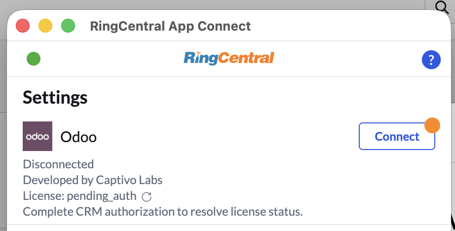
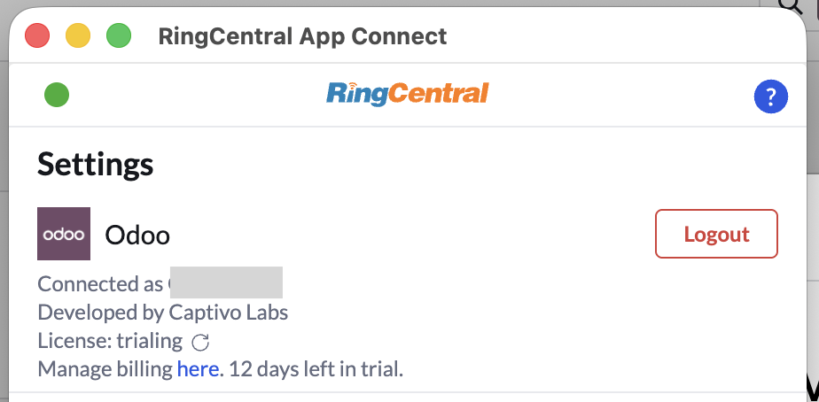
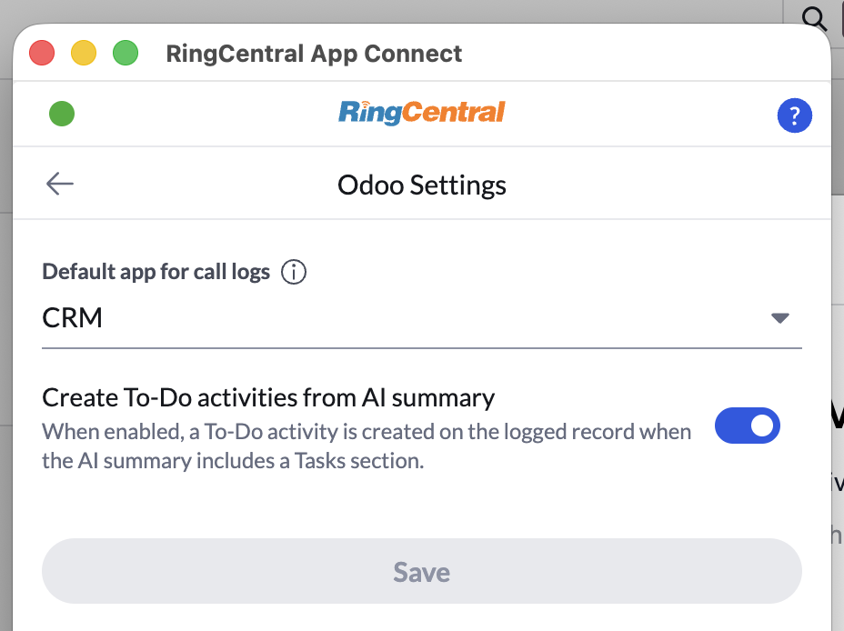

# Setting up App Connect for Odoo

!!! info "Requires App Connect 2.0"
    This integration is only available in [App Connect 2.0](../2.0/index.md). Make sure you have the latest version installed before getting started.

[Odoo](https://www.odoo.com) is a suite of open source business apps that cover all your company needs: CRM, eCommerce, accounting, inventory, point of sale, project management, etc. Odoo's unique value proposition is to be at the same time very easy to use and fully integrated.

[Captivo Labs](https://www.captivolabs.com) connects your RingCentral account to your Odoo account. When you receive a call, our system looks up the contact from your Odoo and displays it to you before answering the actual call. When a call ends, it's logged against the right contact, the right matter, the right account along with notes, AI transcription summaries, tasks, and call duration.

!!! money "As a third-party integration, the Odoo integration comes at an additional cost"

## What it does

- Surfaces the matching Odoo contact when a call comes in or goes out
- Automatically logs call activities against the correct record, including duration and notes
- Lets you add call notes from directly within the RingCentral dialer
- Uses AI transcriptions to summarise conversations and extract tasks
- Outbound calls directly from Odoo
- Allows users to select a default Odoo app to log calls against

<iframe width="825" height="464" src="https://www.youtube.com/embed/-UK7l3TaPPI?si=lPBsr2KH3oC6NQiT" title="Ring Central + Odoo by Captivo Labs" frameborder="0" allow="accelerometer; autoplay; clipboard-write; encrypted-media; gyroscope; picture-in-picture; web-share" allowfullscreen></iframe>

## Obtain your Odoo credentials

Before installation, obtain your Odoo instance url e.g. `https://your-company.odoo.com` and an API key. To generate an API key in Odoo, go to My Preferences > Security > Add API Key. Save these two values somewhere safe as we'll need them later.

## Install the extension

If you have not already done so, begin by [installing App Connect](https://appconnect.labs.ringcentral.com/2.0/) from the Chrome Web Store.

## Setup the extension

Once the extension has been installed, follow these steps to setup and configure the extension for Odoo. 

1. Launch the App Connect extension from your browser extensions. If you don't see the extension, click on the extensions button in your browser and pin the App Connect extension so it's always visible.

2. Login with your RingCentral account.

3. Navigate to the Settings screen in App Connect, and find the option labeled "Odoo."

4. Click the "Connect" button. 

5. A window will be opened prompting you to first enter your Odoo URL. This is the URL we saved from earlier e.g. `https://your-company.odoo.com`. Click Next.

6. Next, enter your API key that you generated from earlier. Click Next.

When you login successfully, the browser extension will automatically update to show you are connected to Odoo. If you are connected, the button next to Odoo will say, "logout".

And with that, you will be connected to Odoo and ready to begin using the integration.

## Odoo Settings

Odoo comes with many apps so you have to let the integration know which app you want to log calls against. Go to App Connect > Settings > Odoo Settings and you'll see a dropdown of all the Odoo apps you have installed. Select a default app, e.g. "CRM" and save. Now all calls will be saved against records in your CRM.

## Usage Instructions

For more detailed installation and usage instructions, please visit the [integration documentation](https://docs.captivolabs.com/odoo).
