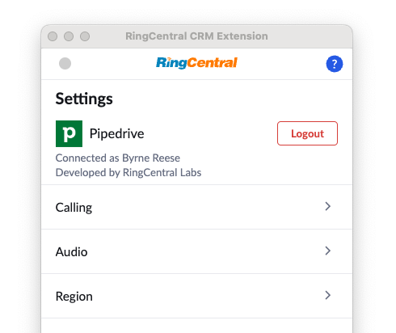

# Setting up App Connect for Pipedrive

Pipedrive is designed to help small businesses grow. For over ten years, Pipedrive has been committed to building the best CRM – a CRM by and for salespeople. The result is an easy-to-use, effective sales tool that centralizes your data, helping you visualize your entire sales process and win more deals.

RingCentral's integration with Pipedrive helps streamline communications between customers, and helps sales staff to better support them through their entire lifecycle by helping to manage and store communication history with customers, capture important communication metadata and more.

## Install the extension

If you have not already done so, begin by [installing App Connect](../getting-started.md) from the Chrome web store. 

<iframe width="825" height="464" src="https://www.youtube.com/embed/Hu0qC13HDkQ?si=XZLWUCalDRhF8ASP" title="App Connect for Insightly - quick start" frameborder="0" allow="accelerometer; autoplay; clipboard-write; encrypted-media; gyroscope; picture-in-picture; web-share" allowfullscreen></iframe>

## Setup the extension

Once the extension has been installed, follow these steps to setup and configure the extension for Pipedrive. 

1. Make sure you are [logged in to Pipedrive](https://app.pipedrive.com/auth/login).

2. Navigate to the RingCentral App Connect in the [Pipedrive Marketplace](https://www.pipedrive.com/en/marketplace/app/ring-central-crm-extension/5d4736e322561f57).

3. From the marketplace listing, initiate the authorization process by clicking the "Install Now" button.

    

3. On the authorization screen, scroll to the bottom and click "Allow and Install." App Connect should automatically come to the foreground and show that you are now connected to Pipedrive. 

When you login successfully, the Chrome extension will automatically update to show you are connected to Pipedrive. If you are connected, the button next to Pipedrive will say, "logout".

<figure markdown>
  
  <figcaption>Settings once you have connected to Pipedrive</figcaption>
</figure>

And with that, you will be connected to Pipedrive and ready to begin using the integration. 

## Tailoring your configuration

Pipedrive's system exhibits a relatively uncommon behavior that is the result of a perfectly normal function of the frameworks used by their engineers. However, this behavior is unfortunate because it causes the dialer to be removed from the page after it has loaded. You may see it appear briefly, and then POOF! It is gone. 

To address this, go our [advanced settings](../users/settings.md#advanced-configuration-options) and set the config option called "Click-to-dial inject delay" to `2` or `3`. Depending upon network latencies, you may need to increase this number, but usually a value of `2` is sufficient. 

