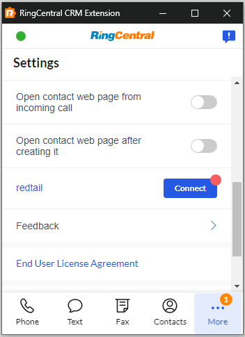

# Redtail CRM

Whether you are looking to strengthen your client relationships, improve your team’s collaboration efforts and overall efficiency, increase your revenues and profitability, decrease client attrition, or engage in any number of other business-building activities, Redtail CRM offers tools to assist in your efforts.

RingCentral's integration with Redtail CRM helps streamline communications between customers, and helps sales staff to better support them through their entire lifecycle by helping to manage and store communication history with customers, capture important communication metadata and more.

<iframe width="825" height="464" src="https://www.youtube.com/embed/1pbpbEvp5uQ?si=BUmLcaKk5att_XQf" title="App Connect for Redtail CRM - quick start" frameborder="0" allow="accelerometer; autoplay; clipboard-write; encrypted-media; gyroscope; picture-in-picture; web-share" allowfullscreen></iframe>

## Setup and configuration

### Install the extension

If you have not already done so, begin by [installing App Connect](../getting-started.md) from the Chrome web store. 

### Connect to Redtail

Once the extension has been installed, follow these steps to setup and configure the extension for Redtail. 

1. [Login to Redtail](https://corporate.redtailtechnology.com/login/).

2. While visiting a Redtail application page, click the quick access button to bring the dialer to the foreground. 

3. Navigate to the Settings screen in App Connect, and find the option labeled "Redtail."

    { .mw-400 }

4. Click the "Connect" button. 

5. A window will be opened prompting you to enter your Redtail username and password. Login to Redtail. 

When you login successfully, the Chrome extension will automatically update to show you are connected to Redtail. If you are connected, the button next to Redtail will say, "logout".

And with that, you will be connected to Redtail and ready to begin using the integration. 

## Redtail call logging preferences

### Activity completion

The Redtail options section includes **When to mark an activity complete?**. This setting controls whether App Connect marks Redtail activities completed after call logging.

* **Let me mark activities complete manually** keeps Redtail activities open so users can review and complete them in Redtail.
* **Mark activity complete when all data is available automatically** marks the Redtail activity complete only when App Connect has the complete call data needed for the final log update.

### Note display preference

Use the call log detail settings to choose which note sections are displayed in the Redtail activity description, including user-entered notes, call details, recordings, AI summaries, and transcripts. These settings control the content App Connect sends to Redtail when it creates or updates an activity.

Recommendation: enable **One-time call logging** for Redtail when notes should be written once with the final call data. With one-time call logging, App Connect waits until call details and related artifacts are ready, preserves temporary notes entered during the wait, then writes the complete Redtail activity in one logging pass.
