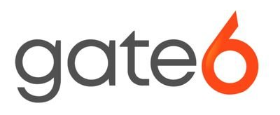

# App Connect and ServiceNow

ServiceNow is an IT service and operations management company that helps companies automate IT business processes. The ServiceNow integration powered by App Connect comes with these unique capabilities:

* Automatically log calls for external AND internal calls
* Archive call recordings directly in ServiceNow for enhanced compliance
* Supports both ServiceNow cloud and on-prem solutions

RingCentral supports ServiceNow via a trusted third-party vendor [Gate6](https://gate6.com/).

!!! money "As a third-party integration, the ServiceNow integration comes at an additional cost"

## Install the extension

If you have not already done so, begin by [installing App Connect](../getting-started.md) from the Chrome web store. 

## Setup App Connect

{ .mw-250 .float-right }
The ServiceNow integration is available directly from within App Connect — no need to contact Gate6 first. Open the extension, go to **More > Settings**, select **ServiceNow** from the list of connectors, and click "Connect." Follow the on-screen instructions to finish setup.
