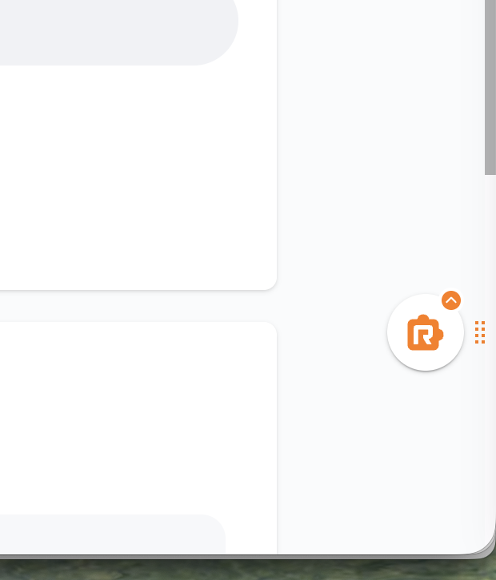
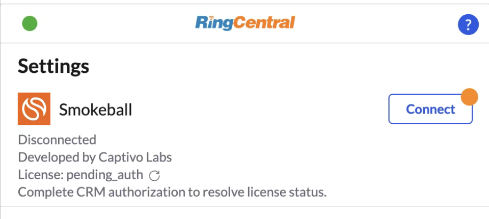
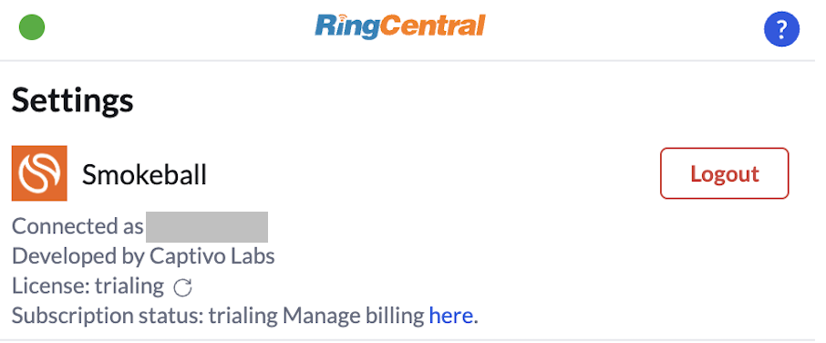

# Setting up App Connect for Smokeball

Smokeball is the leading legal practice management software that boosts your productivity through automatic time tracking, document automation, and law society approved billing.

[Captivo Labs](https://www.captivolabs.com) connects your RingCentral account to your Smokeball account. When you receive a call, our system looks up the contact from your Smokeball and displays it to you before answering the actual call. When a call ends, it's logged against the right contact, the right matter, the right account along with notes, AI transcription summaries, tasks, and call duration.

## What it does

- Surfaces the matching Smokeball contact when a call comes in or goes out
- Automatically logs call activities against the correct matter, including duration and notes
- Lets you add call notes from directly within the RingCentral dialer
- Uses AI transcriptions to summarise conversations and extract tasks
- Outbound calls directly from Smokeball

!!! tip "Please note, this integration only works with Australian Smokeball accounts. US and UK integrations are coming soon."

<iframe width="560" height="315" src="https://www.youtube.com/embed/6mxT9D4chr0?si=EqiXQBOwacLlvZXX" title="Ring Central + Smokeball by Captivo Labs" frameborder="0" allow="accelerometer; autoplay; clipboard-write; encrypted-media; gyroscope; picture-in-picture; web-share" referrerpolicy="strict-origin-when-cross-origin" allowfullscreen></iframe>

## Install the extension

If you have not already done so, begin by [installing App Connect](../getting-started.md) from the Chrome/Edge web store. 

## Setup the extension

Once the extension has been installed, follow these steps to setup and configure the extension for Clio. 

1. [Login to Smokeball AU](https://app.smokeball.com.au/).

2. While visiting a Smokeball application page, click the quick access button to bring the dialer to the foreground.

3. Login with your RingCentral account.

4. Navigate to the Settings screen in App Connect, and find the option labeled "Smokeball."

5. Click the "Connect" button. 

6. A window will be opened prompting you to enter your Smokeball username and password. Login to Smokeball. 

When you login successfully, the browser extension will automatically update to show you are connected to Smokeball. If you are connected, the button next to Smokeball will say, "logout".

And with that, you will be connected to Smokeball and ready to begin using the integration.

## Usage Instructions

For more detailed installation and usage instructions, please visit the [integration documentation](https://docs.captivolabs.com/smokeball).
