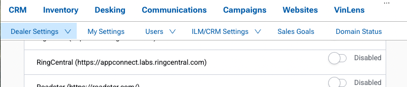
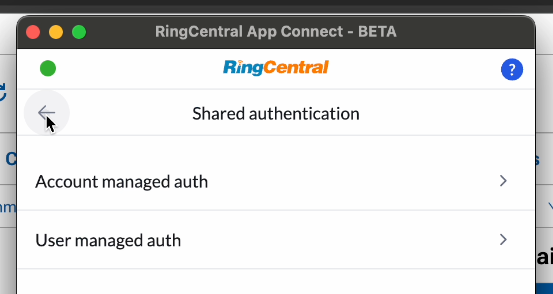
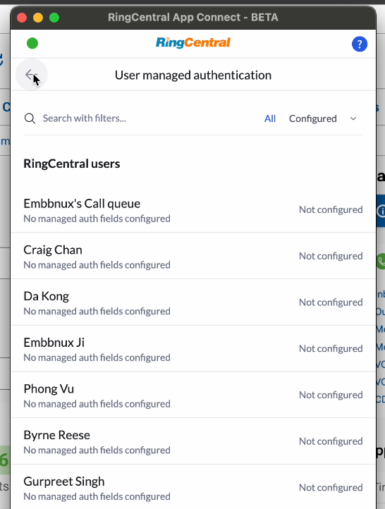

# Vin Solutions

!!! info "Built for automotive dealerships"
    Learn more about [RingCentral's solutions for automotive dealerships](https://www.ringcentral.com/office/industry-solutions/automotive.html).

Vin Solutions is a CRM built for automotive dealerships, part of the Cox Automotive family of products. RingCentral's integration with Vin Solutions brings click-to-dial, screen-pop, and automatic call logging directly into the tools your sales and service teams already use.

<iframe width="825" height="464" src="https://www.youtube.com/embed/08H2DPJB1uk" title="App Connect for Vin Solutions - quick start" frameborder="0" allow="accelerometer; autoplay; clipboard-write; encrypted-media; gyroscope; picture-in-picture; web-share" allowfullscreen></iframe>

## Setup and configuration

!!! warning "Important: enable the integration first"
    To have Vin Solutions appear in your list of available App Connect connectors, [contact Sales](https://forms.gle/zn8EJHnvg34wAMRV9) to have the integration enabled for your account.

### Step 1: Enable RingCentral inside Vin Solutions

Once Sales has enabled the integration for your account, an admin needs to turn it on inside Vin Solutions before anyone can connect.

1. Log in to Vin Solutions as an admin.
2. Navigate to **Settings**.
3. From the Dealer Settings menu, select **Partner enablement**.
4. Wait for the list of partners to load.
5. Under **Application Service Providers**, find **RingCentral** and toggle the integration to the **on** position.
6. Under **Call Tracking Providers**, find **RingCentral** and enable it as well.

{ .mw-600 }

### Step 2: Install App Connect

With the integration enabled inside Vin Solutions, installation continues with the regular App Connect installation process.

1. If you haven't already, [install App Connect](../getting-started.md) from the Chrome or Edge web store.
2. From the list of connectors, select **Cox Automotive**.

!!! info "Don't see "Cox Automotive" in the list?"
    If "Cox Automotive" isn't showing up as an available connector, it likely hasn't been enabled for your account yet. [Contact Sales](https://forms.gle/zn8EJHnvg34wAMRV9) to have it turned on.

### Step 3: Connect your account

Once Cox Automotive is selected, log in using:

* **Dealer ID** — found in the upper right-hand corner of the Vin Solutions app.
* **User ID** — provided by your Vin Solutions administrator.

Once connected, App Connect will begin logging calls and SMS against your Vin Solutions records, and screen-pop customer information as calls come in.

### Optional: Set up shared authentication for your dealership

Rather than having every employee track down their own Dealer ID and User ID, an admin can pre-configure these values for the whole dealership. Once set up, connecting to Vin Solutions becomes a one-click experience for everyone else — nobody has to hunt for their credentials.

1. Open App Connect and go to the **Admin** tab.
2. Navigate to **Shared authentication**.
3. Select **Account managed auth** and enter your dealership's **Dealer ID**. This value applies to every user on the account.

{ .mw-600 }

4. Select **User managed auth** and enter the Vin Solutions **User ID** for each employee.

{ .mw-600 }

With both values configured, dealership personnel can connect to Vin Solutions without ever needing to know or look up their own User ID.
