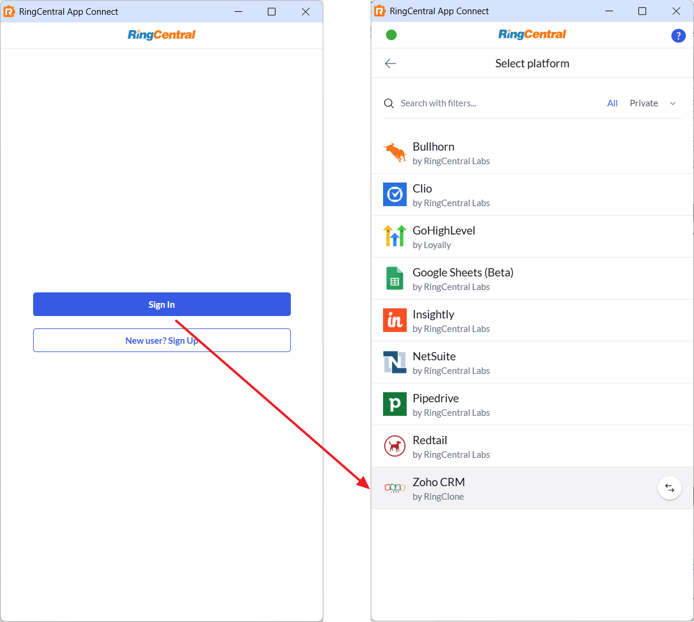
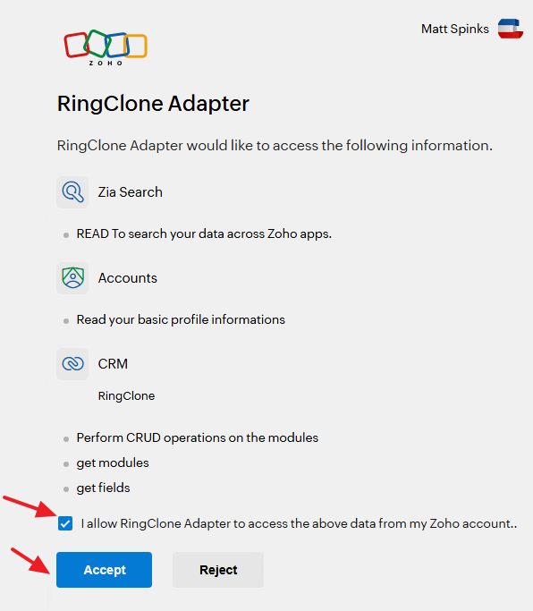

# Setting up App Connect for Zoho

<!-- md:version 2.0 -->

Zoho CRM is a cloud-based customer relationship management software that helps businesses manage sales, marketing, and customer support activities in a single platform. It allows companies to store customer information, track processes, automate tasks, and streamline communication across departments to improve customer engagement and drive sales. Zoho CRM offers a free edition for small teams and paid options with more features for businesses of all sizes.

RingClone's integration with Zoho helps streamline communications with customers, and helps sales teams track communications so that they can have a full 360-view of their customers and deals in the pipeline. With a focus on ease of use, accurate contact matching, and fast deployment, the RingClone Zoho App Connect adapter helps teams work faster while keeping CRM data clean and complete.

## Install the extension

If you have not already done so, begin by [installing App Connect](../getting-started.md) from the Chrome or Edge web stores. 

## Setup the extension

Once the extension has been installed, follow these steps to configure Zoho in the extension. 

1. Sign in to your RingCentral account in the extension, and select the Zoho platform. Make sure to click the "Connect" button.

    { .mw-400 }

2. A window will be opened prompting you to login to your Zoho account. Authorize Zoho and click "Accept".

    { .mw-400 }

When you login successfully, the browser extension will automatically update to show you are connected to Zoho. If you are connected, the button next to Bullhorn will say "logout".

## Call logging activity

The Zoho adapter logs call activity directly to a proper "Call" entity inside your Zoho account. Calls are associated with Contacts. Contacts are determined by name and/or phone number. A feature of App Connect is to allow a user to open all matched contacts when they receive a phone call. If multiple contacts are matched based on that criteria, a popup screen will be displayed allowing the user to select the correct contact from the list of matches.

### Required Permissions for the API User

The Zoho API user associated with these credentials must be granted specific permissions to ensure all necessary data can be accessed and logged. These permissions include:

* **Access to all Contacts**
* **Create/Update/Assign Calls**

Without these permissions, the server-side logging functionality may be incomplete or fail to capture critical event data. It is recommended to create a dedicated API user in Zoho with only the necessary permissions to adhere to the principle of least privilege.
