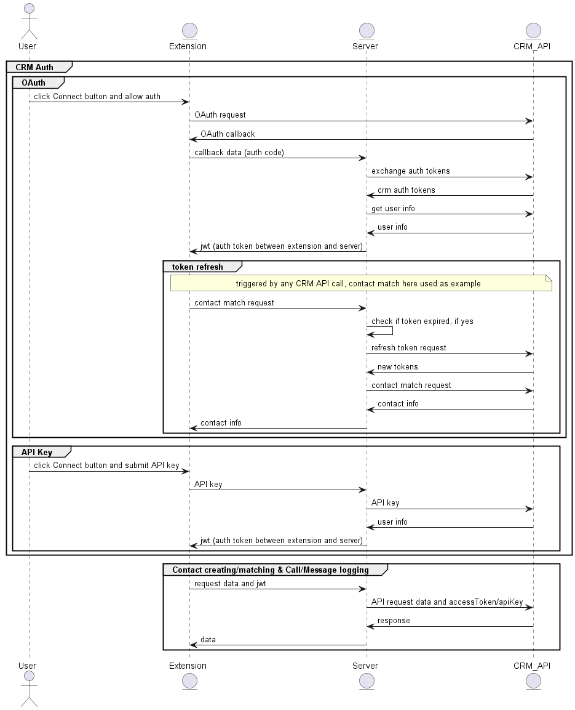

# Implementing your CRM adapter

{! docs/developers/beta_notice.inc !}

App Connect's developer framework comes with everything you need to build an adapter for virtually any target CRM platform. While the [sample adapter](https://github.com/ringcentral/rc-unified-crm-extension/blob/FrameworkRefactor/src/adapters/testCRM/) that is provided through this framework is implemented in Javascript, you are free to implement your server in whatever language you prefer -- provided that it implements the interface properly. However, we recommend most developers utilize this framework directly, as it will dramatically decrease your time to market. 

Every adapter contains two key files or elements:

1. A manifest file that defines and governs app behaviors
2. A server that the Unfied Chrome extension interfaces with to communicate with the target CRM

## How the Chrome extension interfaces with an adapter to talk to a CRM

One can think of an adapter as nothing more than an intermediary service that is responsible for translating actions performed by a user of the Chrome extension, into API calls made to a target CRM that fulfill a user's intent. Take for example when a user logs a call:

1. A user clicks "Log call" from the call history page. 
2. The user fills out a form in which they enter notes and other data related to the call. 
3. The user clicks "Save." 
4. The Chrome extension then packages up the user's input, and sends it to the adapter.
5. The adapter's server receives a request stating, "a user wants to log a call."
6. The adapter's server then calls the target CRM's API to log a call. 

This basic pattern is repeated for every action the framework enables. For those who want to nerd-out on this pattern, the following sequence diagram will describe the process more thoroughly. 

### Sequence diagram

## Working examples

The framework currently contains a total of five natively supported CRMs. These adapters are useful reference implementations for developers to learn from. The following table lists these adapters and what sets them apart from one another technically:

| CRM | Auth type | Contact type | Note |
|-----|-----------|--------------|------|
|Clio|OAuth|Contact|Clio API only supports exact match for contact match by phone number, so users need to use [overriding formats](../users//settings.md#phone-number-formats)|
|Pipedrive|OAuth|Contact|Pipedrive has unique auth process behind OAuth, it's not recommended to be used as OAuth reference|
|Insightly|api key|Lead and Contact|Insightly API only supports exact match for contact match by phone number, so users need to use [overriding formats](../users//settings.md#phone-number-formats)|
|Bullhorn|OAuth|Candidate and Contact|Bullhorn has unique auth process behind OAuth, it's not recommended to be used as OAuth reference|
|Redtail|api key (username & password)|Contact|None|
|NetSuite|OAuth|Contact|NetSuite API only supports exact match for contact match by phone number, so users need to use [overriding formats](../users//settings.md#phone-number-formats)|

## Development process

This guide will walk you through the process of creating an adapter step-by-step. At a high-level however, developers will be expected to do the following:

* [Create a manifest file](manifest.md)
* Implement each of the required adapter interfaces:
    * [Authorization](auth.md)
    * [Contact lookup and matching](contact-matching.md)
    * [Logging, updating and looking up call logs](logging-calls.md)
    * [Logging SMS messages](logging-sms.md)
    * [Creating placeholder contacts](placeholder-contacts.md)
    * [Creating a custom welcome and getting started page](welcome-page.md)
    * [Opening contact and activity pages in the CRM](view-details.md)
* [Deploy your server](deploy.md)
* Configure the App Connect Chrome extension to load your custom adapter

Let's [get started](getting-started.md).

