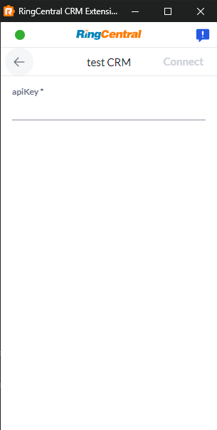
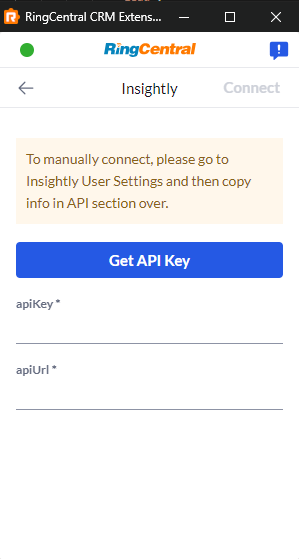

# Authorization and authenticating users with their CRM

App Connect's framework currently supports two different authentication modalities:

* [OAuth](#connecting-to-a-crm-via-oauth). This is the most common form of authentication and authorization supported by most CRMs. 
* [API keys](#connecting-to-a-crm-using-an-api-key). This less common method typically requires a CRM user to retrieve an auth string, often called an "API key," and saving it within the framework. This key is then transmitted with each API request to the CRM. 

Start by editing the `platforms` object within your adapter's [manifest](manifest.md), and setting the `type` property under `auth` to either:

* `oauth`
* `apiKey`

## Connecting to a CRM via OAuth

When implementing OAuth, you will need to login to the target CRM as a developer to retrieve a client ID and client secret. Every CRM is different, so please consult the CRM's API documentation to learn how to generate these two values to uniquely identify your application that will be calling the CRM's APIs. 

Once you have obtained these values, you will need to set the following values in your adapter's manifest:

| Name                             | Type   | Description |
|----------------------------------|--------|-------------|
| `platforms.{crmName}.auth.oauth.authUrl`    | string | The auth URL to initiate the OAuth process with the CRM. Eg. https://app.clio.com/oauth/authorize |
| `platforms.{crmName}.auth.oauth.clientId`   | string | Only used with `authType` equal to `oauth`. The client ID of the application registered with the CRM to access it's API. | 
| `platforms.{crmName}.auth.oauth.redirectUri`| string | You can use your own uri, but the default one `https://ringcentral.github.io/ringcentral-embeddable/redirect.html` should work in most cases. |
| `platforms.{crmName}.auth.oauth.scope`      | string | (Optional) Only if you want to specify scopes in OAuth url. eg. "scope":"scopes=write,read" |
| `platforms.{crmName}.auth.oauth.customState`| string | (Optional) Only if you want to override state query string in OAuth url. The state query string will be `state={customState}` instead. |


### Generating an Auth URL

The framework will compose an OAuth compliant auth URL for you by appending to the `authUrl` the following query string:

    {authUrl}?responseType=code&client_id={clientId}&{scope}&state=platform={name}
		&redirect_uri=https://ringcentral.github.io/ringcentral-embeddable/redirect.html

### Setting the redirect URI

App Connect's framework utilizes a a fixed redirect URI for OAuth. This redirect URI is: 

    https://ringcentral.github.io/ringcentral-embeddable/redirect.html

It should suffice standard OAuth use cases. If there's any special case, please contact us.

### Implement server endpoints

Within your adapter's `index.js` file, implement the following methods.

* [`getAuthType`](interfaces/getAuthType.md)
* [`getOauthInfo`](interfaces/getOauthInfo.md)
* [`getUserInfo`](interfaces/getUserInfo.md)

## Connecting to a CRM using an API key

Some CRMs provide developers access to their API via an API key. An API key is a slightly more cumbersome connection process for users, in that they must go into a technical part of the CRM to retrieve an obscure text string. But, the App Connect framework does what it can to make the process as easy as possible for users. 

To auth a user via an API key, you need to present them with a form in which they will enter all needed credentials. The user will save those values and the framework will stash them a secure database for you. 

### Setup the auth page in the extension

**Sample CRM adapter**

=== "manifest.json"

    ```js 
    {!> src/adapters/testCRM/manifest.json [ln:22-36] !}
    ```

=== "Rendered page"

    { .md-200 }

**Insightly adapter**

=== "manifest.json"

    ```js
    {!> src/adapters/manifest.json [ln:262-294] !}
    ```

=== "Rendered page"

    

### Implement server endpoints

Within your adapter's `index.js` file, implement the following methods.

* [`getAuthType`](interfaces/getAuthType.md)
* [`getOauthInfo`](interfaces/getOauthInfo.md)
* [`getUserInfo`](interfaces/getUserInfo.md)

## Deauthorizing users

Just as one needs to log someone in, they need to log someone out. 

### Implement server endpoints

Within your adapter's `index.js` file, implement the following methods.

* [`unAuthorize`](interfaces/unAuthorize.md)

## Testing your authorization implementation

Now that the necessary server endpoints have been implemented, and the manifest updated, let's test authorization. 

1. Refresh and or save the [Custom CRM config url](../users/developer-options.md#loading-custom-crm-adapter) setting under the extension's options. 
   2. Access the Chrome extension. 
3. Log out and log back into your CRM using the "Connect" button under the Settings tab, or by going through the appropriate CRM login and authorization flow for your adapter.
4. Finally, check to see if any user info was saved in the database (`CHECK.1`)

