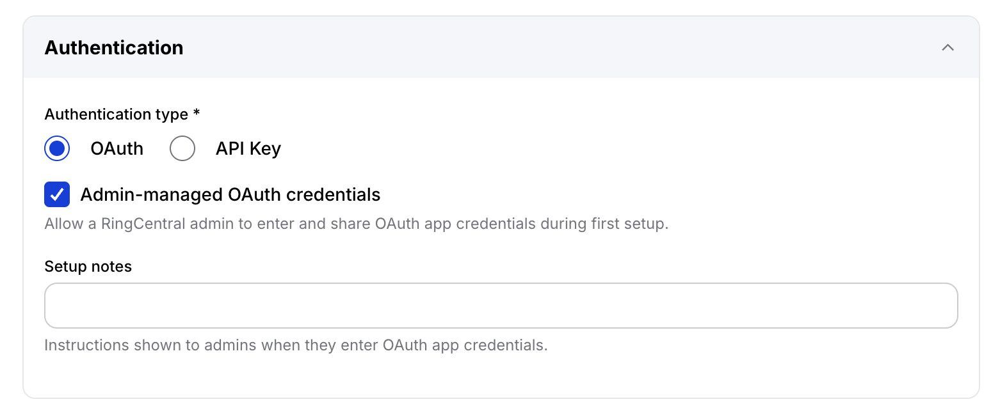
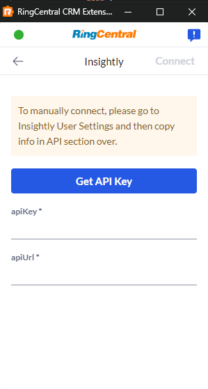

# Authorization and authenticating users with their CRM

App Connect's framework currently supports three different authentication modalities:

* [OAuth](#connecting-to-a-crm-via-oauth). The most common form of authentication, supported by most CRMs.
* [Admin-managed OAuth](#admin-managed-oauth). A variant of OAuth designed for CRMs that require each tenant to register their own application and supply their own credentials. The admin sets up credentials once; all users in the organisation share the connection.
* [API keys](#connecting-to-a-crm-using-an-api-key). A less common method that requires a user to retrieve an API key from the CRM and save it within the framework.

Start by editing the `platforms` object within your connector's [manifest](manifest.md), and setting the `type` property under `auth` to either:

* `oauth`
* `apiKey`

## Connecting to a CRM via OAuth

When implementing OAuth, you will need to login to the target CRM as a developer to retrieve a client ID and client secret. Every CRM is different, so please consult the CRM's API documentation to learn how to generate these two values to uniquely identify your application that will be calling the CRM's APIs. 

Once you have obtained these values, you will need to set the following values in your connector's manifest:

| Name                             | Type   | Description |
|----------------------------------|--------|-------------|
| `platforms.{crmName}.auth.oauth.authUrl`    | string | The auth URL to initiate the OAuth process with the CRM. Eg. https://app.clio.com/oauth/authorize |
| `platforms.{crmName}.auth.oauth.clientId`   | string | Only used with `authType` equal to `oauth`. The client ID of the application registered with the CRM to access it's API. | 
| `platforms.{crmName}.auth.oauth.redirectUri`| string | You can use your own uri, but the default one `https://apps.ringcentral.com/integration/ringcentral-embeddable/latest/redirect.html` should work in most cases. |
| `platforms.{crmName}.auth.oauth.scope`      | string | (Optional) Only if you want to specify scopes in OAuth url. eg. "scope":"scopes=write,read" |
| `platforms.{crmName}.auth.oauth.customState`| string | (Optional) Only if you want to override state query string in OAuth url. The state query string will be `state={customState}` instead. |


### Generating an Auth URL

The framework will compose an OAuth compliant auth URL for you by appending to the `authUrl` the following query string:

    {authUrl}?responseType=code&client_id={clientId}&{scope}&state=platform={name}
		&redirect_uri=https://apps.ringcentral.com/integration/ringcentral-embeddable/latest/redirect.html

### Setting the redirect URI

App Connect's framework utilizes a a fixed redirect URI for OAuth. This redirect URI is: 

    https://apps.ringcentral.com/integration/ringcentral-embeddable/latest/redirect.html

It should suffice standard OAuth use cases. If there's any special case, please contact us.

### Implement server endpoints

Within your connector's `index.js` file, implement the following methods.

* [`getAuthType`](interfaces/getAuthType.md)
* [`getOauthInfo`](interfaces/getOauthInfo.md)
* [`getUserInfo`](interfaces/getUserInfo.md)

## Admin-managed OAuth

Some CRMs require each customer to register their own application in the CRM's developer portal and obtain their own OAuth credentials — a client ID, client secret, and redirect URI unique to their tenant. Asking every end user to supply these values is impractical; they are technical, lengthy, and often only obtainable by an administrator.

Admin-managed OAuth solves this. One administrator provides the credentials once, the framework stores them securely, and all subsequent users in the same organisation connect without ever seeing a credential input.

### How it works

**For the developer — connector registration**

When registering your connector in the Developer Console, select **OAuth** as the auth type and then enable **Admin-managed OAuth credentials**. You will be given a text field where you can write instructions for the admin explaining exactly how to obtain the required credentials from the target CRM's developer portal. Be specific — include the exact steps, the name of each field, and any redirect URI the admin must register.



**For the admin — first-time setup**

The first user in an organisation who attempts to connect to a service configured for admin-managed OAuth will be presented with a credentials form instead of being taken directly to the OAuth flow. This form typically collects:

- Client ID
- Client secret
- Redirect URI

These are the values obtained when the admin registered their application with the CRM. Once submitted, the framework validates the credentials and initiates the OAuth authorisation flow. After a successful authorisation, the credentials are stored at the tenant level.

**For all subsequent users**

Every other user in the same organisation will connect normally via the standard OAuth flow — no credential entry required. The admin-supplied credentials are reused transparently.

### Updating credentials

Admins can review and update their application credentials at any time under the **Admin** tab in App Connect. 

!!! warning
    Editing credentials after a successful connection will invalidate existing sessions for all users in the organisation. Only update these values if you are certain it is necessary — for example, if the CRM application was re-registered or the client secret was rotated.

### Why this matters

Many enterprise and vertical CRMs (particularly those in legal, insurance, and field service) do not offer a shared multi-tenant application model. Admin-managed OAuth allows App Connect to support these CRMs without burdening every user with cryptographic keys they have no way of knowing.

## Connecting to a CRM using an API key

Some CRMs provide developers access to their API via an API key. An API key is a slightly more cumbersome connection process for users, in that they must go into a technical part of the CRM to retrieve an obscure text string. But, the App Connect framework does what it can to make the process as easy as possible for users. 

To auth a user via an API key, you need to present them with a form in which they will enter all needed credentials. The user will save those values and the framework will stash them a secure database for you. 

### Setup the auth page in the extension

**Insightly connector**

=== "manifest.json"

    ```js
    --8<-- "src/connectors/manifest.json:199:231"
    ```

=== "Rendered page"

    

### Implement server endpoints

Within your connector's `index.js` file, implement the following methods.

* [`getAuthType`](interfaces/getAuthType.md)
* [`getOauthInfo`](interfaces/getOauthInfo.md)
* [`getUserInfo`](interfaces/getUserInfo.md)

## Deauthorizing users

Just as one needs to log someone in, they need to log someone out. 

### Implement server endpoints

Within your connector's `index.js` file, implement the following methods.

* [`unAuthorize`](interfaces/unAuthorize.md)

## Testing your authorization implementation

Now that the necessary server endpoints have been implemented, and the manifest updated, let's test authorization. 

1. Go to the [Developer Options](../users/developer-options.md) and click "Clear platform info." This will clear within App Connect any link to an existing CRM. It is not quite a "factory reset" but it is close. 
2. Refresh and reload the App Connect window. When complete, you should be prompted to select the CRM you wish to connect to.  
3. Connect to the CRM you are testing.
4. Finally, check to see if any user info was saved in the database (`CHECK.1`)

