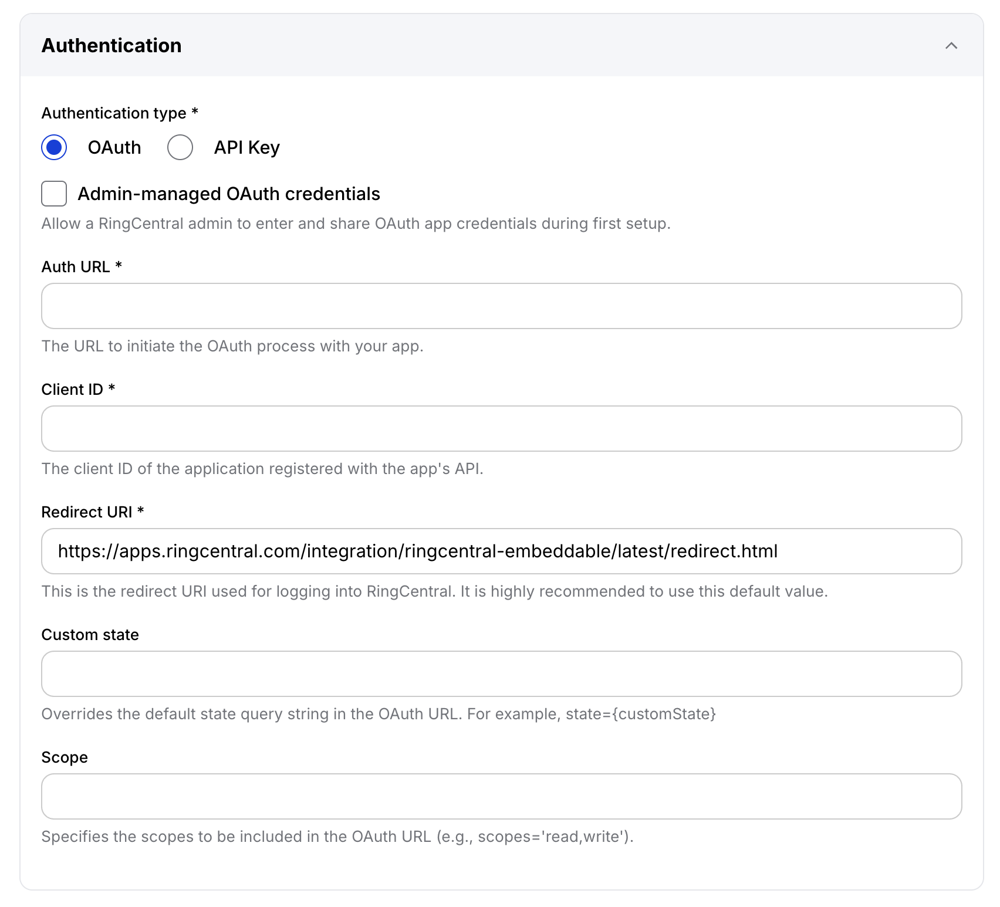
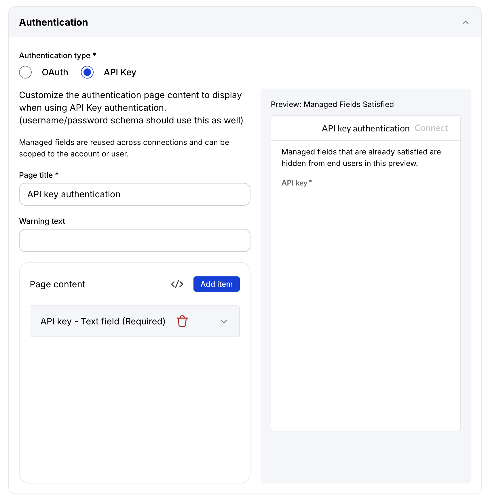

# Authorization

App Connect supports two ways for a connector to authenticate a user against a CRM: **OAuth** and **API Key**. Either one can optionally be **admin-managed**, meaning an administrator supplies some of the required values once, and App Connect reuses them automatically for other users. The manifest controls the client-facing experience; connector interfaces supply secrets, validate credentials, and persist user identity.

## Auth modes

### OAuth

OAuth is the internet-standard authorization protocol. The user is redirected to the CRM's own login page, grants access, and is redirected back — not to the connector, but to App Connect itself. App Connect completes the three-legged OAuth flow and exchanges the resulting code for an access token, using the client secret and token endpoint the connector supplies. The connector never sees the authorization code and never talks to the CRM's token endpoint directly; it only receives the finished access token afterward. Use OAuth whenever the CRM exposes an OAuth 2.0 (or compatible) authorization endpoint — it's the preferred mode because the user never hands their CRM password to App Connect directly.

### API Key

API Key (also called static credentials) covers any auth mechanism where the user has to supply a fixed set of values up front: a literal API key, a username and password, a tenant ID, a subdomain — any combination of text inputs the connector defines in its login form. Use this mode when the CRM doesn't support browser-redirect OAuth, or when it authenticates with a long-lived token or credential pair instead.

### Admin-managed auth

In some CRMs, a value isn't personal to each user — it's shared by everyone in the same organization (company account, dealership, tenant), and only an administrator should ever need to enter it. Admin-managed auth lets a connector mark specific OAuth or API-key fields as **managed**: an administrator supplies the value once, App Connect stores it encrypted at the account (or per-user) level, and it's applied automatically on every later login, without other users seeing it or needing to know it.

This is a modifier on top of OAuth or API Key, not a third auth type — you still set `auth.type` to `oauth` or `apiKey`, and mark the fields that should be admin-supplied. The **Admin-managed OAuth** and **Admin-managed API-key fields** steps below, nested under OAuth and API Key respectively, cover the mechanics for each.

!!! example "VinSolutions: an account-wide dealer ID"
    Every VinSolutions user must supply a dealer ID to authenticate, but the dealer ID is identical for every user at the same dealership. VinSolutions defines `dealerId` as an admin-managed, account-scoped API-key field: an admin enters it once in the Admin tab, and every other user at that dealership authenticates without ever seeing or typing it. Each user still supplies their own Vin Solutions User ID, which is admin-managed at the *user* scope instead — an admin assigns it per person, but the individual user never has to look it up themselves.

!!! example "ServiceTitan: a shared OAuth client ID and secret"
    ServiceTitan provisions one OAuth client ID and client secret per customer account, not per user — every integration user at that company authenticates through the same registered app. Rather than asking each user to track down and paste in a client ID and secret they likely don't have access to, an admin enters those values once through admin-managed OAuth. Every other user in the account then connects through the normal OAuth redirect, with App Connect supplying the shared credentials behind the scenes.

The following two sections walk through each mode step by step, from registering credentials with the CRM through implementing the connector interfaces.

## OAuth

Setting up an OAuth connector follows four steps: obtain credentials from the CRM, enter them into App Connect, optionally mark them as admin-managed, then implement the required interfaces.

### Step 1: Obtain OAuth credentials from the CRM

Register an OAuth application with the target CRM platform as you normally would. The one thing to get right is the **redirect URI** — set it to RingCentral's hosted redirect page, not a URI on your own server:

```
https://apps.ringcentral.com/integration/ringcentral-embeddable/latest/redirect.html
```

**Why this redirect URI?** App Connect's client completes the three-legged OAuth flow on the connector's behalf — the connector's server is never the party that exchanges the authorization code for an access token. Concretely:

1. After the user grants access, the CRM redirects the browser to the RingCentral-hosted page above, with the authorization `code` in the query string.
2. That page hands the code back to the App Connect client.
3. App Connect's server exchanges the code for an access token by calling the CRM's token endpoint directly, using the `clientSecret` and `accessTokenUri` the connector returns from [`getOauthInfo`](interfaces/getOauthInfo.md) — see Step 2 below.
4. The App Connect client passes the resulting access token to the connector, which stores it.

Because App Connect owns the redirect and the exchange, the connector doesn't need to host its own OAuth callback endpoint. If the CRM's app registration requires an exact, allow-listed redirect URI, register the RingCentral-hosted URI above instead of one on your own domain.

Once a token is stored, the developer generally doesn't need to manage or refresh it — App Connect handles that automatically. App Connect does make credentials available to connector interfaces (for example, [`getUserInfo`](interfaces/getUserInfo.md)), but connectors rarely need to read them directly: on every call, App Connect presents the stored credential to the connector in the standard form of a `Bearer` authorization header. If you're building an OAuth connector, don't be surprised if you never see or handle a raw access token in your own code.

### Step 2: Enter the credentials in App Connect

OAuth connectors need two sets of data:

| Source | Data |
| --- | --- |
| Manifest `auth.oauth` | Client-visible authorize URL, client ID, redirect URI, scopes, and state. |
| [`getOauthInfo`](interfaces/getOauthInfo.md) | Server-side token exchange values, especially `clientSecret` and `accessTokenUri`. |

**Auth URL** (`authUrl` in the manifest, labeled "Auth URL" in the Developer Console) is the CRM's OAuth *authorization* endpoint — the page the browser is sent to so the user can log in and grant access. It's not the token endpoint (that's `accessTokenUri`, returned from `getOauthInfo`), and it's publicly documented by the CRM, since the browser navigates to it directly. For example, Bullhorn's [developer documentation](https://help.bullhorn.com/article/How-To-Authenticate-With-the-Bullhorn-REST-API) publishes its authorization endpoint as `https://auth.bullhornstaffing.com/oauth/authorize` — that's the value a Bullhorn connector would put in Auth URL.

The client-visible half (`auth.oauth`) can be entered either through the Developer Console or directly in the manifest:

=== "Developer Console"

    { .mw-600 }

=== "Manifest"

    ```json
    {
      "auth": {
        "type": "oauth",
        "oauth": {
          "authUrl": "https://app.example.com/oauth/authorize",
          "clientId": "public-client-id",
          "redirectUri": "https://apps.ringcentral.com/integration/ringcentral-embeddable/latest/redirect.html",
          "scope": "scope=contacts.read contacts.write",
          "customState": "platform=myCRM"
        }
      }
    }
    ```

The server-side half — `clientSecret` and `accessTokenUri` — never lives in the manifest. Implement [`getOauthInfo`](interfaces/getOauthInfo.md) to return those values instead, typically sourced from environment variables.

### Step 3: Admin-managed OAuth (optional)

Use admin-managed OAuth when each customer must bring their own CRM OAuth app credentials, as with ServiceTitan's per-account client ID and secret.

The flow is:

1. Developer enables admin-managed OAuth in the Developer Console and writes admin setup instructions.
2. The first admin user submits client ID, client secret, token URL, authorization URL, redirect URI, and hostname as required by the connector.
3. App Connect stores those encrypted account-level values.
4. Later users in the same RingCentral account connect through the normal OAuth flow without seeing the credentials.
5. On successful callback, pending credentials are promoted to account-managed credentials.

Connector code usually does not need to know whether credentials came from `getOauthInfo()` or managed OAuth. App Connect resolves managed values before calling `getOauthInfo()`.

### Step 4: Implement the required interfaces

Required interfaces:

- [`getAuthType`](interfaces/getAuthType.md)
- [`getOauthInfo`](interfaces/getOauthInfo.md)
- [`getUserInfo`](interfaces/getUserInfo.md)

Optional OAuth interfaces and hooks:

- `getOverridingOAuthOption({ code, oauthInfo })`
- `checkAndRefreshAccessToken(oauthApp, user, tokenLockTimeout)`
- `authValidation({ user })`
- [`refreshUserInfo`](interfaces/refreshUserInfo.md)
- [`unAuthorize`](interfaces/unAuthorize.md)

## API Key

Setting up an API-key connector follows the same shape: obtain credentials from the CRM, define the login form in App Connect, optionally mark fields as admin-managed, then implement the required interfaces.

### Step 1: Obtain credentials from the CRM

Collect whatever the CRM requires for authentication — a literal API key, a username and password, a tenant ID, a subdomain, or any other combination of values. Unlike OAuth, there's no app registration or redirect URI involved; the connector's login form simply asks the user for these values directly.

### Step 2: Define the login form in App Connect

API-key connectors define a login form in `auth.apiKey.page.content[]`. As with OAuth, this can be entered either through the Developer Console or directly in the manifest:

=== "Developer Console"

    { .mw-600 }

=== "Manifest"

    ```json
    {
      "auth": {
        "type": "apiKey",
        "apiKey": {
          "page": {
            "title": "My CRM",
            "warning": "Paste your CRM API key.",
            "content": [
              {
                "const": "apiKey",
                "title": "API key",
                "type": "string",
                "required": true
              },
              {
                "const": "tenantId",
                "title": "Tenant ID",
                "type": "string",
                "required": true
              }
            ]
          }
        }
      }
    }
    ```

App Connect passes the final resolved credential fields to `getUserInfo()` as `additionalInfo`. It also passes `apiKey` as the selected API-key value.

### Step 3: Admin-managed API-key fields (optional)

Use admin-managed API-key fields when only part of the login form is shared across the account (or across a user's own settings), as with VinSolutions's dealer ID. Mark the relevant field as managed:

```json
{
  "const": "tenantId",
  "title": "Tenant ID",
  "type": "string",
  "required": true,
  "managed": true,
  "managedScope": "account",
  "managedFieldType": "input",
  "hidden": true
}
```

| Field | Description |
| --- | --- |
| `managed` | Marks the field as admin-managed. |
| `managedScope` | `account` stores one encrypted value per RingCentral account. `user` stores one encrypted value per RingCentral extension. |
| `managedFieldType` | `input` renders a free-input field. `dynamic` renders a searchable connector-provided dropdown and is valid only for user-scoped fields. Existing fields default to `input`. |
| `hidden` | Hides the field from normal users. |

App Connect resolves managed values before `getUserInfo()` runs. If required managed values are missing, the login route returns a warning with `missingRequiredFieldConsts`. If a managed login fails, the next attempt can fall back to the full manual form.

For a dynamic user field, implement [`getManagedAuthOptions`](interfaces/getManagedAuthOptions.md). The administrator selects **Update list** beside that field. During first login, App Connect passes the currently entered account values to the connector without persisting them. A successful administrator login persists the submitted values at their declared scopes; failed option loading or login does not change stored account values.

### Step 4: Implement the required interfaces

Required interfaces:

- [`getAuthType`](interfaces/getAuthType.md)
- [`getBasicAuth`](interfaces/getBasicAuth.md)
- [`getUserInfo`](interfaces/getUserInfo.md)

Optional API-key interfaces:

- [`refreshUserInfo`](interfaces/refreshUserInfo.md)

## Logout

Implement [`unAuthorize`](interfaces/unAuthorize.md) when the CRM has token revocation or when you need custom cleanup. At minimum, clear `user.accessToken` and `user.refreshToken` or destroy the user record.

## Testing

Use the extension against a local or tunneled server and verify:

1. The manifest auth page renders the expected fields.
2. OAuth redirects back and saves a user record.
3. API-key login calls `getBasicAuth()` and `getUserInfo()` with resolved `additionalInfo`.
4. Managed auth fields are filled from admin storage when configured.
5. Dynamic managed auth options load from transient account values without saving them.
6. Logout clears or revokes credentials.
