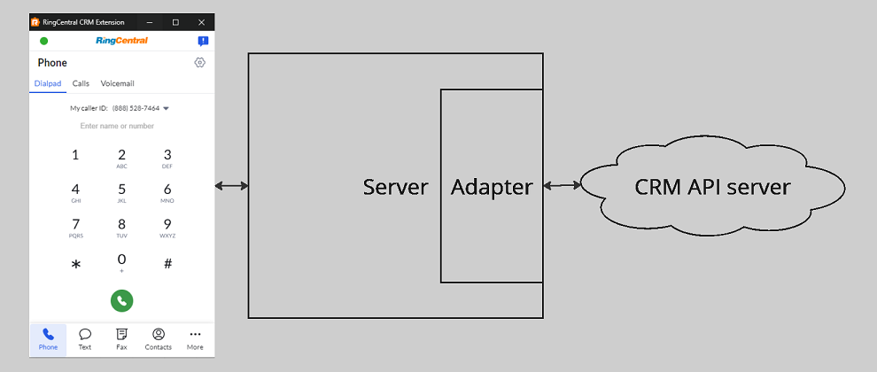
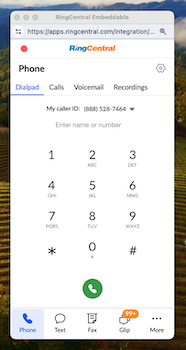

# Integrating with CRMs using the App Connect framework

{! docs/developers/beta_notice.inc !}

Welcome to RingCentral's App Connect integration framework. Using this framework, developers can integrate RingCentral into their web-based CRM more easily. The framework comes with many features, but is principly designed around the following use cases:

* **Embedded phone**. Injecting a phone into the CRM for a fully-integrated communications experience.
* **Call pop**. Automatically opening up a contact record when a call is received.
* **Logging calls**. Capturing and storing call notes in an activity record linked to an associated contact in the CRM.

## Getting started

Follow our simple getting started guide and **in less than 10 minutes** you will have created a dummy server that receives events from App Connect. From there you can begin customizing your adapter to connect to your desired CRM.

[Build your first connector](getting-started.md){ .md-button .md-button--primary }

## Architectural overview

Each CRM supported by this framework is required to implement what is referred to as a "connector." Connectors help broker communications between the client application (the dialer and primary user interface) and the CRM being integrated with. 

Each connector implements the following components:

* A configuration file, or manifest that defines basic metadata and provides a no-code interface for defining common user interactions. 
* A server that implements a prescribed interface that is invoked by the front-end client to perform more complex interactions with the CRM. 

In this guide, you will learn how to build, package and distribute an connector for a CRM.

!!! info "Powered by RingCentral Embeddable"
    { align=right }
	
	App Connect's integration framework is build on top of [RingCentral Embeddable](https://ringcentral.github.io/ringcentral-embeddable/), which itself provides the following capabilities via its unified communications client:

    * Make and receive phone calls.
    * Send and receive SMS.
    * Read and send team chat messages. 
    * Search your RingCentral address book.
    * View a history of past calls.
    * Listen to call recordings.
    * Access and listen to voicemail. 

