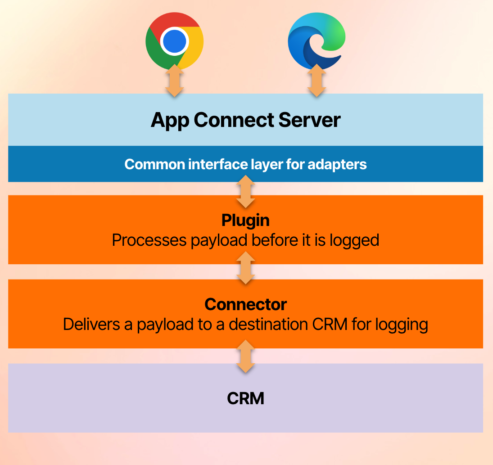
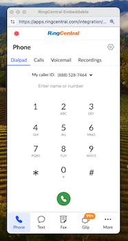

# App Connect Developer Guide

### Jump right in

Follow our simple getting started guide and **in less than 10 minutes** you will have created a dummy server that receives events from App Connect. From there you can begin customizing your connector to connect to your desired CRM.

[Build your first connector](getting-started.md){ .md-button .md-button--primary }

## What can you build as a App Connect developer? 

There are two ways developers can extend the App Connect framework. The first is through "connectors" which assists App Connect in connecting to a system of record like a CRM where users may wish to memorialize communication history and data. The second is through "plugins" which process payloads destined for a CRM. A plugin has the ability to modify a payload prior to it being delivered to a connector for memorialization. 

-   :material-connection:{ .lg .middle } __Connectors__

    ---

    Connectors are used to memorialize communications in a CRM. They perform the valuable function of looking up contacts and logging activities. 

    [:octicons-arrow-right-24: Learn more](getting-started.md)

-   :material-power-plug-outline:{ .lg .middle } __Plugins__

    ---

    Plugins process data before they are memorialized in a CRM. Data passes through them, giving plugins an opportunity to transform data if they wish. 

    [:octicons-arrow-right-24: Learn more](plugins/index.md)

Through the App Connect developer framework, developers works to help RingCentral customers track, record and archive their communications in their CRM of choice. 

## App Connect architecture

Each CRM supported by this framework is required to implement what is referred to as a "connector." Connectors help broker communications between the client application (the dialer and primary user interface) and the CRM being integrated with. Plugins sit between App Connect and the CRM, and allow services to modify a payload before it is stored permanently.

{ .mw-350 }

Whether you are building a connector or a plugin, a developer will implement the following components:

* A **manifest file**, or a configuration that defines basic metadata and provides a no-code interface for defining common user interactions. 
* A **server** that implements a prescribed interface that is invoked by the front-end client to perform more complex interactions with the CRM. 

In this guide, you will learn how to build, package and distribute a plugin and/or connector to a CRM.

!!! info "Powered by RingCentral Embeddable"
    { align=right }
	
	App Connect's integration framework is build on top of [RingCentral Embeddable](https://ringcentral.github.io/ringcentral-embeddable/), which itself provides the following capabilities via its unified communications client:

    * Make and receive phone calls.
    * Send and receive SMS.
    * Read and send team chat messages. 
    * Search your RingCentral address book.
    * View a history of past calls.
    * Listen to call recordings.
    * Access and listen to voicemail. 

