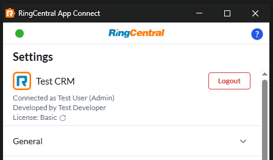
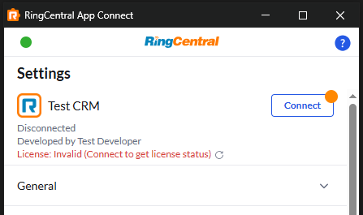

# getLicenseStatus

!!! info "Optional interface"
    If this interface is implemented, you can input logic to talk to your own license service and manage user licenses.

The App Connect framework supports license validation for CRM connectors, allowing you to implement your own licensing service and control access to your connector based on license status. This guide covers how to implement license management in your custom connector.

## Implementing your own license service and enabling license in manifest

To enable license checking for your connector, you need to:

1. Implement your own license validation service
2. Enable license status feature in manifest
3. Implement get license status interface in connector 

### 1. Implement license validation service

It should be implemented in your own system which exposes public APIs for your connector to consume.

In below cases, the APIs will be called:

1. Get license status when users manually refresh it (e.g. after purchasing) or after account authorization/unauthorization.
2. Get license status so to allow/block API calls that require a valid license. 

### 2. Enable license in manifest

First, enable license checking by setting the `useLicense` property to `true` in your connector's manifest file:

**manifest.json**

```json
{
  "platforms": {
    "yourCRM": {
      "name": "yourCRM",
      "displayName": "Your CRM",
      "useLicense": true,
      // ... other platform configuration
    }
  }
}
```

### 3. Implementing license interface in your connector

Your connector must implement the `getLicenseStatus` interface to enable license checking. This function should validate the user's license status and return a standardized response.

#### Function signature

```javascript
async function getLicenseStatus({ userId }) {
    // Implementation here
}
exports.getLicenseStatus = getLicenseStatus;
```

### Response format

The `getLicenseStatus` function must return an object with the following properties:

| Property | Type | Description |
|----------|------|-------------|
| `isLicenseValid` | boolean | Whether the user has a valid license |
| `licenseStatus` | string | Human-readable license status (e.g., "Basic", "Premium", "Expired") |
| `licenseStatusDescription` | string | Additional description or details about the license status. Include links as how Markdown does it. E.g. "Please visit \[here\]\(https://license.myServer.com/purchase\)" |

## License status response display

When license checking is enabled, the App Connect extension will display the license status to users in the extension interface. This helps users understand their current license state and take appropriate action if needed.





## Returning license-related messages in API responses

When license validation fails, your connector should return appropriate error messages to inform users about license issues. The App Connect framework provides a standardized way to return error messages that will be displayed to users.

### Check license before API operations

Before performing any CRM operations, you should verify the user's license status and return appropriate error messages if the license is invalid:

```javascript
async function createCallLog({ user, contactInfo, authHeader, callLog, note, additionalSubmission }) {
    // Check license status first
    const licenseStatus = await getLicenseStatus({ userId: user.id });
    
    if (!licenseStatus.isLicenseValid) {
        return {
            successful: false,
            returnMessage: {
                message: 'License validation failed',
                messageType: 'danger',
                details: [
                    {
                        title: 'License Issue',
                        items: [
                            {
                                id: '1',
                                type: 'text',
                                text: 'Please go to user settings page and refresh license status'
                            }
                        ]
                    }
                ],
                ttl: 5000
            }
        };
    }
    
    // Proceed with call log creation if license is valid
    try {
        // ... implementation
    } catch (error) {
        // ... error handling
    }
}
```
