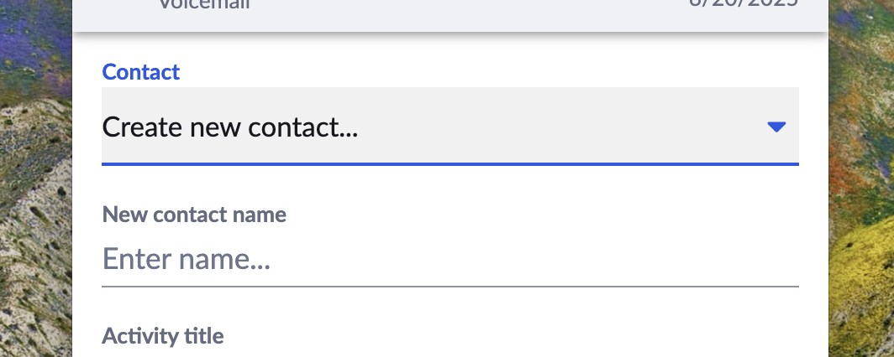

# Lead creation

--8<-- "docs/developers/beta_notice.inc"

A common goal for App Connect connectors is to log every call — regardless of whether the caller already exists as a contact in the CRM. To achieve this, many developers implement auto-contact-creation logic directly inside their `findContact` interface: if a lookup returns no matches, they create a contact on the spot and return it as if it were found.

While this works, it conflates two responsibilities inside a single interface and bypasses user intent. App Connect has a built-in mechanism for this exact scenario that is better for both developers and users.

## The anti-pattern to avoid

```js
// ❌ Don't do this
async function findContact({ phoneNumber }) {
  const contact = await crm.searchByPhone(phoneNumber);
  if (!contact) {
    // silently creates a contact the user didn't ask for
    return await crm.createContact({ phone: phoneNumber });
  }
  return contact;
}
```

Embedding contact creation inside `findContact` causes several problems:

- `findContact` is called on every incoming and outgoing call — including calls the user has no intention of logging. Creating contacts for all of them pollutes the CRM with unwanted records.
- It removes user choice entirely. The user's auto-logging preferences are never consulted.
- It makes the connector harder to reason about and test, since one interface is doing two jobs.

## How the framework handles it

App Connect already has a defined flow for unknown contacts that keeps each interface focused on a single responsibility:

```
Incoming call
     │
     ▼
findContact called
     │
     ├─── Contacts found ──────────────────► Normal flow
     │
     └─── No contacts found
               │
               ▼
     Check user's auto-logging preference
     "What should I do when a caller has no contact record?"
               │
               ├─── "Do nothing" ──────────► Call goes unlogged
               │
               └─── "Create a placeholder" ► createContact called
                                                   │
                                                   ▼
                                          Contact created with
                                          Caller ID name (if available)
                                          or admin-defined placeholder
                                          name (e.g. "Unknown Caller")
                                                   │
                                                   ▼
                                          Call logged against
                                          new contact record
```

The user controls this behaviour via their [auto-logging preferences](../users/logging-conflicts.md#resolving-conflicts-automatically). When the preference is set to "create a placeholder contact", the framework calls your connector's `createContact` interface automatically — you don't need to wire this up yourself.

## Recommended implementation

Keep `findContact` focused solely on lookup. Return an empty list when no match is found and let the framework take it from there:

```js
// ✅ Do this instead
async function findContact({ phoneNumber, phoneNumberList }) {
  const results = [];
  for (const number of phoneNumberList) {
    const match = await crm.searchByPhone(number);
    if (match) results.push(match);
  }
  return results; // return empty array if nothing found — that's correct
}
```

Then implement `createContact` to handle the creation case cleanly:

```js
async function createContact({ phoneNumber, name }) {
  return await crm.contacts.create({
    name: name ?? 'Unknown Caller',
    phone: phoneNumber,
  });
}
```

When the framework calls `createContact`, it will pass the caller's name from Caller ID if it was available, or the placeholder name configured by the admin. Your implementation just needs to write that data to the CRM.

## Manual contact creation by users

Users can also create contacts on demand when logging a call manually. If a user opens the call log UI and no contact is matched, they are presented with a "Create contact" option directly in the interface.

<figure markdown>
  
  <figcaption>Users can create a contact directly from the call log prompt</figcaption>
</figure>

This flow also calls your `createContact` interface, so a single clean implementation handles both the automated placeholder case and the manual case. See [Creating a contact](../users/logging-conflicts.md#create-a-contact) in the user documentation for more detail on what the user experiences.

## Interfaces used

- [`findContact`](interfaces/findContact.md) — return matched contacts, or an empty list
- [`createContact`](interfaces/createContact.md) — create a new contact record from a name and phone number
