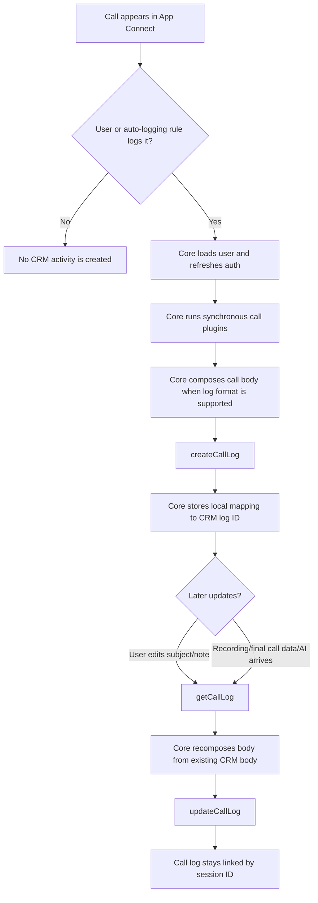

# Logging Calls

Call logging creates and updates CRM activity records for RingCentral calls. The runtime handles routing, auth refresh, plugin execution, local log linkage, and central log-body composition. The connector writes the final data to the CRM.

## Interfaces

Implement:

- [`createCallLog`](interfaces/createCallLog.md)
- [`updateCallLog`](interfaces/updateCallLog.md)
- [`getCallLog`](interfaces/getCallLog.md), recommended for edit/update flows
- [`upsertCallDisposition`](interfaces/upsertCallDisposition.md), optional for disposition or related-entity fields
- [`getLogFormatType`](interfaces/getLogFormatType.md), recommended so core can compose consistent log details

## Flow

## Central Log Composition

If `getLogFormatType()` returns `text/plain`, `text/html`, or `text/markdown`, core builds `composedLogDetails` before calling `createCallLog` or `updateCallLog`.

The composed body can include:

- agent notes
- call session ID
- RingCentral user name and number
- subject
- contact phone number
- date/time using user settings
- duration and result
- recording link
- Smart Notes/AI summary and transcript
- ACE/RingSense transcript, summary, score, bulleted summary, and link
- call legs

If your CRM needs a fully custom body, return another format value such as `custom` and build the body in the connector.

## Recordings And Finalized Data

Recordings and finalized call data can arrive after the first log is created. Expect `updateCallLog` to be called more than once for the same call session.

Use `existingCallLog.thirdPartyLogId` as the CRM log ID. When core can fetch the existing CRM body through `getCallLog`, it passes the full response as `existingCallLogDetails` and the recomposed body as `composedLogDetails`.

## Avoid Overwriting CRM Edits

Users can edit the CRM activity directly before a later update arrives. Prefer targeted update logic:

- read the current CRM body in `getCallLog`
- let core compose from the existing body when using supported formats
- update only fields your connector owns
- avoid replacing unrelated CRM fields

## Server-Side Call Logging

When server-side call logging creates or updates a log, `isFromSSCL` is true. The note can come from the temporary note cache when `USE_CACHE` is enabled.

If server-side logging should assign CRM owners, implement [`getUserList`](interfaces/getUserList.md) and configure `serverSideLogging.enableUserMapping` in the manifest.

## Internal Extension Numbers

Set `enableExtensionNumberLoggingSetting: true` in the platform manifest to show the user setting for extension-number logging. When enabled, `findContact` receives `isExtension` so your connector can search internal extensions differently from PSTN numbers.

## Testing

1. Connect the CRM user.
2. Confirm `/implementedInterfaces?platform=<name>` shows call logging methods.
3. Match or create a test contact.
4. Log a call and verify the CRM record and local `callLogs` row.
5. Edit the call log from App Connect and verify `getCallLog` then `updateCallLog`.
6. Test a recorded call and verify later recording updates.
