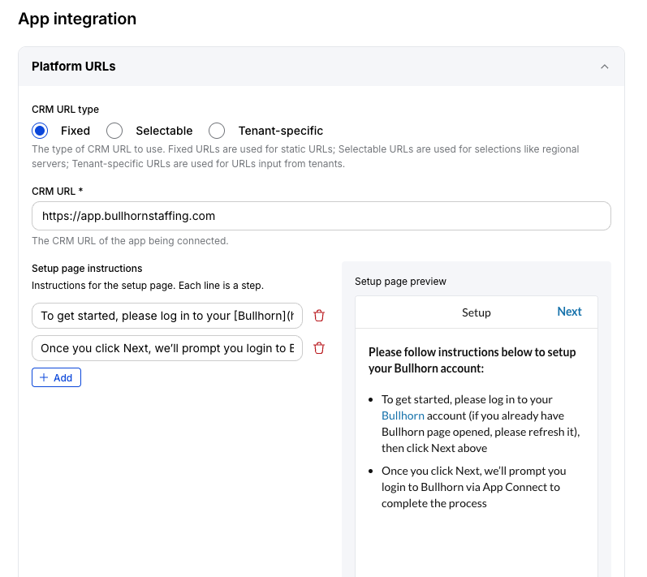
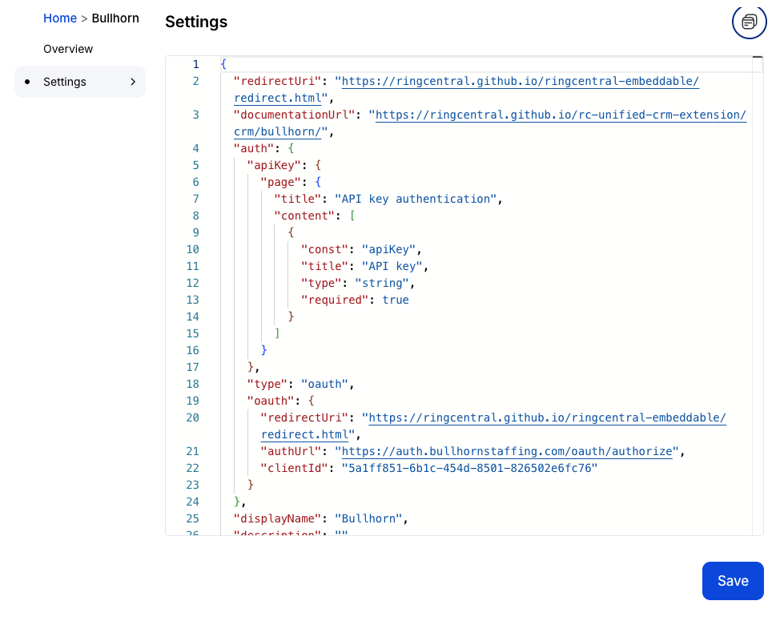

# Configuring your connector's manifest

--8<-- "docs/developers/beta_notice.inc"

An connector's manifest file helps a developer to instruct the framework on how to interface with your connector. It enables developers to customize the user interface within certain boundaries, enables authentication and connectivity with the target CRM and more. 

Below you will find an explanation of the many properties found within a manifest file. 

!!! info "Building a plugin instead?"
    This page covers the manifest used by full CRM connectors. If you are building a plugin to process logging payloads rather than a CRM integration, please refer to the [plugins guide](plugins/index.md).

## Editing your manifest file

The [App Connect Developer Console](https://appconnect.labs.ringcentral.com/console) provides a user interface for editing and managing your connector's manifest file. This is the recommended way to edit your manifest file as it will allow you to preview many of your changes in real time, and ensures the manifest created is valid. 



### Editing your manifest directly

Some developers may prefer to edit and manage their manifest file directly by editing its source. You can do this on your local filesystem, or via the App Connect developer console. 



## Basic properties

These basic properties 

| Name          | Type   | Description                                                                                                           |
|---------------|--------|-----------------------------------------------------------------------------------------------------------------------|
| `author`      | string | The author of the connector. This is displayed to end users within the Chrome extension.                                |
| `platforms`   | ARRAY of object | An array of [platforms](#platform-configuration) being integrated with. Each element of this array defines a different CRM. |
| `serverUrl`   | string | The base URL the Chrome extension will used when composing requests to your connector. The URL should utilize HTTPS and should omit the trailing slash (`/`). For example: `https://my-connector.myserver.com` |
| `version`     | string | The version of your connector. This is displayed to end users within the Chrome extension. |

### Platform configuration

Each manifest file contains an array of `platform` objects. This is helpful for developers who manage multiple CRM connectors from the same server. 

The platforms property is an associative array. Each key should be a unique identifier for the crm. The value of each element is an object with the following properties. 

| Name             | Type            | Description |
|------------------|-----------------|-------------|
| `name`           | string          | The name of the CRM. |
| `displayName`           | string          | The display name of the CRM. |
| `urlIdentifier`  | string          | The URL for which this CRM will be enabled. When the CRM is enabled for a domain, the extension's orange quick access button will appear. (`*` for wildcard match is supported) |
| `auth`       | object          | Contains all info for authorization. [Details](#authorization) |
| `canOpenLogPage` | boolean         | Set to `true` if the corresponding CRM supports permalinks for a given activity/log. When set to `true` users will have the option view/open the activity log in the CRM from the call history page. When set to `false`, users will open the contact page instead. |
| `contactTypes`   | ARRAY of object | (Optional) CRMs often adopt unique vernaculars to describe contacts. Provide the enumerated list of contact types supported by the corresponding CRM. Each object has `display` and `value`. |
| `contactPageUrl` | string          | A format string to open a CRM's contact page, e.g.`https://{hostname}/person/{contactId}`. Supported parameters: `{hostname}`, `{contactId}`, `{contactType}`|
| `embeddedOnCrmPage` | object       | The rendering config for embedded page. |
| `logPageUrl`|string |  A format string to open CRM log page. Eg.`https://{hostname}/activity/{logId}`. Supported parameters: `{hostname}`, `{logId}`, `{contactType}`|
| `page`           | object          | The rendering config for all pages. |
|`requestConfig`| object| Contains http request config for client extension, including `timeout` (number in seconds)|
| `embedUrls`      | array of string | (Optional) A list of URLs (or URL patterns) on which the App Connect panel will be embedded. When a user navigates to one of these URLs, the panel is automatically shown. Supports `*` wildcards. See [Embed URLs](#embed-urls). |
| `serverSideLogging` | object | (Optional) Configuration for [server-side call logging](#server-side-logging). |
| `developer`      | object  | (Optional) Identifies the connector author. Contains `name` (string) and `url` (string) linking to the developer's website. |
| `documentationUrl` | string | (Optional) URL to the connector's end-user documentation. Shown in App Connect as a help link. |
| `releaseNotesUrl` | string | (Optional) URL to the connector's release notes or changelog. |
| `getSupportUrl`  | string  | (Optional) URL users are directed to when requesting support for this connector. |
| `writeReviewUrl` | string  | (Optional) URL where users can leave a review for the connector. |
| `rcAdditionalSubmission` | boolean | (Optional) When `true`, the framework sends additional RingCentral call metadata to the connector alongside the standard call log payload. |
| `trackSmsTypingDuration` | boolean | (Optional) When `true`, the framework tracks and reports how long an agent spent composing an SMS message. |
| `disableDisposition` | boolean | (Optional) When `true`, the call disposition selector is hidden from the call logging form regardless of user settings. |

The client-side authorization url that is opened by the extension will be: `{authUrl}?responseType=code&client_id={clientId}&{scope}&state=platform={name}&redirect_uri=https://apps.ringcentral.com/integration/ringcentral-embeddable/latest/redirect.html`

## Authorization

`platform` has `auth` object which has following parameters:

| Name             | Type            | Description |
|------------------|-----------------|-------------|
| `type`       | string          | The authorization mode utilized by the target CRM. Only two values are supported: `oauth` and `apiKey`. Setting up auth is covered in more detail in the [Authorization](auth.md) section. |
| `oauth`        | object       | Only used with `type` equal to `oauth`. It contains `authUrl`, `clientId` and `redirectUri`. |
| `apiKey`| object| Only used with `type` equal to `apiKey`. It contains [`page`](manifest-pages.md#customizing-apikey-auth-page) |

### oauth parameters

| Name          | Type   | Description |
|-|-|-|
| `authUrl`     | string | Only used with `authType` equal to `oauth`. The auth URL to initiate the OAuth process with the CRM. |
| `clientId`    | string | Only used with `authType` equal to `oauth`. The client ID of the application registered with the CRM to access it's API. |
| `redirectUri` | string | The Redirect URI used when logging into RingCentral (not the CRM). It's recommended to use the default value of `https://apps.ringcentral.com/integration/ringcentral-embeddable/latest/redirect.html`. |
| `customState` | string | (Optional) Only if you want to override state query string in OAuth url. The state query string will be `state={customState}` instead. |
| `scope`       | string | (Optional) Only if you want to specify scopes in OAuth url. eg. "scope":"scopes=write,read" |

## Embed URLs

The `embedUrls` property lists the pages of the CRM's web application where App Connect should automatically appear. When a user navigates to a matching URL, the extension panel is opened without the user having to manually click the App Connect icon.

This is distinct from `urlIdentifier`, which controls when the App Connect quick-access button is visible in the browser toolbar. `embedUrls` controls when the panel opens automatically.

Values support `*` as a wildcard. Use it to match any subdomain or any path segment.

```json
"embedUrls": [
  "https://*.pipedrive.com/*"
]
```

All built-in connectors use a single wildcard pattern that matches the CRM's entire domain:

| CRM          | embedUrls pattern                        |
|--------------|------------------------------------------|
| Pipedrive    | `https://*.pipedrive.com/*`              |
| Insightly    | `https://*.insightly.com/*`              |
| Clio         | `https://*.clio.com/*`                   |
| Bullhorn     | `https://*.bullhornstaffing.com/*`       |
| NetSuite     | `https://*.app.netsuite.com/*`           |
| Google Sheets| `https://docs.google.com/*`              |

You can supply multiple patterns if the CRM spans more than one domain, or if you want to restrict embedding to specific sections of the UI:

```json
"embedUrls": [
  "https://app.example.com/contacts/*",
  "https://app.example.com/deals/*"
]
```

## Server-side logging

The `serverSideLogging` property configures App Connect's server-side call logging service, which logs calls automatically on behalf of users without requiring them to interact with the extension.

| Name                      | Type            | Description |
|---------------------------|-----------------|-------------|
| `url`                     | string          | The URL of the server-side logging endpoint on your connector. |
| `useAdminAssignedUserToken` | boolean       | When `true`, the framework uses an admin-assigned token to make API calls on behalf of users rather than each user's individual OAuth token. |
| `enableUserMapping`       | boolean         | When `true`, the Admin settings in App Connect show a user-mapping UI that allows admins to map RingCentral users to CRM users. |
| `additionalFields`        | array of object | (Optional) Connector-specific configuration fields shown in the Admin settings UI. Each element has the same structure as [`page.callLog.additionalFields`](manifest-pages.md#adding-custom-fields-to-logging-forms). |

### additionalFields for server-side logging

The `additionalFields` array under `serverSideLogging` defines extra fields that an administrator must fill in once when configuring server-side logging. These values are then available to the [`getServerLoggingSettings`](interfaces/getServerLoggingSettings.md) and [`updateServerLoggingSettings`](interfaces/updateServerLoggingSettings.md) lifecycle hooks.

Common uses include collecting CRM API credentials (username and password) that the server uses to log calls on behalf of all users.

```json
"serverSideLogging": {
  "url": "https://my-connector.example.com",
  "useAdminAssignedUserToken": false,
  "enableUserMapping": true,
  "additionalFields": [
    {
      "const": "apiUsername",
      "title": "CRM API Username",
      "type": "inputField"
    },
    {
      "const": "apiPassword",
      "title": "CRM API Password",
      "type": "inputField"
    }
  ]
}
```

## Manifest overrides

The `override` property allows you to define conditions under which certain manifest values are replaced with alternative values at runtime. This is primarily used to support regional CRM deployments. See [Regional services](regional-services.md) for full documentation.

```json
"override": [
  {
    "triggerType": "hostname",
    "triggerValue": "au.app.clio.com",
    "overrideObjects": [
      {
        "path": "auth.oauth.authUrl",
        "value": "https://au.app.clio.com/oauth/authorize"
      }
    ]
  }
]
```

