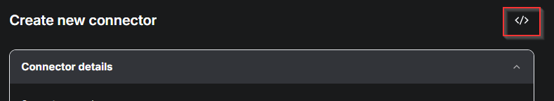
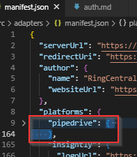

# Migration Guide

This guide covers migrating from version 1.6.x to 1.7.x, which introduces a new way to manage manifests. The primary changes are on the manifest management side - there is NO change required for server adapter (connector). This migration involves a few simple steps and takes advantage of the convenient features provided by our developer console.

## Register Your Connector

1. Navigate to [Developer Console](https://appconnect.labs.ringcentral.com/console) and log in with your RingCentral account
2. Enter the basic information for your connector
3. Create a new connector

You can reuse your existing `manifest.json` file by following these steps:

**Step 1: Switch to JSON Editor**

Click the "JSON" button in the developer console to switch to the JSON editor mode.

**Step 2: Copy Your Manifest**

Copy the CRM object from your existing `manifest.json` file and paste it into the JSON editor. This will automatically populate most of the connector configuration fields.

4. Switch back to form view - most fields will be automatically populated
5. Copy your server URL to the `Connector server URL` field
6. Scroll down and click `Create`

You now have a private connector that is only visible within your organization.

## Connect with the New Client

Download the beta client build from [here](https://rc-unified-crm-extension-serverlessdeploymentbuck-kvb7fti23x1f.s3.us-east-1.amazonaws.com/dist.zip). This beta client requires manual installation from your local machine.

> **Note:** The Chrome Web Store version allows users to register CRM platforms by opening the extension from the CRM page. In this beta version, users select a CRM from a pre-configured list in the developer console.

To connect with the new client:

1. Open the extension from anywhere
2. Log in with your RingCentral account
3. You'll see a list of available connectors, including both public connectors and the private one you just created

### Setup Guide

The final step is configuring the CRM hostname in your connector profile.

There are 3 types of hostname configurations (using `mycrm.com` as an example):

- **Fixed**: For static URLs (e.g., `mycrm.com` for all requests)
- **Selectable**: For regional servers or predefined options (e.g., `mycrm.com/us`, `mycrm.com/au`)
- **Tenant-specific**: For user-provided URLs (e.g., `mySubDomain.mycrm.com`)

To improve the user experience, you can add setup instructions on the configuration page to guide end users through the process.

After you have made the changes to connector profile, save it and reload the extension, and you should be able to see the changes.

> **Note:** To clear current CRM info, you can either go to extension option or do it in extension UIs under user settings -> developer settings

## Test Your Setup

That's it! Congratulations on completing the migration. 

Give your connector a try and feel free to contact da.kong@ringcentral.com if you encounter any issues.