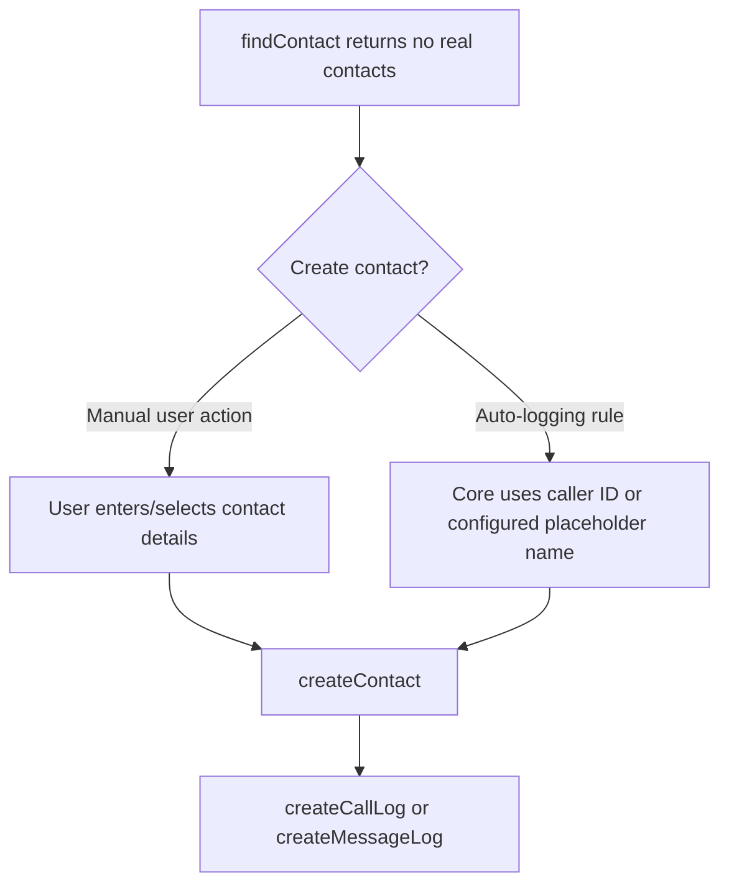

# Placeholder Contacts

A placeholder contact is a CRM contact created for a phone number that did not match an existing CRM record. The connector only creates it when the user or an auto-logging rule chooses to log against that unknown number.

## Runtime Flow



## Connector Responsibilities

Implement [`createContact`](interfaces/createContact.md). It receives:

- `phoneNumber`
- `newContactName`
- `newContactType`
- `additionalSubmission`
- `user`
- `authHeader`

Return `contactInfo` with at least `id` and `name`.

## Do Not Auto-Create In findContact

`findContact` runs for calls and messages the user may never log. Creating contacts there can pollute the CRM. Return no matches and let the configured logging flow decide whether to create a contact.

## Manifest Contact Types

If users need to choose a CRM entity type, define `contactTypes`:

```json
{
  "contactTypes": [
    { "display": "Person", "value": "Person" },
    { "display": "Company", "value": "Company" }
  ]
}
```

The selected value is passed to `createContact` as `newContactType`.

## Testing

1. Call or message an unknown number.
2. Log the communication and choose create contact.
3. Verify `createContact` creates the CRM record.
4. Verify the log is created against the new contact.
5. Test the auto-logging placeholder rule if your account uses it.
