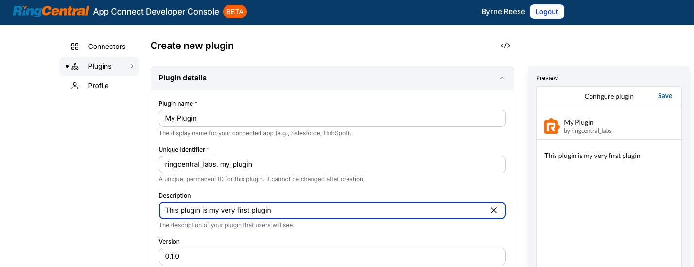
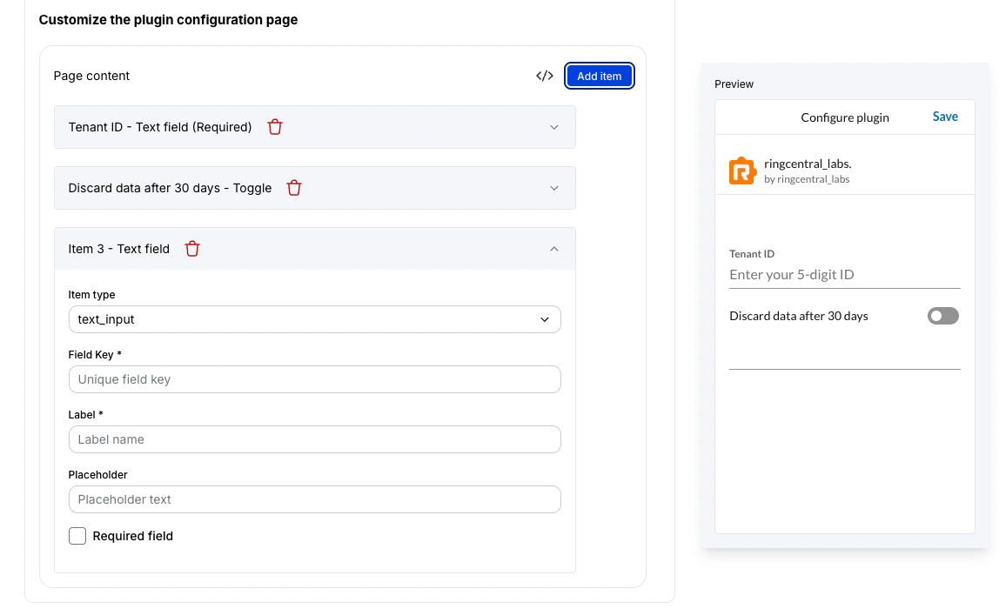

# Extending App Connect with plugins

!!! info "Looking to connect your CRM to App Connect? Try a [connector](../getting-started.md) instead."

Plugins are a light-weight method for allow a service to process content and data before being delivered to a connector for memorialization inside a CRM. A plugin focuses on activity logging workflows by intercepting log data to enrich it, or performing additional parallel actions.

Use a plugin when you want to extend logging behavior.

## Plugin development workflow

Creating a plugin is a multi-step process:

1. A developer **registers a plugin** profile in the [Developer Console](https://appconnect.labs.ringcentral.com/console).
2. An admin logs into App Connect and installs that plugin to their account.
3. An admin, if the plugin supports the capability, can then customize and configure the plugin. 
4. Going forward, for every payload that might be sent to a CRM, the payload is first sent to each installed plugin giving each an opportunity to perform some operation on the payload. 

## Configuring your plugin

To get started, login to the [Developer Console](https://appconnect.labs.ringcentral.com/console), click the "Plugins" tab, and then "Create new plugin." You will begin by configuring your plugin so that the App Connect framework knows how to interface with it. You are free to edit the configuration manually if you choose, but the Developer Console makes this much easier. 

{ .mw-350 }

### Endpoint url

You will need to deploy a server endpoint that will receive callbacks from the App Connect framework. Enter the URL of this endpoint into this field. 

### Supported log types

Plugins can process payloads for one or more communication modalities. Use this field to identify which of these modalities your plugin will process. This is captured in the `supportedLogTypes` manifest property. You can choose between the following values:

* `call`
* `sms`
* `fax`

App Connect only invokes the plugin when the current activity matches one of those types.

### Synchronous vs asynchronous plugins

When developing a plugin you will choose between two ways of interfacing with App Connect - either synchronously or asynchronously. 

* A **synchronous** plugin is what is used to modify payload before they are delivered to a connector for memorialization. They generally need to be highly performant because all logging is blocked while the plugin is processing the payload. 
* An **asynchronous** plugin has no ability to modify the payload, but can process the data independently. This kind of plugin is useful when the service is simply intercepting the data and performing some other function on the data without modifying it. 

#### Synchronous processing

!!! warning "Please make sure not to remove fields as the data structure must be kept the same for logging process to work properly"

Synchronous plugins run inline during logging. The server sends the current payload to the plugin endpoint, waits for a response, and then continues normal logging using the plugin's returned data.

Use this mode when your plugin needs to transform the final payload that App Connect saves into the CRM.

#### Asynchronous processing

Asynchronous plugins run as a background job. When a communication is being prepared for logging, App Connect creates an async task record, invokes the plugin, and continues normal logging without waiting for the plugin to finish.

The client stores async task IDs locally and polls App Connect every five minutes to summarize task status back to the user.

Use this mode when your plugin performs side effects that do not need to block the main CRM log save.

### Support OAuth

Check this option if a user/admin is expected to login to a service in order to use and/or setup your plugin. 

### Require License

Check this option if you intend to monetize the plugin you build. Checking this box will result in App Connect periodically sending you a heartbeat to check the license status of a user. This empowers you to disable functionality if a user is not yet entitled to the functionality you provide. In addition, it provides you with a way of sending a message/link to the user to make the necessary purchase before using your plugin. 

### Define custom configuration options

Just as you can with connectors, you can define custom configuration properties for plugins. These properties can be set by users, or if an admin chooses, can be forcibly set by an admin. 

{ .mw-350 }

## Next: Implement your server

Now that the plugin is configured and setup properly, you need to implement your server endpoints. This can be done without the need for the entire App Connect framework. 

[Build your plugin server](server.md){ .md-button .md-button-primary }
