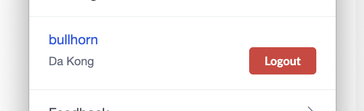

# Unauthorizing users

{! docs/developers/beta_notice.inc !}

The framework will automatically present to a user the controls they need to connect or disconnect from a CRM. In the event that a user is logged in, a "Logout" button will be made available to them. 



When this logout button is clicked, the CRM extension will call the server to deauthorize the current user in the corresponding CRM. In so doing, the adapter should revoke the user's access token for the CRM, and ensure it is properly disposed of..

### Endpoint

* HTTP method: POST
* HTTP endpoint: `<server base URL>/unAuthorize`

### Request parameters

| Parameter  | Description                                                                     |
|------------|---------------------------------------------------------------------------------|
| `jwtToken` | An encrypted string that includes the current user's ID and the associated CRM. |

The server will need to decrypt the `jwtToken` received in the request using the `APP_SERVER_SECRET_KEY` configuration parameter. The decrypted string will have the following structure:

```js
{
  'id': 'some_user_id',
  'platform': 'the_associated_crm'
}
```

The server then needs to lookup the [User](https://github.com/ringcentral/rc-unified-crm-extension/blob/FrameworkRefactor/server/src/models/userModel.js) associated with the provided `id` in the server's database. 

Finally, now that you have in your context the full user record, your adapter will need to make the necessary API calls to deauthorize the user's session with the associated CRM. 

### Sample code

=== "Sample adapter"
    ```js
    {!> server/src/platformModules/testCRM.js [ln:121-141]!}
    ```

=== "Pipedrive adapter"

    ```js
    {!> server/src/platformModules/pipedrive.js [ln:83-105]!}
    ```

