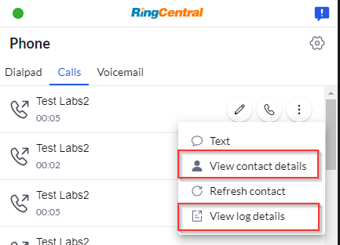

# View contact and log details

For a matched contact or a logged call, the extension supports to open the corresponding page on CRM.

To configure this feature, there are several fields to setup in `manifest.json`.

| Name             | Type            | Description |
|------------------|-----------------|-------------|
| `canOpenLogPage` | boolean         | Set to `true` if the corresponding CRM supports permalinks for a given activity/log. When set to `true` users will have the option view/open the activity log in the CRM from the call history page. When set to `false`, users will open the contact page instead. |
| `contactPageUrl`| string| A format string to open CRM contact page. Eg.`https://{hostname}/person/{contactId}`. Supported parameters: `{hostname}`, `{contactId}`, `{contactType}`|
| `logPageUrl`|string |  A format string to open CRM log page. Eg.`https://{hostname}/activity/{logId}`. Supported parameters: `{hostname}`, `{logId}`, `{contactType}`|

