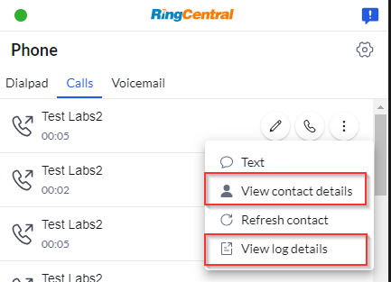

# View Contact And Log Details

App Connect can open the corresponding CRM contact or activity page for matched contacts and logged calls.



Configure this in the platform manifest:

| Field | Description |
| --- | --- |
| `canOpenLogPage` | When true, logged activities open `logPageUrl`. When false, they open `contactPageUrl`. |
| `contactPageUrl` | Contact URL template. Supports built-in URL tokens and custom setting tokens. |
| `enableFallbackContactPageUrl` | Enables the call-pop fallback URL when no existing contact is matched. |
| `fallbackContactPageUrl` | Fixed URL opened by call-pop when fallback is enabled and no existing contact is matched. Supports built-in URL tokens and custom setting tokens. |
| `logPageUrl` | Activity/log URL template. Supports built-in URL tokens and custom setting tokens. |

Example:

```json
{
  "canOpenLogPage": true,
  "contactPageUrl": "https://{hostname}/contacts/{contactId}",
  "enableFallbackContactPageUrl": true,
  "fallbackContactPageUrl": "https://{hostname}/contacts",
  "logPageUrl": "https://{hostname}/activities/{logId}"
}
```

Values come from connector responses:

- `contactId` and `contactType` come from contact lookup or log submission data.
- `logId` comes from `createCallLog` or `createMessageLog`.
- `hostname` comes from the connected user record.
- Custom setting tokens come from the merged user/admin settings object. Use the setting item `id` directly, for example `{contactBoardId}` reads `userSettings.contactBoardId.value`.

For example, a connector can define a custom setting for a Monday.com contacts board:

```json
{
  "settings": [
    {
      "id": "mondayOptions",
      "type": "section",
      "name": "Monday options",
      "items": [
        {
          "id": "contactBoardId",
          "type": "inputField",
          "name": "Contact board ID"
        }
      ]
    }
  ],
  "contactPageUrl": "https://{hostname}/boards/{contactBoardId}/pulses/{contactId}",
  "logPageUrl": "https://{hostname}/boards/{contactBoardId}/pulses/{logId}"
}
```

The fallback contact page URL is only used by call-pop. Manual view-contact actions keep the existing behavior and do nothing when no existing contact is matched.

