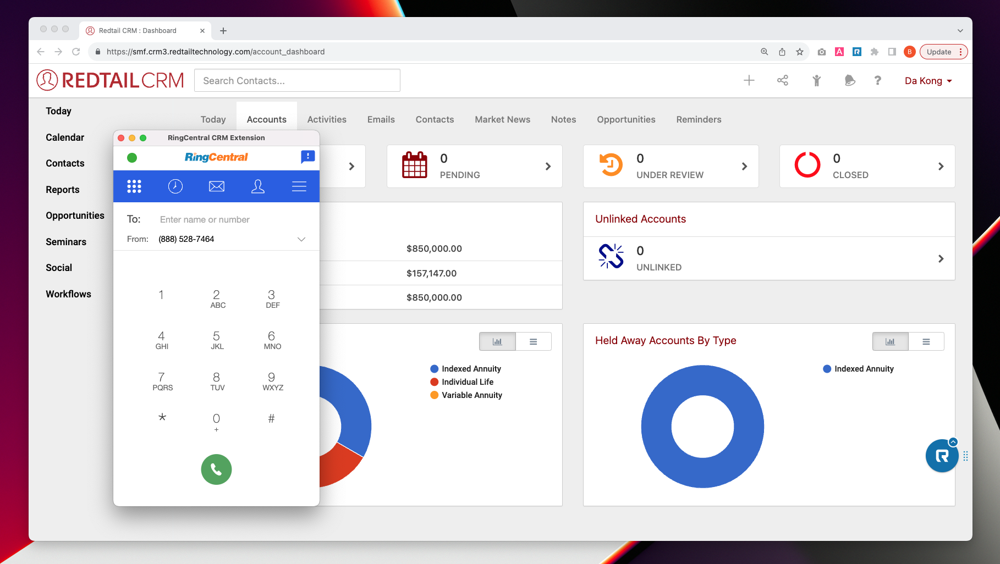
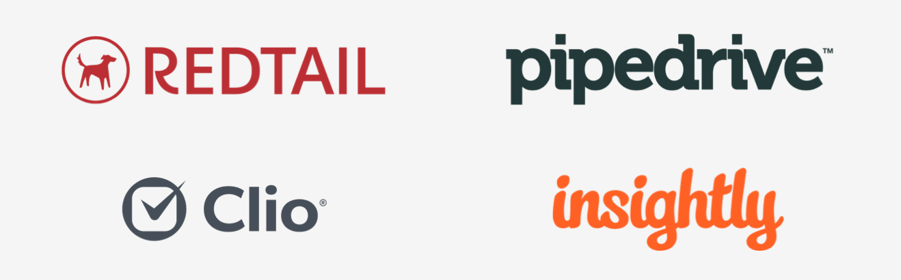

---
hide:
  - navigation
---
# Unified CRM extension for Google Chrome and Microsoft Edge

RingCentral's Unified CRM extension for Google Chrome and Microsoft Edge is a browser plugin that helps connect your RingCentral account to a number of different CRM services. It embeds a fully functional web phone into your CRM and supports key user flows unique to CRMs to better track calls and engage with customers.

<figure markdown>
  
  <figcaption>RingCentral's Unified CRM extension as seen inside Redtail CRM</figcaption>
</figure>

## Supported CRMs

## Features

* **Embedded CTI**. A fully functional phone is embedded into your CRM so that you can place and receive phone calls. The CTI is also enhanced with specific capabilities designed specifically for use cases common to users of most CRMs. These enhancements are enumerated below. 
* **Click-to-dial**. Make any phone number in your CRM clickable to easily call or send an SMS to that phone number. 
* **Call logging**. Every call you make or receive on RingCentral can easily be logged into your CRM ensuring important communications are recorded there. Options are available that allow you to log calls and messages automatically, and more. 
* **Call pop**. When you receive a phone call, the extension will automatically open the caller's contact page in your CRM so that you have the customer's full context before answering the phone.
* **Send/receive SMS**. Not only can you place calls, but you can also send and receive SMS using the CTI. 
* **SMS templates**. Respond to SMS more quickly, by storing and accessing messages you commonly send over SMS using a simple UI. 

## Prerequisites

The Unified CRM extension requires the following:

* Google Chrome or Microsoft Edge

## Supported CRMs

RingCentral currently supports the following CRMs using the Unified CRM extension:

* [Bullhorn](./bullhorn.md)
* [Clio](./clio.md)
* [Insightly](./insightly.md)
* [Pipedrive](./pipedrive.md)
* [Redtail CRM](./redtail.md)
* [NetSuite](./netsuite.md)

Don't see your CRM listed above? Visit our [Ideas portal](https://ideas.ringcetral.com/) to tell us more about the CRM you would like us to integrate with. 

## Are you a developer? Build support for your own CRM

The Unified CRM extension is built on top of an [open source framework](https://github.com/ringcentral/rc-unified-crm-extension), and can be used by third-party developers to [create a custom CRM integration](developers/index.md) more easily than building one from scratch. Visit our github page to learn how to build and contribute support for additional CRMs. 

