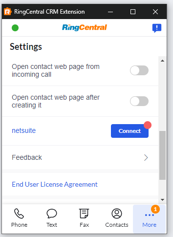

# Setting up the Unified CRM extension for NetSuite

NetSuite is a cloud-based business management software that helps organizations manage their financials, operations, and customer relationships.

RingCentral's integration with NetSuite helps streamline communications with contacts, and helps staffing agents better support contacts through the entire sales order pipeline by helping to manage and store communication history for all contacts. 

## Install the extension

If you have not already done so, begin by [installing the Unified CRM extension](./getting-started.md) from the Chrome web store. 

<iframe width="825" height="464" src="https://www.youtube.com/embed/yo4Q1Vj-sH4" title="Unified CRM extension for NetSuite - quick start" frameborder="0" allow="accelerometer; autoplay; clipboard-write; encrypted-media; gyroscope; picture-in-picture; web-share" allowfullscreen></iframe>

## Setup the extension

Once the extension has been installed, follow these steps to setup and configure the extension for Bullhorn. 

1. [Login to NetSuite](https://system.netsuite.com/pages/customerlogin.jsp).

2. While visiting a NetSuite web page, click the quick access button to bring the dialer to the foreground. 

3. Navigate to the Settings screen in the Unified CRM extension's CTI, and find the option labeled "netsuite".

    { style="max-width: 200px" }

4. Click the "Connect" button. 

5. A window will be opened prompting you to allow OAuth scopes. Allow it.

When you login successfully, the Chrome extension will automatically update to show you are connected to NetSuite. If you are connected, the button next to NetSuite will say, "logout".

And with that, you will be connected to NetSuite and ready to begin using the integration. 

## Role permission setup

For this extension to work, NetSuite account admin needs to assign users with below permissions:

*Transactions:*

|Permission|Level|
|-|-|
|Sales Order|Full|

*Reports:*

|Permission|Level|
|-|-|
|SuiteAnalytics Workbook|Edit|

*Lists:*

|Permission|Level|
|-|-|
|Contact-Subsidiary relationship|View|
|Contacts|Full|
|Customers|Full|
|Employee Record|Full|
|Employees|Full|
|Entity-Subsidiary relationship|View|
|Phone Calls|Full|
|Related Items|View|

*Setup:*

|Permission|Level|
|-|-|
|Log in using OAuth 2.0 Access Tokens|Full|
|REST Web Services|Full|
|User Access Tokens|Full