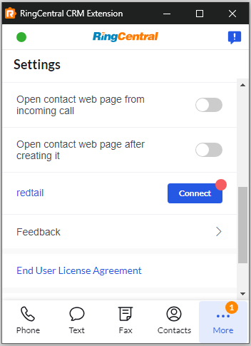

# Setting up the Unified CRM extension for Redtail CRM

Whether you are looking to strengthen your client relationships, improve your team’s collaboration efforts and overall efficiency, increase your revenues and profitability, decrease client attrition, or engage in any number of other business-building activities, Redtail CRM offers tools to assist in your efforts.

RingCentral's integration with Redtail CRM helps streamline communications between customers, and helps sales staff to better support them through their entire lifecycle by helping to manage and store communication history with customers, capture important communication metadata and more.

## Install the extension

If you have not already done so, begin by [installing the Unified CRM extension](./getting-started.md) from the Chrome web store. 

<iframe width="825" height="464" src="https://www.youtube.com/embed/1pbpbEvp5uQ?si=BUmLcaKk5att_XQf" title="Unified CRM extension for Redtail CRM - quick start" frameborder="0" allow="accelerometer; autoplay; clipboard-write; encrypted-media; gyroscope; picture-in-picture; web-share" allowfullscreen></iframe>

## Setup the extension

Once the extension has been installed, follow these steps to setup and configure the extension for Redtail. 

1. [Login to Redtail](https://corporate.redtailtechnology.com/login/).

2. While visiting a Redtail application page, click the quick access button to bring the dialer to the foreground. 

3. Navigate to the Settings screen in the Unified CRM extension's CTI, and find the option labeled "redtail."

    { style="max-width: 200px" }

4. Click the "Connect" button. 

5. A window will be opened prompting you to enter your Redtail username and password. Login to Redtail. 

When you login successfully, the Chrome extension will automatically update to show you are connected to Redtail. If you are connected, the button next to Redtail will say, "logout".

And with that, you will be connected to Redtail and ready to begin using the integration. 
