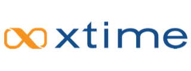
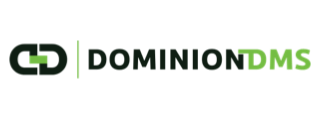
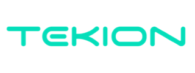

# Connect Through Your DMS or Automotive Solution Provider

Automotive Connect works through the platform your dealership already relies on — no rip-and-replace, no second system for your team to learn. Pick your provider below to see setup details, or reach out to Sales if you don't see yours listed.

  <a href="../../../crm/vinsolutions/" class="crm-mkt__card crm-mkt__card--partner">
    

    

      
Automotive / DMS

      
Vin Solutions

      
Click-to-dial, screen-pop, and automatic call logging directly inside Vin Solutions.

    

    

      Available now
      View setup guide →
    

  </a>

  

    

    

      
Service Scheduling / Cox Automotive

      
Xtime

      
Bring RingEX calling and logging into Xtime service scheduling workflows.

    

    

      Coming soon
      <a href="https://forms.gle/zn8EJHnvg34wAMRV9" class="crm-mkt__cta">Contact Sales →</a>
    

  

  <a href="https://forms.gle/zn8EJHnvg34wAMRV9" class="crm-mkt__card crm-mkt__card--partner">
    

    

      
Dealership Management System

      
Dominion

      
Log calls and texts against Dominion DMS records without leaving the platform.

    

    

      Available now
      Contact Sales →
    

  </a>

  

    

    

      
Dealership Management System

      
Tekion

      
Connect RingEX calling and logging to the Tekion Automotive Cloud.

    

    

      Coming soon
      <a href="https://forms.gle/zn8EJHnvg34wAMRV9" class="crm-mkt__cta">Contact Sales →</a>
    

  

## Talk to Sales

  

    
Ready to connect your dealership?

    
Every Automotive Connect integration needs to be enabled for your account first. Talk to Sales to get started and learn which providers are the best fit for your dealership.

  

  <a href="https://forms.gle/zn8EJHnvg34wAMRV9" class="bld-cta__btn" target="_blank" rel="noopener">Contact Sales →</a>

