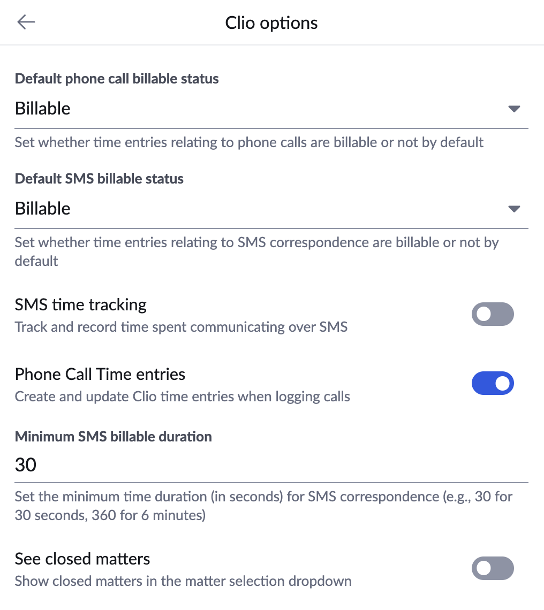
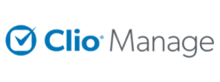
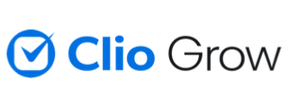

# Solution: Legal Practice Management

### Every Call Is Billable. Make Sure Every Minute Counts.

Law firms live and die by two things: accurate time records and airtight client communication history. When calls with clients, opposing counsel, and witnesses go unlogged, firms lose billable hours, weaken their matter files, and put compliance at risk. **App Connect** closes that gap, automatically tying every call and text to the right matter the moment it happens — no manual entry, no missed minutes.

## Every Second Accounted For

Legal billing runs on precision. A few unlogged minutes here and there doesn't just cost a firm money — it erodes the accuracy of every invoice a client receives. App Connect is built so no billable time slips through the cracks, whether it happens on a call or in a text thread.

* **Automatic SMS time tracking:** Time spent reading and responding to client texts is tracked automatically and rounded up to the nearest billing increment, so quick exchanges are never missed.
* **Billable call tracking:** Phone call time is tracked and recorded as billable by default, tied to the matter the call belongs to.
* **Billable / non-billable control:** Associates can mark individual calls as billable or non-billable, so personal calls and free consultations never inflate a client's invoice.
* **Firm-wide defaults:** Administrators set consistent billing defaults across the practice through [Managed Settings](../users/managed-settings.md), so time is tracked the same way no matter who's on the phone.

<figure markdown>
  { .mw-400 }
  <figcaption>Clio-specific options in App Connect, including billable status defaults for time entries.</figcaption>
</figure>

## Your Matters, Fully Documented

Stop reconstructing your day from memory at 6pm. App Connect turns your phone into an extension of your practice management system, so every conversation is captured against the correct matter, contact, and timeline the instant it occurs.

### Core Capabilities

* **[Automatic Call Logging](../users/automatic-logging.md):** Every call is logged the moment it ends — duration, direction, and timestamp flow straight into the matter record, giving you a defensible basis for billable time without a single manual entry.
* **[Screen Pop](../users/screen-pop.md):** When a call comes in, App Connect surfaces the matching matter and contact before you even pick up — helpful context for conflict checks and knowing exactly who you're speaking with.
* **[Call Log Prompts](../users/prompts.md):** Right after a call ends, App Connect prompts you to add notes while the conversation is still fresh, so matter files stay complete instead of relying on end-of-day recall.
* **[Server-Side Logging](../users/server-side-logging.md):** Calls are logged even if a browser is closed or an attorney is on a mobile device, so billable time isn't lost just because someone stepped away from their desk.
* **[Click-to-Dial](../users/making-calls.md):** Call clients, witnesses, or opposing counsel directly from their matter record — no re-typing or re-dialing numbers.
* **[AI Assistant](../users/ai.md):** Real-time call transcription and note-taking so attorneys and staff can stay focused on the conversation instead of typing through it.
* **[Metrics and Reports](../users/user-report.md):** Roll up call activity by attorney or staff member to support utilization tracking and billing review.
* **[Managed Settings](../users/managed-settings.md):** Administrators can lock logging and configuration rules firm-wide from a central panel, ensuring every attorney handles client communications the same, compliant way.

!!! note "A note on AI and privilege"
    AI transcription and summarization are powerful tools for building out a matter file quickly, but firms should apply the same judgment they would to any recorded communication — confirm what's appropriate to capture for privileged or sensitive conversations before relying on automated notes.

## Built for Legal Practice Management Software

App Connect doesn't bolt onto a generic CRM and hope it fits your practice — it connects directly to the platforms law firms already run on.

  <a href="../../crm/clio/" class="crm-mkt__card crm-mkt__card--partner">
    

    

      
Legal

      
Clio

      
Automatically log calls to Clio matters, create contacts, and track billable time.

    

    

      By RingCentral
      View docs →
    

  </a>

  <a href="../../crm/smokeball/" class="crm-mkt__card">
    

    

      
Legal Practice Management

      
Smokeball

      
Automatically log RingEX calls and communications against Smokeball matters and client records.

    

    

      By Captivo Labs
      View docs →
    

  </a>

## Deeper Integration, Built Specifically for Clio

Every connector logs calls and texts. App Connect's Clio integration goes further, built to match the way Clio firms actually practice.

* **Clio Manage & Clio Grow, both supported:** Whether your firm runs case management in Clio Manage, intake and CRM in Clio Grow, or both, App Connect connects to the tool your team is already using.
* **Fax logging that firms can rely on:** Faxes aren't an afterthought. App Connect logs and stores them safely and permanently in Clio, so every form of client communication — not just calls and texts — lives in one durable record.
* **Clio Medical Records support:** For firms using Clio's Medical Records add-on, App Connect logs calls directly against the medical providers already stored in Clio, keeping treatment-related communication tied to the right record.
* **Global Clio coverage:** App Connect supports Clio across every region Clio operates in, so multi-region and international firms get the same experience everywhere they practice.

<figure markdown>
  { .mw-200 } { .mw-200 }
  <figcaption>App Connect supports both Clio Manage and Clio Grow.</figcaption>
</figure>

## Why It Matters for Law Firms

| Feature | The Business Value |
| :--- | :--- |
| **Automatic & Server-Side Logging** | Captures billable time even when no one remembers to log it manually. |
| **SMS Time Tracking** | Rounds up billable text time so quick client exchanges are never written off. |
| **Billable / Non-Billable Control** | Keeps invoices accurate by letting associates flag which calls actually count. |
| **Screen Pop** | Surfaces the matter and contact before you answer, supporting conflict checks. |
| **Call Log Prompts** | Keeps matter notes accurate by capturing them the moment a call ends. |
| **Matter-Level Connectors** | Clio and Smokeball tie every call to the correct matter, not just a generic contact. |
| **Managed Settings** | Enforces consistent, firm-wide handling of client communications. |
| **Clio Fax Logging** | Stores faxes permanently in Clio alongside calls and texts. |
| **Clio Medical Records Support** | Ties calls to medical providers for firms handling treatment-related matters. |

## From Phone Call to Matter File

1. **Connect:** Link App Connect to Clio, Smokeball, or your firm's practice management system.
2. **Answer:** Screen pop shows you exactly who's calling and which matter it belongs to.
3. **Talk:** Handle the call — App Connect and AI Assistant capture the details in the background.
4. **Bill:** Review complete, matter-linked call records when it's time to report billable hours.

--8<-- "docs/solutions/solutions-footer.md"
