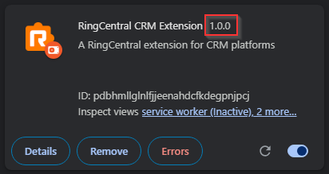

# Getting help with App Connect

-    **[:material-forum: Search the Community](https://community.ringcentral.com/groups/app-connect-22)**
     
     Search for answers from the community knowledge base.

-    **[:material-help: Ask a question](https://community.ringcentral.com/topic/new?fid=22)**
     
     Ask the community for help - you will find all of us very helpful.

!!! tip "Always make sure you are running the latest version"
    
    App Connect is frequently updated with fixes and feature enhancements. While the extension is updated automatically, you may need to restart your browser in order for those updates to take effect. 

## Knowledge base

-   **[No "Connect" button visible](troubleshooting/no-connect-button.md)**

    App Connect opens but there is no button to authorize or connect your CRM.

-   **[Contact not found during call lookup](troubleshooting/contact-not-found.md)**

    A caller's contact exists in your CRM but App Connect cannot find them.

-   **[Calls stuck in "Pending" or "preparing data..."](troubleshooting/calls-stuck-pending.md)**

    Call log records are created in the CRM but never fully populated — they stay in a Pending state indefinitely.

## Does App Connect support contact synchronization?

No. App Connect does not currently support contact synchronization between your CRM and RingCentral.

When users ask for contact sync, they are typically looking for a way to pull CRM contacts into the RingCentral Personal Address Book so that callers are identified by name on the RingCentral desktop or mobile apps. App Connect does not copy data between systems in this way.

What App Connect does instead is a real-time, read-only lookup: when a call arrives, App Connect searches your CRM for a matching phone number and displays the contact's information within the App Connect sidebar. No data is written to your RingCentral address book. If you need a contact to appear in your native RingCentral app's directory, they must be added to RingCentral manually or via a CSV import.

## Managing software updates

Updates to App Connect are installed automatically by Chrome and Edge when you restart your browser. To check which version is currently installed, navigate to **Manage extensions** in your browser, find App Connect in the list, and click **Show details**. The currently installed version is displayed there.

{ style="width:50%" }

To ensure you are running the most recent version, restart your browser. In rare cases where a restart does not resolve an issue, uninstalling and reinstalling the extension is worth trying as a last resort.
