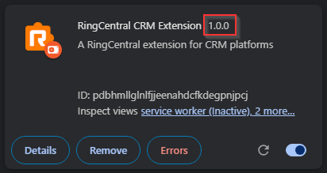

# Getting help with App Connect

!!! tip "Need help connecting to your CRM?"

    If App Connect doesn't yet support your CRM, an [App Connect partner](build/index.md) can build the connection for you.

## Get help using App Connect

-    **[:material-forum: Search the Community](https://community.ringcentral.com/integrations-app-connect-33)**
     
     Search for answers from the community knowledge base.

-    **[:material-help: Ask a question](https://community.ringcentral.com/topic/new?fid=33)**
     
     Ask the community for help - you will find all of us very helpful.

## Knowledge base

-   **[What does App Connect cost?](troubleshooting/app-connect-cost.md)**

    A breakdown of what's free and what costs extra when using App Connect.

-   **[How long will the introductory period last?](troubleshooting/introductory-period.md)**

    Find out how long the free introductory period for AI-generated call artifacts will last.

-   **[No "Connect" button visible](troubleshooting/no-connect-button.md)**

    App Connect opens but there is no button to authorize or connect your CRM.

-   **[Contact not found during call lookup](troubleshooting/contact-not-found.md)**

    A caller's contact exists in your CRM but App Connect cannot find them.

-   **[Calls stuck in "Pending" or "preparing data..."](troubleshooting/calls-stuck-pending.md)**

    Call log records are created in the CRM but never fully populated — they stay in a Pending state indefinitely.

## Does App Connect support contact synchronization?

Not natively. App Connect's core framework does not write CRM data into RingCentral — but a free plugin adds limited, one-way contact synchronization on top of it.

### Contact lookup versus contact synchronization

These are two different things, and most requests for "contact sync" are actually asking about the first one:

* **Contact lookup** — **supported.** This is what App Connect does by default: a real-time, read-only search. When a call arrives, App Connect searches your CRM for a matching phone number and displays that contact's information within the App Connect sidebar. Nothing is written anywhere — your CRM remains the only place that record lives.
* **Contact synchronization** — **not supported.** This means copying contact data from your CRM into RingCentral itself, typically so callers are identified by name in the RingCentral Personal Address Book — on a desk phone, the mobile app, or a softphone, not just inside App Connect. App Connect's core framework does not do this natively; the limited exception provided by a plugin is covered below.

### Native contact lookup (built in, no setup required)

Out of the box, App Connect only performs contact lookup, and only within the App Connect client itself. A caller who is correctly identified in the App Connect sidebar during a call will still show up as an anonymous number on your desk phone or the RingCentral mobile app, because no data has been written back to RingCentral.

### Limited contact synchronization via the Lazy Contact Sync plugin

For customers who want callers identified by name across every RingCentral device — not just inside the App Connect client — [Captivo Labs](build/captivolabs.md) publishes a free plugin, [**Lazy Contact Sync**](plugins/lazy-contact-sync.md), that adds this capability on top of App Connect.

Lazy Contact Sync is deliberately limited in scope, and it's worth understanding those limits before you install it:

* **One direction only.** It syncs from your CRM into the RingCentral Personal Address Book. It never writes back to your CRM.
* **Lazy, call-triggered sync.** There is no bulk import and no sync schedule. A contact is only created or updated in RingCentral the moment they call in (or are called) through App Connect.
* **Grows from real activity only.** Your RingCentral address book accumulates the people you've actually corresponded with, not your entire CRM contact base.

See [Lazy Contact Sync](plugins/lazy-contact-sync.md) for details on how it works and how to install it, and [Plugins](users/plugins.md) for how to browse and manage App Connect plugins generally.

### If you need full, two-way contact synchronization

There is currently no native feature or plugin that performs bulk, two-way synchronization of your entire CRM contact list with RingCentral. If you need a contact to appear in RingCentral's directory regardless of call history, they must be added to RingCentral manually or via a CSV import.

## Managing software updates

Updates to App Connect are installed automatically by Chrome and Edge when you restart your browser. To check which version is currently installed, navigate to **Manage extensions** in your browser, find App Connect in the list, and click **Show details**. The currently installed version is displayed there.

{ style="width:50%" }

To ensure you are running the most recent version, restart your browser. In rare cases where a restart does not resolve an issue, uninstalling and reinstalling the extension is worth trying as a last resort.
