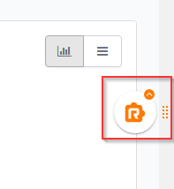
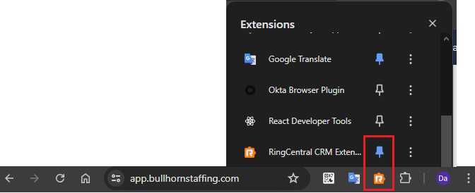

# Accessing the phone dialer to make calls

App Connect makes available to users a fully-functional web phone for placing and receiving calls, as well as recording notes and call dispositions related to those calls -- not to mention numerous other features. The web phone can be accessed in one of two ways.

## Click the quick access badge

When logged into and viewing your CRM, an orange "R" handle/badge will appear in the lower-righthand corner of your browser window. Click the badge to open the dialer window and/or bring it to the foreground. 

<figure markdown>
  
  <figcaption>App Connect's quick access badge</figcaption>
</figure>

!!! tip "If the orange badge obscures page content, or if you wish to hide it for other reasons, you may turn this off using an advanced configuration parameter."

## Click "RingCentral App Connect" from the extensions menu

You can open App Connect's dialer by finding the extension in your list of installed extensions and clicking "RingCentral App Connect."

<figure markdown>
  
  <figcaption>App Connect's quick access badge</figcaption>
</figure>

!!! tip "Pin the extension to your browser bar"
    If you need to access the extension often, you can "pin" the extension to your location bar so that it is more readily available.
	
    

## Embed quick access badge and click-to-dial components into other websites

By default, quick access badge and click-to-dial only work on your CRM pages. There's a way to extend this to any other websites you set. It is done through a whitelist in user settings:

1. Go to User Settings page
2. General
3. Allowed pages
4. Type in website urls, seperated by comma. Use * as wildcard.