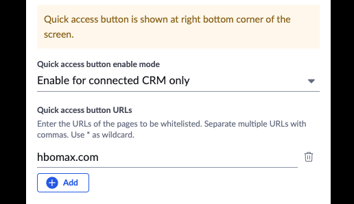

# Accessing the phone dialer to make calls

App Connect makes available to users a fully-functional web phone for placing and receiving calls, as well as recording notes and call dispositions related to those calls -- not to mention numerous other features. The web phone can be accessed in one of two ways.

## Click the quick access badge

When logged into and viewing your CRM, an orange "R" handle/badge will appear in the lower-righthand corner of your browser window. Click the badge to open the dialer window and/or bring it to the foreground. 

<figure markdown>
  
  <figcaption>App Connect's quick access badge</figcaption>
</figure>

!!! tip "If the orange badge obscures page content, or if you wish to hide it for other reasons, you may turn this off using an advanced configuration parameter."

## Disabling the quick access badge

If you wish, you can disable the quick access badge from Settings > General > Enabled domains. From here you can control what web pages and URLs the badge will appear, or not appear. 

<figure markdown>
  { .mw-450 }
  <figcaption>Controlling where the quick access badge will appear in Settings</figcaption>
</figure>

By default, quick access badge and click-to-dial only work on your CRM pages, but you are free to set your own preference from the list below:

* Disabled
* Enable for connected CRM only
* Block by default (then manage a list of sites to allow)
* Allow by default (then manage a list of sites to block)

If either "Block by default" or "Allow by default" are selected, users can then manage a list of URLs for which the badge will appear or be blocked respectively. 

## Pinning App Connect to your browser bar

You can open App Connect's dialer by finding the extension in your list of installed extensions and clicking "RingCentral App Connect." For those who prefer this method over using the quick access badge that is rendered within the CRM, you can optionally pin App Connect from the extensions menu by clicking the pin icon. 

<figure markdown>
  
  <figcaption>App Connect's quick access badge</figcaption>
</figure>

!!! tip "Pin the extension to your browser bar"
    If you need to access the extension often, you can "pin" the extension to your location bar so that it is more readily available.
	
    

