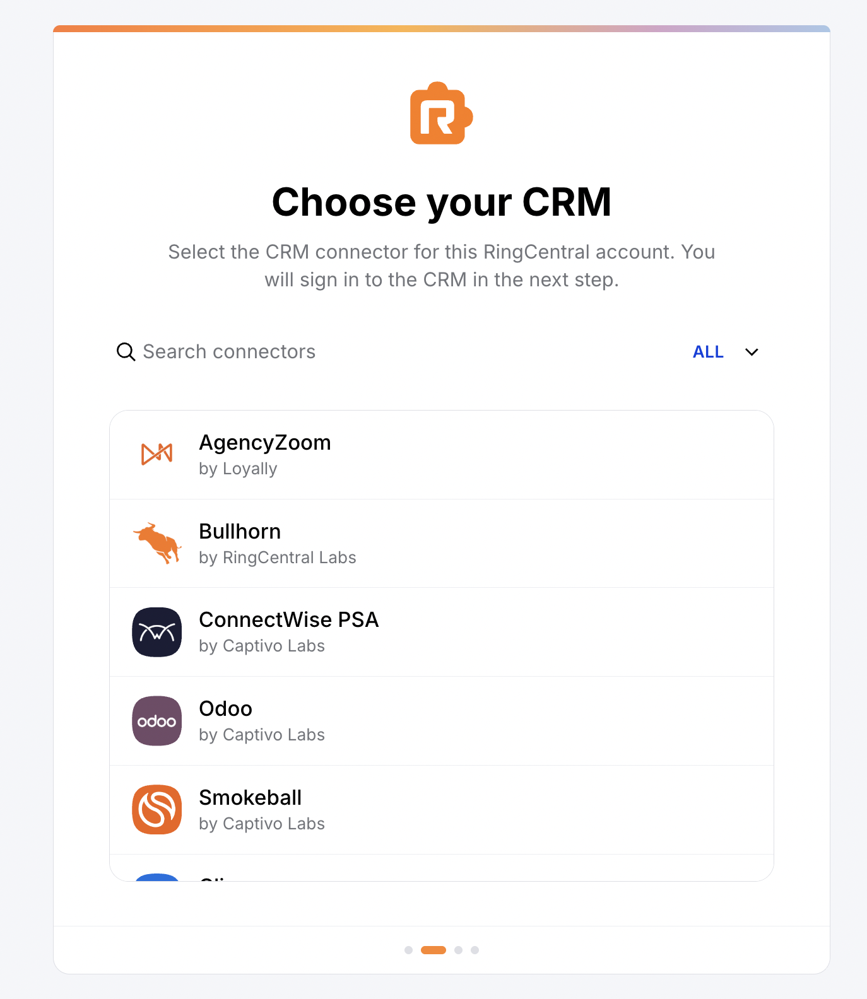
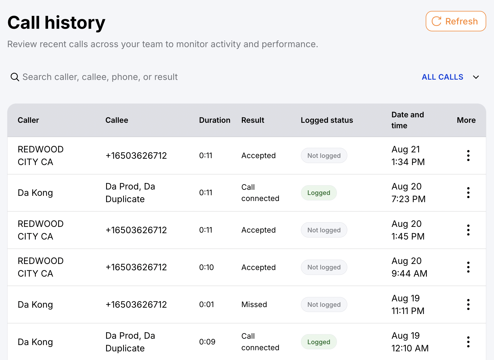
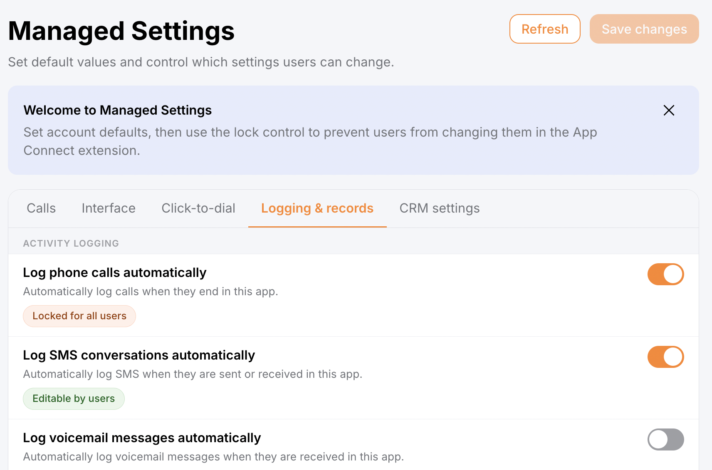
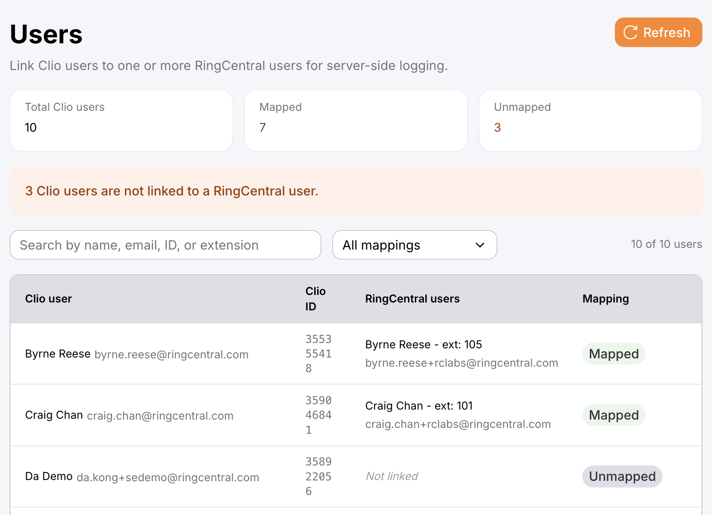
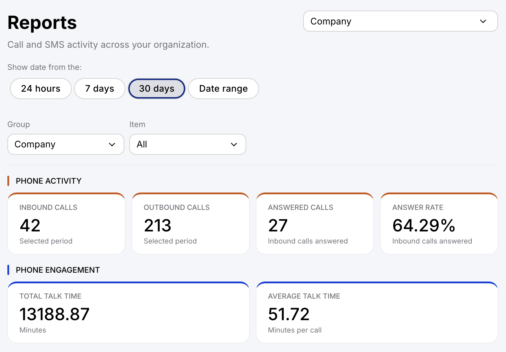
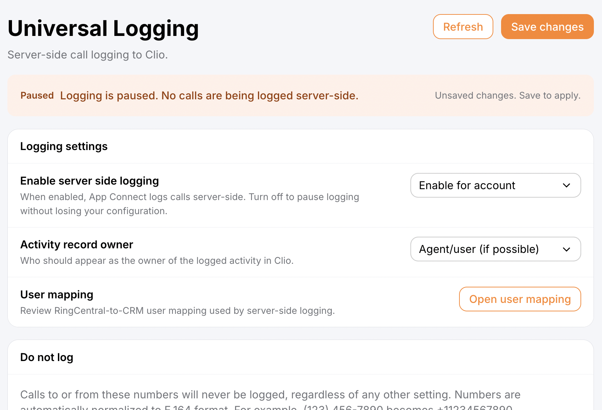

# Using the App Connect admin console

The App Connect admin console gives App Connect administrators a slightly wider view into the administrative functions of the product than what's available inside the Chrome extension. Almost everything you can do in the admin console, you can also do in the Chrome extension.

## Why use the admin console

The most important advantage of the admin console is that it lets an admin set up, configure, and enable logging across their entire account without requiring their users to download and install the browser extension.

!!! tip "We still recommend installing the browser extension for every user"
    While the browser extension is technically optional once logging is enabled from the admin console, we always recommend that users install it. It's the best — and only — way for an individual to check which of their calls weren't logged and resolve those issues manually.

## Managing logging across your company

Setting up App Connect to log calls across your company — without requiring users to install the browser extension — takes just a few steps:

1. Log in to the admin console.
2. Connect to your CRM.

    <figure markdown>
      { .mw-500 }
      <figcaption>Choosing your CRM from the admin console</figcaption>
    </figure>

3. Navigate to Universal Logging.
4. Enable it for your company.
5. Click **Save**.
6. Go to Managed settings and set and lock down your logging preferences for the company.

## Viewing your company's call history

The admin console has one feature you won't find in the browser extension: a view into your whole account's call history. From here, admins can:

* View past calls across the company
* See which calls were logged and which weren't
* Access agent notes, transcripts, and summaries
* Listen to call recordings
* Get quick access to linked contacts and activity records in the CRM

<figure markdown>
  
  <figcaption>The admin console's call history view shows every call across your company, along with its logged status</figcaption>
</figure>

## Features shared with the browser extension

The following areas are available in both the admin console and the browser extension.

### Managed settings

**[Managed settings](managed-settings.md)** let admins set and lock down preferences on behalf of their users. A locked setting shows as "Locked for all users," while settings left open show as "Editable by users."

<figure markdown>
  
  <figcaption>Locking a setting for all users from the admin console</figcaption>
</figure>

### User mapping

If your connector supports it, admins can map RingCentral users to their corresponding CRM users, so that activity records are attributed to the right person. See [Activity record owner](server-side-logging.md#activity-record-owner).

<figure markdown>
  
  <figcaption>Mapping RingCentral users to CRM users from the admin console</figcaption>
</figure>

### User and company reports

**[User and company reports](user-report.md)** let you review calling and messaging statistics for individual users or your whole organization.

<figure markdown>
  
  <figcaption>Account-wide calling and engagement metrics in the admin console</figcaption>
</figure>

### Universal logging

Universal logging (also referred to as [server-side call logging](server-side-logging.md)) enables account-wide call logging that doesn't depend on users having the browser extension installed.

<figure markdown>
  
  <figcaption>Enabling Universal Logging for your company from the admin console</figcaption>
</figure>

### Plugin management and installation

**[Plugin management and installation](plugins.md)** let admins browse, install, and manage plugins for their account.
