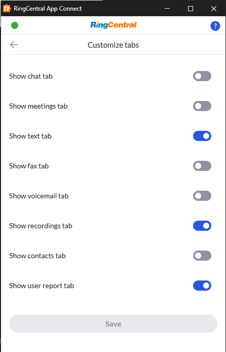
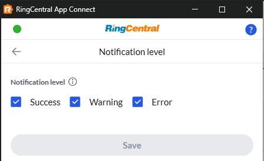
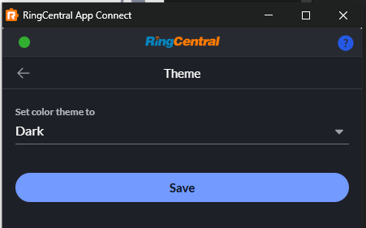

# Appearance Settings

App Connect provides several appearance customization options to help you personalize your experience. These settings allow you to control the visual interface, manage notification preferences, and customize the overall look and feel of the extension.

## Accessing Appearance Settings

To access appearance settings in App Connect:

1. Open the App Connect extension by clicking the orange "R" badge in the lower-right corner of your browser, or by accessing it from your browser's extensions menu
2. Navigate to the **Settings** section within the App Connect interface
3. Look for the **General** settings section and then **Appearance** where these options are located

## 1. Customize Tabs

The customize tabs feature allows you to personalize which tabs and sections are visible in your App Connect interface, helping you streamline your workflow by showing only the features you use most frequently.

<figure markdown>
  
  <figcaption>Customize tabs settings allow you to control which interface elements are visible</figcaption>
</figure>

### How to Customize Tabs

1. In the appearance settings, locate the **Customize Tabs** section
2. You'll see a list of available tabs and interface elements
3. Use the toggle switches or checkboxes to enable or disable specific tabs

### Benefits of Tab Customization

- **Simplified Interface**: Hide tabs you don't frequently use to reduce clutter
- **Faster Navigation**: Focus on the features most important to your workflow
- **Personalized Experience**: Tailor the interface to match your specific role and responsibilities

!!! tip "Recommended Setup"
    Start with all tabs enabled and gradually disable those you rarely use. You can always re-enable tabs later if your workflow changes.

## 2. Notification Level

Notification level settings help you control which types of notifications App Connect displays, allowing you to stay informed about important events while minimizing distractions from less critical alerts.

<figure markdown>
  
  <figcaption>Notification level controls help you manage which alerts and notifications you receive</figcaption>
</figure>

### Notification Level Options

1. **Success**: success notifications like "Call log created".
2. **Warning**: warning notifications like "Please authorize your CRM account".
3. **Error**: error notifications like "Failed to create call log".

## 3. Theme

Theme settings allow you to customize the visual appearance of App Connect, including color schemes and interface styling to match your preferences or work environment.

<figure markdown>
  
  <figcaption>Theme settings let you customize the visual appearance and color scheme</figcaption>
</figure>

!!! info "Settings Sync"
    Depending on your organization's configuration, some appearance settings may be managed by your administrator or synchronized across devices. Check with your IT team if you're unable to modify certain settings.