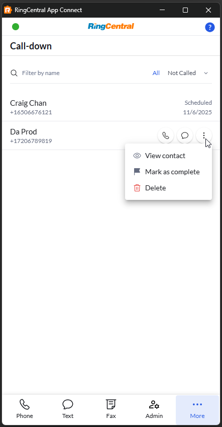
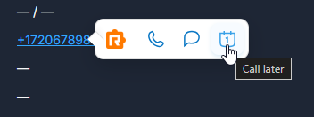
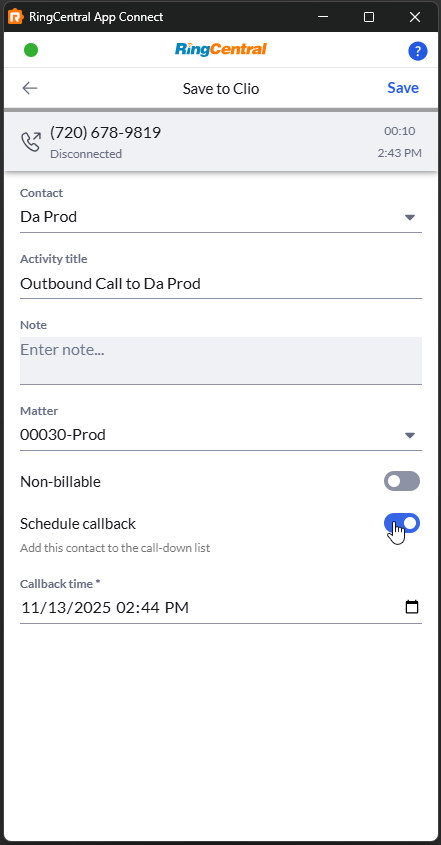
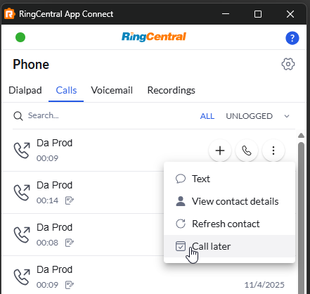

# Call-back Lists

<!-- md:version 2.0 -->

Call-back lists help you manage and execute outbound calling campaigns efficiently. This feature provides a centralized place to organize your contacts, make sequential calls, and track your calling progress—all designed to help you meet your outbound call quotas.

## What are Call-back Lists?

Call-back lists are personal contact lists that streamline your outbound calling workflow. Instead of manually searching for and dialing each contact, you can:

- **Create organized lists** of contacts you need to call
- **Schedule callbacks** for future engagement
- **Track your progress** toward daily call goals

## Accessing Call-back Lists

Find your call-back lists in the **Call-back** tab within App Connect.

<figure markdown>
  { .mw-400 }
  <figcaption>Call-back lists tab</figcaption>
</figure>

## Adding Contacts to Your List

You can add contacts to your call-back list in several ways:

### From Click-to-Dial

Hover on contact number and use click-to-dial to schedule it.

<figure markdown>
  { .mw-400 }
  <figcaption>Schedule with c2d</figcaption>
</figure>

### During Call Logging

After completing a call, you can schedule a callback by selecting the option to call this contact at a later time. This automatically adds them to your call-back list.

<figure markdown>
  { .mw-400 }
  <figcaption>Schedule on call log form</figcaption>
</figure>

### From Call History

1. Navigate to your call history
2. Find the contact you want to call back
3. Select **Call later**
4. Choose when you want to call them

<figure markdown>
  { .mw-400 }
  <figcaption>Schedule on call history page</figcaption>
</figure>

## Managing Your Call-back List

### View and Filter Contacts

**Filter by name**: Use the search box to find specific contacts

**Filter by status**: Show only Called, Not Called or Scheduled contacts

**View scheduled calls**: See how many calls are scheduled for today using the counter badge on top of tab icon
