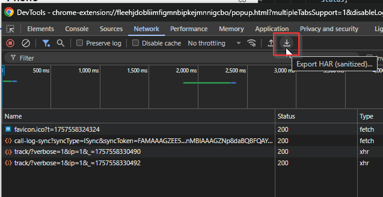

# Collecting Error Logs

The most effective way for us to fix bugs is to reproduce them first. Error logs are essential for this process. If you're reading this page, thank you for helping us improve the application!

To help us diagnose issues quickly, we need three types of information: console logs, network logs, and screen recordings.

## 1. Console Logs

Console logs contain detailed error messages and debugging information that help us identify the root cause of issues.

**Steps to collect console logs:**

1. If possible, manually trigger the error (if you can reproduce it consistently)
2. Right-click on the App Connect extension and select "Inspect"
3. Switch to the "Console" tab and copy **all** content

!!! tip
    Make sure to scroll up in the console to capture any earlier error messages that might be related to the issue. 

## 2. Network Logs

Network logs show all HTTP requests and responses, helping us identify API-related issues or connectivity problems.

**Steps to collect network logs:**

1. Right-click on the App Connect extension and select "Inspect"
2. Switch to the "Network" tab
3. Trigger the error while recording is active
4. Save the network log as a HAR file

## 3. Screen Recordings

Screen recordings provide visual context and show exactly what happens on your screen when the error occurs. This helps us understand the user experience and identify UI-related issues.

**Recommended tools for screen recording:**

- **[Loom](https://chromewebstore.google.com/detail/loom-%E2%80%93-screen-recorder-sc/liecbddmkiiihnedobmlmillhodjkdmb)** - Creates shareable links automatically after recording

**What to include in your recording:**

1. Start recording before reproducing the issue
2. Show the steps that lead to the error
3. Include any error messages or unexpected behavior
4. Keep the recording focused and concise (2-3 minutes is usually sufficient)

!!! tip
    If the issue is intermittent, try to record multiple attempts to show the inconsistent behavior.

## Submitting Your Logs

Once you've collected the necessary information:

1. **Console logs** - Copy and paste into your support ticket or bug report
2. **Network logs** - Attach the HAR file to your report
3. **Screen recording** - Share the video file or link (if using Loom)

**Additional helpful information:**

- Browser version and operating system
- App Connect extension version
- CRM system being used
- Steps to reproduce the issue
- When the issue first started occurring

The more details you provide, the faster we can identify and fix the problem. Thank you for your help!