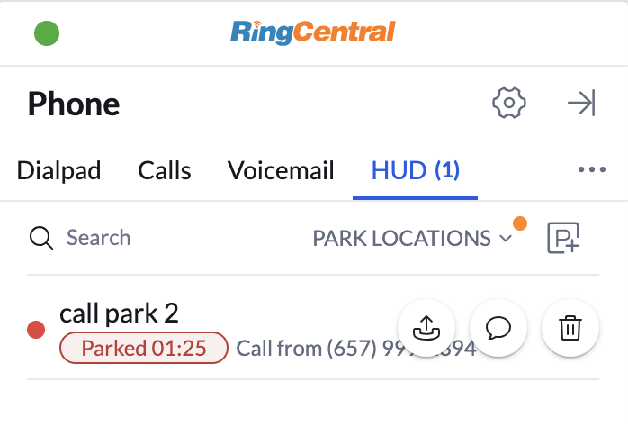

# Monitoring calls across the network (a.k.a. "HUD")

<!-- md:version 2.0 -->

The heads-up display feature, or "HUD," brings popular functionality from the RingCentral desktop application to App Connect. Using the HUD one can monitor team member presence, see which calls are parked or queued, and pick up those calls directly—all in real-time, right where you work.

## Key Benefits

* **Real-time visibility:** See at a glance who is available, busy, or on a call
* **Quick call pickup:** Pick up parked or queued calls with a single click
* **Team coordination:** Monitor team activity without leaving your CRM

## Accessing the HUD

You can access the HUD from the **More** menu in the App Connect dialer. The HUD panel displays your configured monitoring groups and their current status.

## Extensions one can monitor through the "HUD"

App Connect supports four types of monitoring:

### Extensions

Monitor team member presence to see who is available, busy, or on a call. This helps coordinate with colleagues and know when they're free to receive transferred calls.

<figure markdown>
  { .mw-400 }
  <figcaption>Monitor team member presence via Extensions</figcaption>
</figure>

### Park locations

Park and pick up calls from specific [park locations](https://support.ringcentral.com/article-v2/Managing-park-locations-in-the-Admin-Portal.html?brand=RingCentral&product=RingEX&language=en_US). When a call is parked, any team member monitoring that location can pick it up.

<figure markdown>
  { .mw-400 }
  <figcaption>View and pick up parked calls</figcaption>
</figure>

### Group call pickup

Pick up incoming calls from members of your [group call pickup](https://support.ringcentral.com/article-v2/Setting-up-Group-Call-Pickup-group.html?brand=RC_US&product=RingEX&language=en_US) group. This is useful when a colleague is away from their desk and you need to answer their call.

<figure markdown>
  { .mw-400 }
  <figcaption>Pick up group member's call</figcaption>
</figure>

### Call queue pickup

Pick up queued calls when primary agents are busy. Monitor [call queues](https://support.ringcentral.com/article-v2/Set-up-Call-Queue-Pickup-Group.html?brand=RC_US&product=RingEX&language=en_US) and help reduce wait times by picking up calls during high-volume periods.

<figure markdown>
  { .mw-400 }
  <figcaption>Monitor and pick up queued calls</figcaption>
</figure>

!!! note "HUD configuration is managed by your RingCentral administrator. Contact your admin if you need specific monitoring groups added to your HUD."
