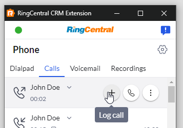
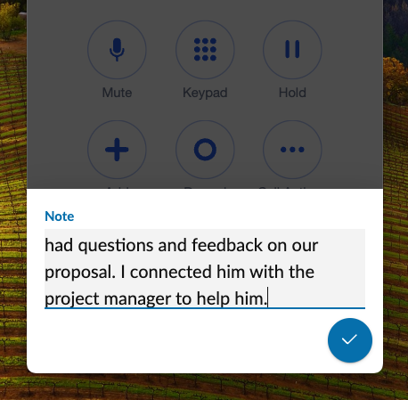
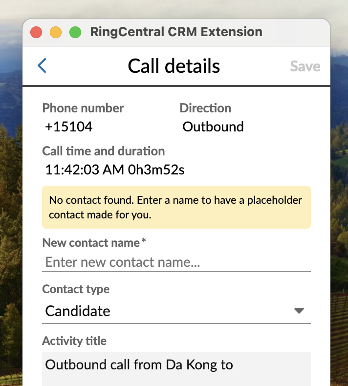
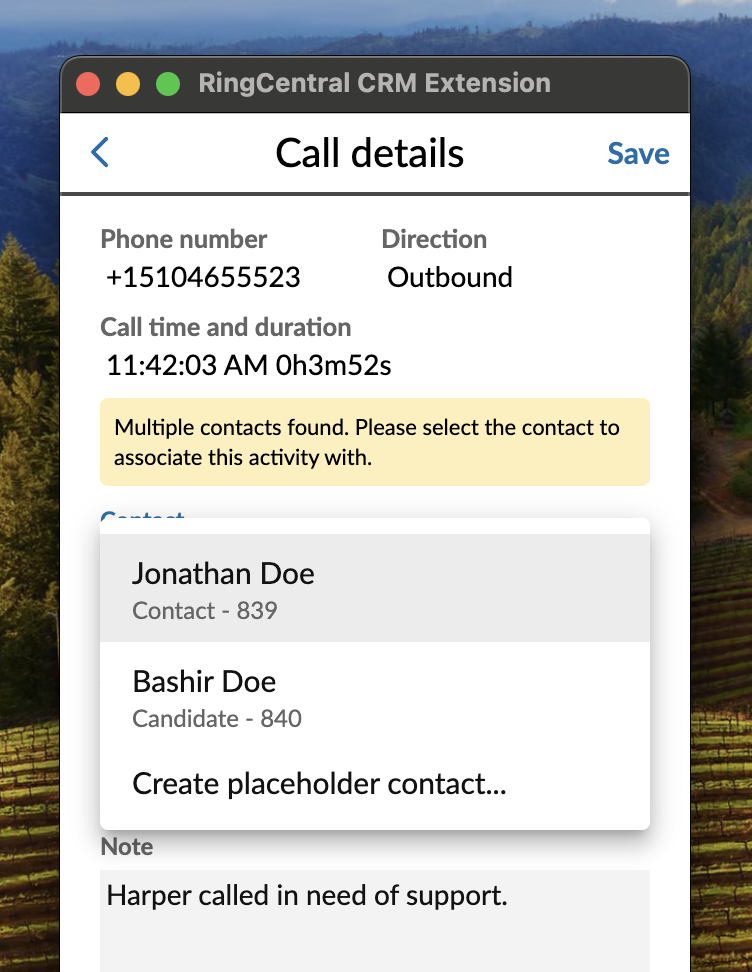
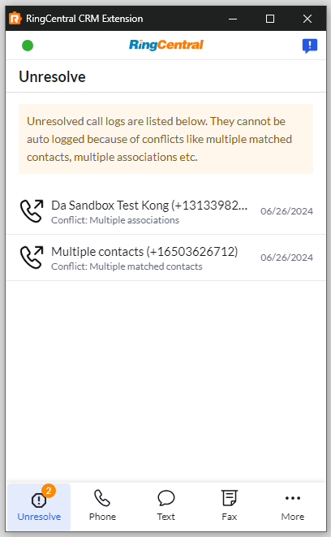

# Logging phone calls in the CRM

One of the central features of App Connect is the ability to automatically log calls that are received or placed while the extension is active. All calls made or received can be logged manually. To manually log a call, open the "Calls" tab in the extension, find the call you wish to log in the list, and click the call log icon. You will then be prompted to enter call notes for the call. Clicking "save" will result in the call be logged, associated with the proper contact, and any notes you entered being saved with the associated activity.

<figure markdown>
  { .mw-400 }
  <figcaption>App Connect's call history page</figcaption>
</figure>

### Finding all unlogged calls

It might be helpful from time to time to quickly assess and remedy any calls that have not yet been logged. To see a list of calls that have not yet been logged, select "Unlogged" from the list of available filters. 

<figure markdown>
  { .mw-400 }
  <figcaption>App Connect's filtered list of "Unlogged" calls</figcaption>
</figure>

### Logging call recordings

If a call is recorded, a link to the call's recording is included in the contents logged to the CRM automatically. 

!!! warning "Call recording links are generated with certain delay"
    Please be aware that it takes time for RingCentral server to process and upload your recordings, therefore recording links won't be generated immediately after calls. The delay could be seconds to minutes dpending on duration of the call and RingCentral server's current capacity.  

!!! warning "Call logs are kept for a maximum of 90 days within RingCentral"
    Please be aware that RingCentral does not retain data indefinitely. Call recordings for example are purged after 90 days. If you wish to retain those files longer, most users subscribe to a third-party service to archive call media. 

## Taking notes during an active call

While a call is active, click the "Notes" icon found in the lower right-hand corner of the dialer to open up a notes page into which you free type notes. When the call is complete, the notes will be saved locally, and when you log the call in the CRM the notes will transmitted to and saved in the CRM.

<figure markdown>
  
  <figcaption>Users can take notes during a phone call that can later be logged into a CRM.</figcaption>
</figure>

## Logging calls when no contact is found

In order for a call to be logged properly, a contact record within the connected CRM must exist and be associated with the phone call. Calls are matched to a contact via the phone number associated with the call.

When no contact can be found associated with a given phone number, App Connect makes it easy to create a placeholder contact associated with the corresponding phone number. To create a placeholder contact, provide the name of the contact and the extension will do the rest. 

<figure markdown>
  
  <figcaption>Creating a placeholder contact in the connected CRM</figcaption>
</figure>

It is the intention for someone to edit the placeholder contact after the call has been logged, to make sure all the correct and appropriate information about the contact has been captured. 

!!! tip "What if no contact was found, when a contact is known to exist?"
    Sometimes a contact is not found, even though one knows for a fact that the contact exists. This happens with some CRMs whose search mechanisms are overly strict. You can address this through [advanced settings](settings.md#phone-number-formats).

## Resolving logging conflicts

A call must be associated with one and only contact record in order for it to be logged. There are therefore two circumstances that will prevent a call from being logged.

### When no contact is found

If you receive a call from someone whose phone number is not in your CRM, or whose contact record cannot be found, then the call will not be logged. In this circumstance, App Connect will give you the option of creating a new contact when the call is logged. Here are some things to keep in mind when creating contacts in this way.

* App Connect only prompts you for a name. You may want to edit the contact later to augment it with more information about the contact after the call is logged. 
* There is a [call-pop setting](making-calls.md#call-pop) that controls whether App Connect will open a browser tab to the newly created contact to aid you in editing the contact after it is created. 
* Some CRMs require additional records, like a company, be created and associated with a contact. App Connect will often create placeholder objects that you can edit later.

### When multiple possible contacts found

If more than one contact in a CRM shares the same phone number, then multiple contacts are likely to be found. This often happens when communicating with multiple employees from the same company, as it is not uncommon for the incoming phone number of two employees in the same building to present incoming phone numbers of their company's main company number. 

When multiple contacts are found, users are given an opportunity to disambiguate and select the correct contact record. This is done via a pull-down menu on the call logging screen. 

<figure markdown>
  
  <figcaption>Disambiguating between contacts when multiple matches are found in the connected CRM</figcaption>
</figure>

## Automatically logging calls

!!! note "What to expect from logging call automatically"
    App Connect has the ability to automatically log calls for its users, but it is not designed to be an all-purpose call logging solution. So use it successfully to log calls, it is important to understand what it can and cannot do:
	
    * It CAN automatically log the calls for any user who has the extension installed, and has connected the extension to both RingCentral and their CRM.
	* It CANNOT log calls for anyone who does not have the extension installed in their browser. 
	* It CANNOT log calls for anyone who has not connected the extension to their CRM. 
	* It CANNOT log calls automatically for people whose browser is closed. 
	* It CANNOT log calls automatically for people whose App Connect window is closed. 
		
App Connect can be configured to log calls automatically so that you do not need to remember to do so manually. To log calls automatically, there are two configuration parameters that are relevant to you. Both of these parameters can be found under Settings accessed from the More tab.

<figure markdown>
  { .mw-400 }
  <figcaption>Settings screen in App Connect to enable automatic call logging</figcaption>
</figure>

| Setting | Description |
|---------|-------------|
| **Log phone calls automatically** | This toggles the auto log feature which will always attemp to log your calls/messages unless any conflict is found. |
| **Open call logging page after call** | This is a sub-setting under auto log. When enabled, App Connect will open a call logging page when a call ends. If auto-logging is also enabled, then the call will be logged and then the log form will be opened giving you a chance to make edits to what was logged. | 

Automatic call logging allows for calls to be logged, even if you are not actively using your CRM, or taking calls through App Connect. However, there is one key restriction everyone should be aware of: calls cannot be logged if App Connect is closed. Luckily, when you open App Connect, and if automatic call logging is enabled, then App Connect will attempt to log any calls that were not logged while it was closed. It will do this in the background slowly over time, processing calls in groups of ten every minute for ten minutes. Therefore, it will only attempt to log 100 calls in this way. If you failed to log more than 100, then the remainder will need to be logged manually. 

!!! warning "Auto-logging calls require you to be logged in"
    Users should be aware that calls received while the browser is closed, or while the extension is not actively running will *not* be logged automatically. They will however be logged the next time App Connect is active. 

### How to resolve logging conflicts

If you have "Auto log call" enabled under Settings, then whenever a call is received or placed that cannot be logged automatically, then a new tab will appear called "Unresolve." Within this tab, calls with various logging conflicts will queue up for the user to resolve. 

In most cases, there are three reasons a call cannot be logged. 

1. **No contact found**: A contact could not be found in the CRM associated with the associated phone number. When this happens, a new contact must be created, or the actual contact record in the CRM should be updated with the phone number in question. 

2. **Multiple contacts found**: More than one contact was found with the associated phone number. To log this call, a contact record needs to be selected for the note/activity to be associated. 

3. **Multiple associations found**: In some CRMs, a call/SMS log can be associated with other entities. A quick example would be, a contact has two orders.

**How do you know if a contact record has been found?**

You will know if a contact record has been found if you see a contact's name in the call history tab of App Connect. If you see a phone number only, chances are a contact record could not be found. 

*Pro tip: you can still log the call as long as you fill in a contact name in the call log form for the extension to create a placeholder contact and then log the call against it*

## Logging past calls

App Connect has the ability to automatically log calls in your connected CRM (see "Automatically logging calls" above). However, for calls to be logged automatically, the extension must be actively running. So if you receive a call overnight for example, the next morning when you login, you can navigate to the Call History tab, see the calls you missed, and click the call log icon to record notes or call disposition for that particular call. 

What you are prompted to log will vary depending upon the CRM you are connected to, as we tailor the logging behavior to best fit with the conventions of the corresponding CRM. 

