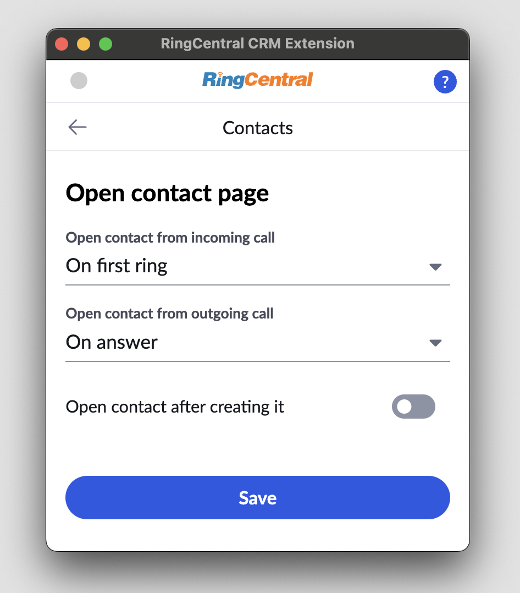

# Making and receiving calls

It is hard to believe this needs to be documented at all. As soon as you login to your RingCentral account via the extension when it is first loaded and initialized, you will be able to make and receive calls. 

When you receive a call, you will hear a ringing sound. Bring the extension to the foreground and click "Answer" to begin the call.

To place a call, bring the extension to the foreground, open up the dialer, and dial the phone number. It is as simple as that. 

## Click-to-dial

When using your CRM, all phone numbers in your CRM will become clickable, allowing you to easily initiate a call with that phone number, or send an SMS message to that phone number. This helps users more quickly and easily engage with contacts, leads, candidates and people whom your CRM tracks. 

<figure markdown>
  
  <figcaption>Click-to-dial hovercard for easy calling</figcaption>
</figure>

## Call-pop

If this feature is enabled, when you receive a phone call the Unified CRM extension will open a browser tab to the contact record of the person calling you. That way when you answer the call, you will have all pertinent information about them at your fingertips, helping you to create a personalized experience for your customer. 

!!! tip "Pro tip: call-pop functionality can easily be disabled via Settings accessed via the More menu."

